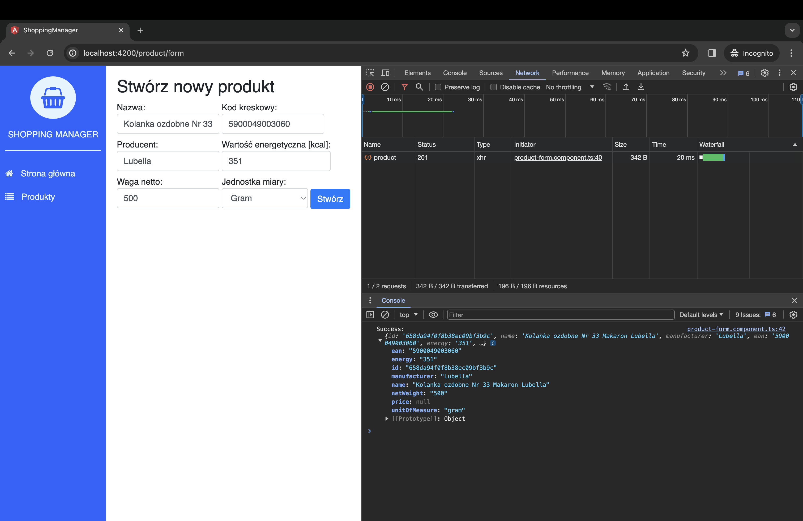
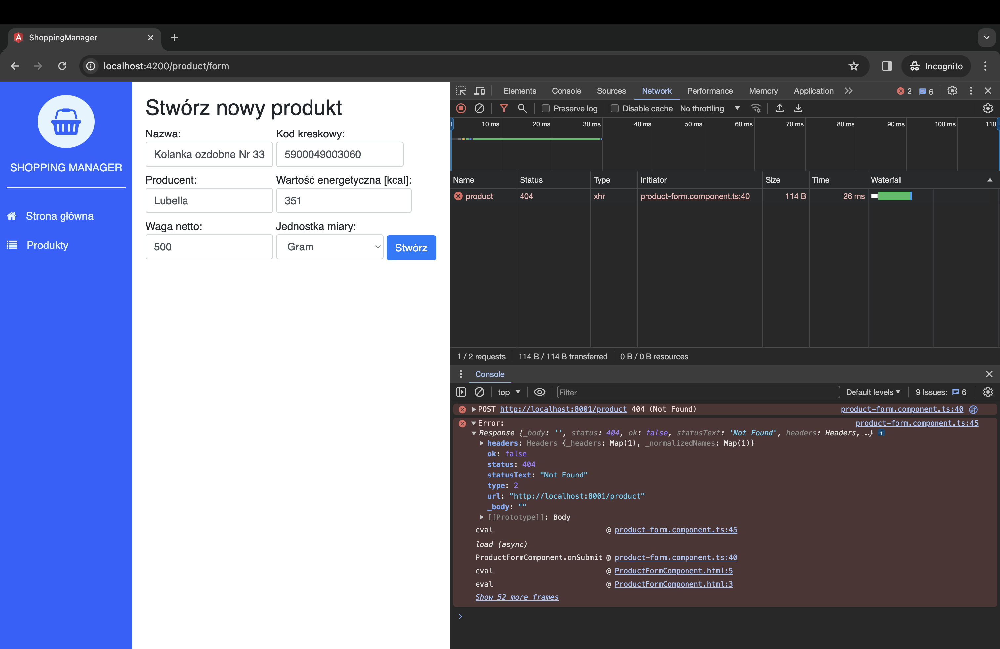

Wysyłanie danych w **Angular 2** jest możliwe dzięki metodzie `post()` z pakietu `http`. W tym wpisie wykorzystamy [reaktywny formularz](/angular-2-reactive-forms-tworzenie-formularza-reaktywnego/) stworzony wcześniej i wyślemy dane na backend naszej aplikacji.

## Wysyłanie danych - `http.post()`

Do wysłania danych użyjemy metody [post()](https://v2.angular.io/docs/ts/latest/api/http/index/Http-class.html#!#post-anchor) z poznanego już pakietu `http`.

```typescript
post(url: string, body: any, options?: RequestOptionsArgs): Observable<Response>
```

Post składa się z trzech parametrów: `url`, `body` oraz `options`. Jako pierwszy parametr podajemy adres URL endpointa w postaci ciągu znaków, np. `http://localhost:8001/product`. Następnie `body`, czyli dane, które chcemy wysłać. Ostatni parametr to opcje. Jak widać po deklaracji, tylko `url` i `body` są wymagane.

Nawiązując do przykładu, prosty `http.post()` w naszej aplikacji wygląda następująco:

```typescript
return this.http
  .post(this.createUrl, product, options)
  .map((response: Response) => {
    let product = response.json();

    return product || {};
  })
  .catch(this.handleError);
```

### Opcje - Options

Aby dodać `options`, należy zaimportować `Headers` i `RequestOptions`. Obie klasy znajdują się również w paczce `http`.

```typescript
let headers = new Headers({ 'Content-Type': 'application/json' });
let options = new RequestOptions({ headers: headers });
```

Tworzymy lokalną zmienną `headers`, która zawiera zdefiniowane przez nas nagłówki. Następnie tworzymy opcje, w których umieszczamy `headers`. Tak przygotowaną zmienną przekazujemy jako trzeci parametr w metodzie `post`.

## Wysyłanie danych

Aby nasza metoda zadziałała, należy ją wykorzystać w metodzie `onSubmit` w formularzu.

```typescript
onSubmit({ value, valid }): void {
  if (!valid) {
    return;
  }

  this.productService.create(value)
    .subscribe(
      (product: Product)  => {
        console.info("Success:", product);
      },
      (error: Error) =>  {
        console.error("Error:", error);
      }
    );
}
```

Wykorzystujemy tutaj stworzoną wcześniej metodę `create()` z naszego repozytorium. Na razie wyświetlamy `console.info`, jeżeli request zakończy się powodzeniem, lub `console.error` w przypadku błędu.




