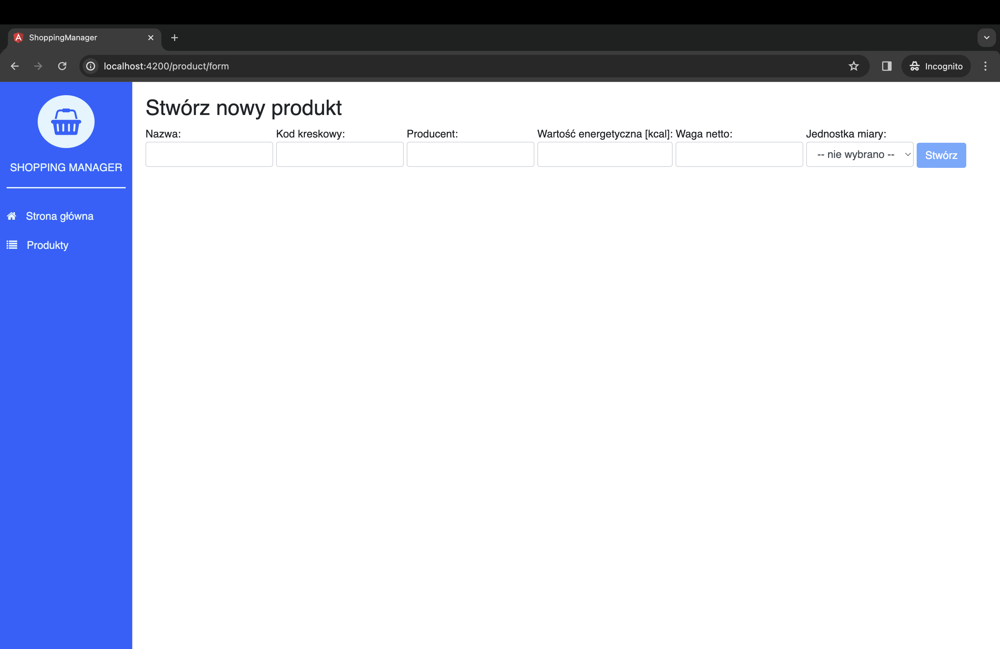
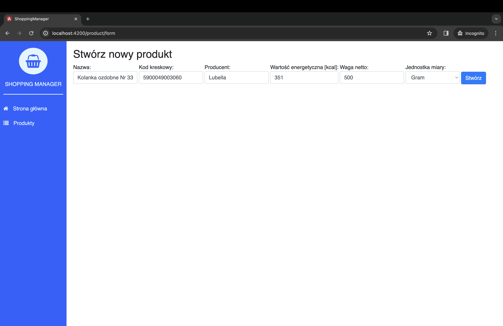
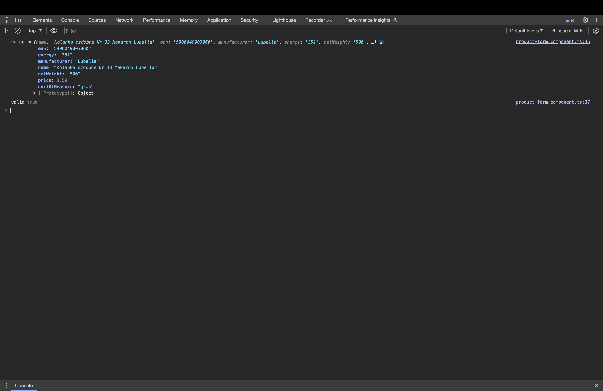

W poprzednim wpisie dowiedzieliśmy się, czym są [reaktywne formularze](/angular-2-reactive-forms-wprowadzenie-formularzy/). Czas na wprowadzenie teorii w życie. W tym krótkim wpisie dowiemy się, że **tworzenie formularza reaktywnego** nie jest tak skomplikowane, jak się wydaje.

## Przygotowanie

Na początku przygotujmy sobie miejsce, gdzie stworzymy nasz formularz. Do przygotowania struktury użyjemy komendy [Angular CLI](/angular-2-angular-cli-pierwsze-kroki/):

```bash
ng g c product/product-form
```

W katalogu `product` został stworzony nowy katalog `product-form`. W środku powinny się znaleźć 4 pliki, z czego w tym wpisie interesować nas będą tylko dwa: `product-form.component.ts` oraz `product-form.component.html`.

Nasz plik z komponentem powinien wyglądać mniej więcej tak:

```typescript
import { Component, OnInit } from '@angular/core';

@Component({
  selector: 'app-product-form',
  templateUrl: './product-form.component.html',
  styleUrls: ['./product-form.component.scss'],
})
export class ProductFormComponent implements OnInit {
  constructor() {}

  ngOnInit() {}
}
```

Pozostało jeszcze dodać nasz nowy komponent do routingu i możemy zaczynać zabawę.

## Tworzenie formularza reaktywnego

### FormBuilder i FormGroup

Na samym początku zaimportujemy dwie klasy: `FormBuilder` i `FormGroup`. Obie znajdują się w paczce `@angular/forms`.

Możemy teraz stworzyć publiczną zmienną `product`, która będzie typu `FormGroup`:

```typescript
public product: FormGroup;
```

Informujemy kontroler, że chcemy użyć `FormBuilder` do budowania formularza i możemy przystąpić do implementacji.

```typescript
ngOnInit() {
  this.product = this.formBuilder.group({
    name: [''],
    ean: [''],
    manufacturer: [''],
    energy: [''],
    netWeight: [''],
    unitOfMeasure: [''],
    price: []
  });
}
```

W metodzie `ngOnInit`, za pomocą `FormBuilder`, tworzymy nową instancję `FormGroup`.

### Widok

W widoku naszego komponentu musimy teraz odwzorować formularz za pomocą HTML-a.

```html
<h2>Stwórz nowy produkt</h2>

<form
  novalidate
  (ngSubmit)="onSubmit(product)"
  [formGroup]="product"
  class="form-group"
>
  <label class="center-block">
    <span>Nazwa:</span>
    <input type="text" formControlName="name" class="form-control" />
  </label>

  <label class="center-block">
    <span>Kod kreskowy:</span>
    <input type="text" formControlName="ean" class="form-control" />
  </label>

  <label class="center-block">
    <span>Producent:</span>
    <input type="text" formControlName="manufacturer" class="form-control" />
  </label>

  <label class="center-block">
    <span>Wartość energetyczna [kcal]:</span>
    <input type="text" formControlName="energy" class="form-control" />
  </label>

  <label class="center-block">
    <span>Waga netto:</span>
    <input type="text" formControlName="netWeight" class="form-control" />
  </label>

  <label class="center-block">
    <span>Jednostka miary:</span>
    <select formControlName="unitOfMeasure" class="form-control">
      <option [value]="">-- nie wybrano --</option>
      <option [value]="'gram'">Gram</option>
      <option [value]="'liter'">Litr</option>
      <option [value]="'piece'">Sztuka</option>
    </select>
  </label>

  <button type="submit" [disabled]="product.invalid" class="btn btn-primary">
    Stwórz
  </button>
</form>
```

#### FormGroup

Na początku tworzymy formularz:

```html
<form
  novalidate
  (ngSubmit)="onSubmit(product)"
  [formGroup]="product"
  class="form-group"
>
  ...
</form>
```

Informujemy widok, że interesuje nas `FormGroup` o nazwie `product`. Wysłanie formularza odbędzie się za pomocą metody `ngSubmit`, w której przekazujemy nasz `product`. Dodatkowo dodajemy pole `novalidate`, ponieważ walidacją zajmie się reaktywny formularz.

#### FormControl

Interesujące nas pola formularza, deklarujemy, tak jak w zwykłym formularzu:

```html
<label class="center-block">
  <span>Nazwa:</span>
  <input type="text" formControlName="name" class="form-control" />
</label>
```

Ważne jest tutaj przypisanie `formControlName`, które będzie odpowiadać zadeklarowanemu po stronie kontrolera.

#### OnSubmit

Na koniec tworzymy przycisk:

```html
<button type="submit" [disabled]="product.invalid" class="btn btn-primary">
  Stwórz
</button>
```

Ważne, żeby przypisać mu typ `submit`. Dodatkowo, możemy go zablokować, gdy formularz nie przejdzie walidacji.

```typescript
onSubmit({
  value,
  valid
}) {
  console.log('value', value);
  console.log('valid', valid);
}
```

Wynik naszej pracy możemy zwieńczyć dodając metodę `onSubmit`, w której zrobimy logi naszej pracy.

### Walidacja

Walidacja takich formularzy to sama przyjemność. Na początku musimy zaimportować klasę do walidacji: `Validators` z paczki `@angular/forms`.

Następnie do `FormControl` dodajemy tablicę opcjonalnych parametrów. Zdecydowałem się sprawdzić, czy pole `name` ma przynajmniej trzy znaki oraz poinformować formularz, że jest ono wymagane:

```typescript
[Validators.required, Validators.minLength(3)];
```

Efekt pracy:





Zmianę możemy zaobserwować na przycisku `Stwórz`. Jeżeli pole `name` nie jest poprawne, jest on nieaktywny.

## Podsumowanie

Jeżeli walidacja przebiegła pomyślnie, przycisk staje się aktywny i możemy użyć metody `onSubmit()`. Naszym oczom ukażą się dwa `console.logi`, w których pierwszy to wartości w formularzu, a drugi to informacja, iż formularz jest poprawny.


