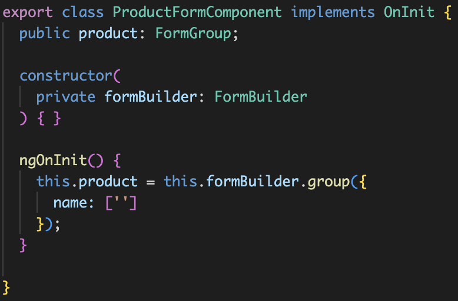

**Angular 2** pozwala nam na stworzenie dwóch rodzajów formularzy: **reactive forms** (zwane też model-driven forms) i **template-driven forms**. Oba rodzaje znajdują się w bibliotece `@angular/forms`. W tym wpisie przyjrzymy się pierwszej z technik tworzenia formularzy, czyli reactive forms.

## Reactive forms

Reactive forms, jak sama nazwa wskazuje, wspomagają _reaktywny_ styl budowania aplikacji. Formularze tworzy się w wygodny i szybki sposób. Łatwo też możemy nimi zarządzać, bezpośrednio w klasie komponentu.



Poprzez formularze reaktywne stworzone zostaje swoiste drzewo. Dzięki temu zarządzanie, nawet najbardziej skomplikowanymi formularzami, staje się dużo prostsze.

> With _reactive_ forms, you create a tree of Angular form control objects in the component class and bind them to native form control elements in the component template, using techniques described in this guide.

### Klasy

W formularzach w Angular 2 możemy wyodrębnić podstawowe klasy: **FormControl** i **FormGroup**.

#### FormControl

**FormControl** jest podstawowym bytem formularza. Pozwala na śledzenie zmian oraz na walidację pojedynczego pola formularza.

Przykład:

```typescript
this.sampleControl = new FormControl('Test control');
```

#### FormGroup

**FormGroup** to grupa instancji FormControl. Również pozwala na śledzenie zmian oraz walidację w ramach grupy.

Przykład:

```typescript
this.sampleGroup = new FormGroup({
  sampleControl: new FormControl('Test control'),
  sampleSecondControl: new FormControl('Test second control'),
});
```

#### Dodatkowe

Ponadto, w Angular 2 przygotowano klasę **FormArray**. Umożliwia operowanie na indeksach tablicowych przy tworzeniu formularza. Specyfikacja wyróżnia jeszcze abstrakcyjną klasę **AbstractControl**.

### Form Builder

Do przyspieszenia pracy znakomicie nadaje się **FormBuilder**. Klasa ta pozwala ograniczyć powtórzenia kodu oraz poprawić jego czytelność.

### Co dalej

W kolejnym wpisie wprowadzimy teorię w ruch i zbudujemy reaktywny formularz w aplikacji [Shopping Manager](/shopping-manager-mockup/). Do zbudowania wykorzystamy komponenty wspomniane w dzisiejszym wpisie.

## Źródła

- [Reactive Forms](https://v2.angular.io/docs/ts/latest/guide/reactive-forms.html)
