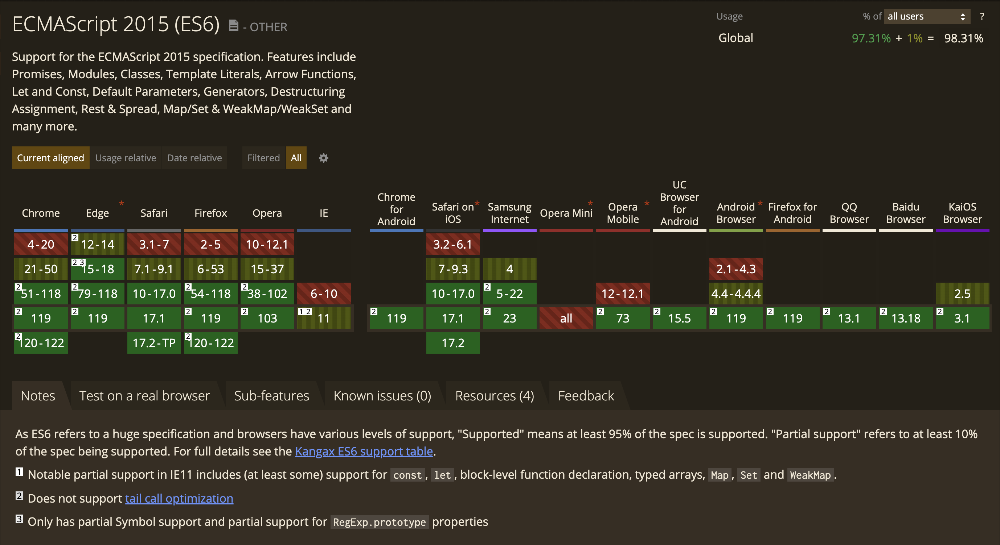

**ECMAScript to standard programistyczny** i wyrocznia dla wielu języków skryptowych (m.in. JavaScriptu). Ukończony w czerwcu tego roku **ECMAScript 2016** (ES7) jest najnowszą wersją owych standardów. Póki co pozostaje tylko ciekawostką i punktem zaczepnym dla geeków programowania.

Mimo, że poprzednia wersja ECMAScript została wydana już rok temu, to do tej pory nie doczekała pełnego wsparcia ze strony przeglądarek. Kod jest najczęściej **przetwarzany do wersji ES5**, która zapewnia, większą stabilność aplikacji.



## ES7 - szybki przegląd

Wersja siódma standardu, znana pod oficjalną nazwą **ECMAScript 2016** została sfinalizowana w czerwcu tego roku. Nie wnosi ona tak ogromnych zmian jak poprzednia wersja, nie ma tutaj tak przełomowych rozwiązań jak na przykład **arrow function** (`=>`). Są za to proste rozwiązania, które z łatwością będzie można wykorzystać w codziennej pracy. Wyjście specyfikacji **ES7** jest także odpowiedzią na błędy zgłaszane prze community. Trend wyraźnie wskazuje na to, iż wpierw należy zapewnić pełne wsparcie przeglądarek oraz rozwiązać istniejące problemy, a dopiero później wprowadzać kolejne nowinki.

## ECMAScript 2016 - Features

Dobrą wiadomościa dla ludzi zagubionych w czeluściach JavaScriptu jest fakt, że wersja **ECMAScript 2016** wprowadza tylko dwie zasadnicze zmiany: `Array.prototype.includes()` oraz **exponentiation operator** (`**`).

### Array.prototype.includes()

Metoda `includes()` sprawdza czy tablica zawiera zadany element.

```js
Array.prototype.includes(value);
```

<iframe
  src="//jsfiddle.net/dawidrylko/51npf041/embedded/js/dark/"
  width="100%"
  height="300"
  frameborder="0"
  allowfullscreen="allowfullscreen"
></iframe>

### Exponentiation operator (`**`)

**Exponentation operator** zwraca taki sam wynik jak znana wszystkim metoda `Math.pow(x, y)`. Pierwszy argument zostaje podniesiony do potęgi, która jest zadeklarowana w drugim argumencie.

<iframe
  src="//jsfiddle.net/dawidrylko/vmrxpsz2/embedded/js/dark/"
  width="100%"
  height="300"
  frameborder="0"
  allowfullscreen="allowfullscreen"
></iframe>

## Dokąd zmierzamy

Mnogość zmian oraz szeroki wachlarz możliwości jakie daje **ECMAScript 6** budzi różnorakie emocje. Sceptycy twierdzą, że jest to przerost formy nad treścią i JS nigdy nie zostanie _"prawdziwym"_ językiem programowania. Innych z kolei przeraża ogrom zmian. Ludzie związani z szeroko rozumianym front-endem często zaś popadają w huraoptymizm widząc jakie możliwości dają coraz to nowsze wersje specyfikacji ECMA. Pamiętajmy jednak o tym, że tak długo jak przeglądarki nie będą w stu procentach kompatybilne ze standardem, tak długo nie będziemy mogli korzystać z dobrodziejstw jakie zostają na dostarczone (chyba, że bezustannie będziemy korzystać z kompilatorów).

### Źródła:

- [ECMAScript Next support in Mozilla - JavaScript | MDN](https://web.archive.org/web/20171019083731/https://developer.mozilla.org/en-US/docs/Web/JavaScript/New_in_JavaScript/ECMAScript_Next_support_in_Mozilla) _[Wayback Machine]_
