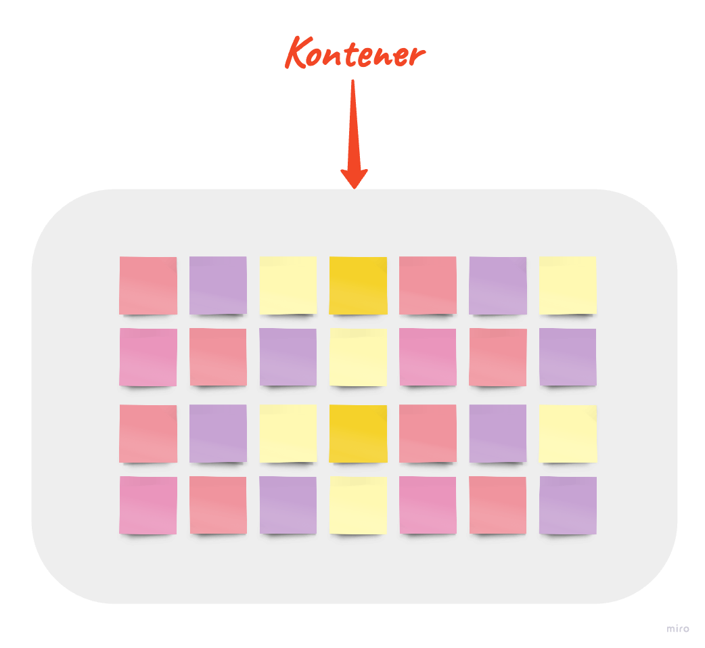
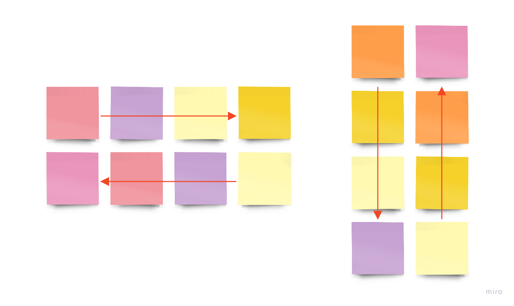
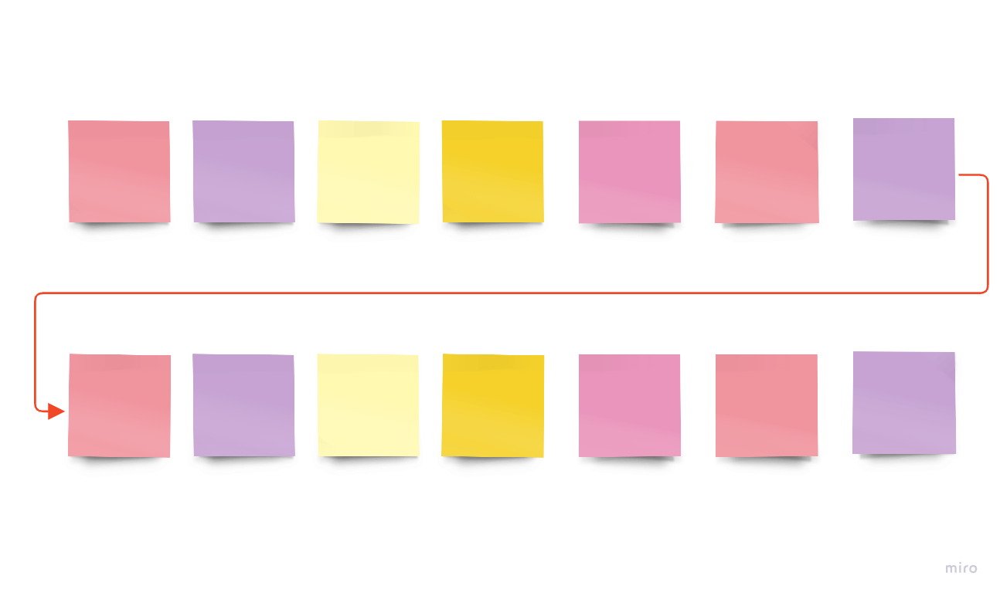

**Witryny i strony internetowe** oparte na statycznych elementach blokowych powoli przechodzą do lamusa. Czy to koniec deklarowania kontenerów z właściwością `float` oraz `clear`? Częściowo tak, **CSS3** wprowadza **Flexbox Layout**, który wspomaga lepsze zarządzanie elementami i łatwiejsze konstruowanie stron.

**Flexbox Layout** (Flexible Box wg [W3C recommendation](https://www.w3.org/TR/css-flexbox-1/), z 1 marca 2016 roku) to moduł, który zapewnia efektywniejszy, a co za tym idzie skuteczniejszy sposób na zarządzanie wyrównaniem, rozkładem elementów wewnątrz kontenerów, przestrzenią wokół nich oraz samymi kontenerami. Przydatne jest to zwłaszcza wtedy, gdy wielkość elementu jest nieznana lub generowana jest w sposób dynamiczny.

Głównym założeniem układu **flex** jest nadanie elementom możliwości zmiany szerokości, wysokości oraz rozmieszczenia w różnych konfiguracjach. Wszystkie te operacje wykonywane są w celu najlepszego zagospodarowania dostępnej przestrzeni, co ma poprawić widoczność oraz dostępność potrzebnych części na różnych rozdzielczościach ekranu.

## Właściwości rodzica (kontener)



### Flexbox Layout - Display

```css
.container {
  display: flex | inline-flex;
}
```

W ten sposób definiujemy elastyczny kontener (inline lub block) w zależności od podanej wartości. Wszystkie dzieci mogą odziedziczyć zadeklarowaną wartość `flex`.

### Flexbox Layout - Flex direction

```css
.container {
  flex-direction: row | row-reverse | column | column-reverse;
}
```

Właściwość `flex-direction` deklaruje **kierunek rozmieszczenia elementów** w pojemniku. W anglojęzycznej nomenklaturze używa się określenia **main-axis** (główna oś).

Właściwość może przyjąć następujące wartości (przy `direction: ltr`):



- `row` - (wartość domyślna) - rząd od lewej do prawej
- `row-reverse` - rząd od prawej do lewej
- `column` - kolumna z góry do dołu
- `column-reverse` - kolumna z dołu do góry

### Flexbox Layout - Flex wrap

```css
.container {
  flex-wrap: nowrap | wrap | wrap-reverse;
}
```

Domyślnie **Flex** próbuje zmieścić wszystkie elementy zależne w jednej linii. W zależności od potrzeby można sterować tą właściwością za pomocą deklaracji `flex-wrap`.



Niezadeklarowanie właściwości `flex-wrap` jest równoznaczne z przybraniem domyślnej wartości `nowrap`. Jeżeli chcemy rozbić elementy na kolejne linie należy zadeklarować wartość `wrap` lub `wrap-reverse`, w zależności od potrzeby.

### Flexbox Layout - Flex flow

```css
.container {
  flex-flow: FLEX_DIRECTION FLEX_WRAP;
}
```

Łączy `flex-direction` i `flex-wrap` w jedną właściwość.
