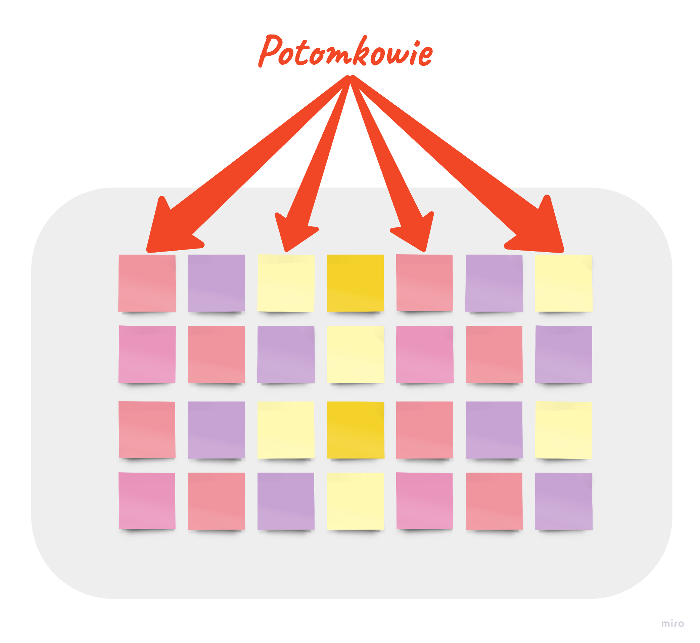
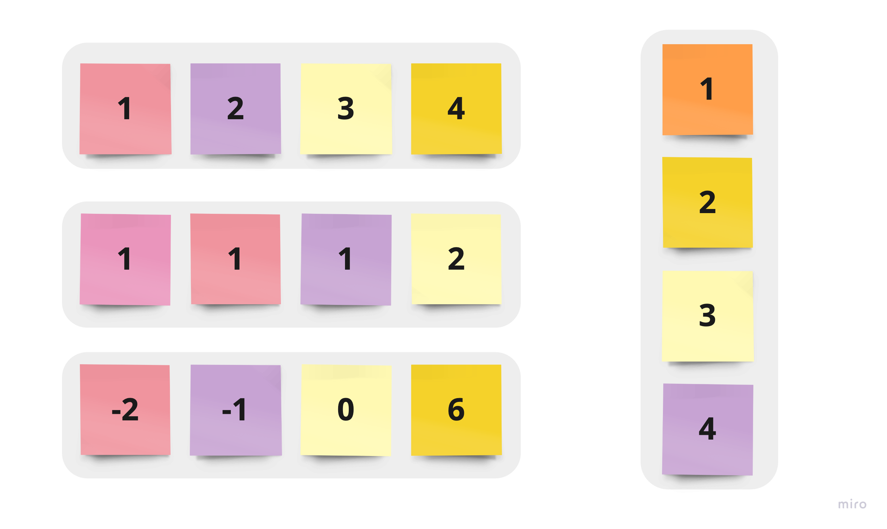
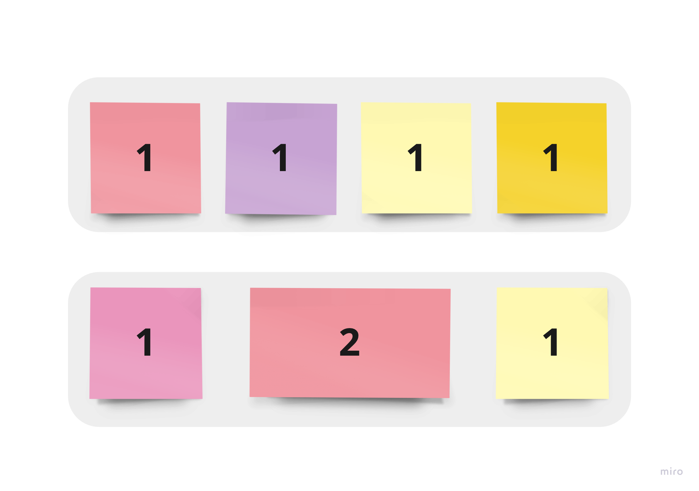

Rozdysponowanie elementów wewnątrz kontenera wcale nie jest takie proste. Czas na drugi wpis z serii **Flexbox Layout**, tym razem poświęcony potomkom kontenera – czyli **children items**.

Artykuł stanowi kontynuację serii. Pierwszy artykuł możesz przeczytać, klikając w: [Flexbox Layout – część 1 – parent container](/flexbox-layout-czesc-1-parent-container/).



**Flex items** to wszystkie obiekty wewnątrz kontenera z zadeklarowaną wartością `flex`. To właśnie operacje na potomkach oraz przypisanie im odpowiednich styli sprawiają, że cały układ zachowa się w możliwie najlepszy (co za tym idzie najbardziej optymalny) sposób.

## Właściwości potomka (children items)

### Flexbox Layout – Order

```css
.item {
  order: NUMBER; /* default 0 */
}
```



Standardowo elementy w kontenerze są ułożone w kolejności występowania w pliku **HTML**. Kolejnością można jednak bez problemu sterować poprzez zastosowanie właściwości `order`.

### Flexbox Layout – Flex grow

```css
.item {
  flex-grow: NUMBER; /* default 0 */
}
```

Właściwość `flex-grow` umożliwia elementom powiększenie się, jeśli tego potrzebują. Przedstawiona właściwość przyjmuje wartość numeryczną. Wartość ta jest **proporcją**, zadeklarowanego dla elementu miejsca, względem całego wykorzystanego miejsca wewnątrz **kontenera flex**.



Jeśli wszystkim elementom wewnątrz kontenera zostanie przyporządkowana właściwość `flex-grow: 1`, to kontener rozdysponuje miejsce w taki sposób, aby wszystkie elementy dostały tyle samo miejsca. Jeśli zadeklarujemy wybranemu elementowi `flex-grow: 2`, a pozostałym `flex-grow: 1`, to wybrany element dostanie dwie wartości przypadające z podziału.

**Ujemne wartości zostają oznaczone jako błędne.**

### Flexbox Layout – Flex shrink

```css
.item {
  flex-shrink: NUMBER; /* default 1 */
}
```

Właściwość `flex-shrink` pozwala elementom na zmniejszanie się, jeśli jest to potrzebne.

**Ujemne wartości zostają oznaczone jako błędne.**

### Flexbox Layout – Flex basis

```css
.item {
  flex-basis: auto | SIZE; /* default auto */
}
```

Podstawową wielkość elementu wewnątrz **flexible container** uzyskujemy dzięki właściwości `flex-basis`. Brak zadeklarowanej wartości oznacza przyjęcie domyślnej – czyli `auto`. Inne wykorzystanie tej właściwości to podanie długości – np. `200px`, `20em`, `20%` itp.

### Flexbox Layout – Flex

```css
.item {
  flex: none | [ FLEX_GROW FLEX_SHRINK || FLEX_BASIS];
}
```

`flex` jest skrótem dla `flex-grow`, `flex-shrink` oraz `flex-basis`. Wg rekomendacji **W3C** zaleca się używanie właśnie tej właściwości, zamiast deklarowania wszystkich powyższych. Ponadto, przy niezadeklarowaniu wszystkich właściwości, skrót `flex` uzupełnia je automatycznie (kolejno `0 1 auto`).

Kolejny wpis z tej serii poświęcony będzie wyrównaniu kontenera i elementów znajdujących się wewnątrz niego.
