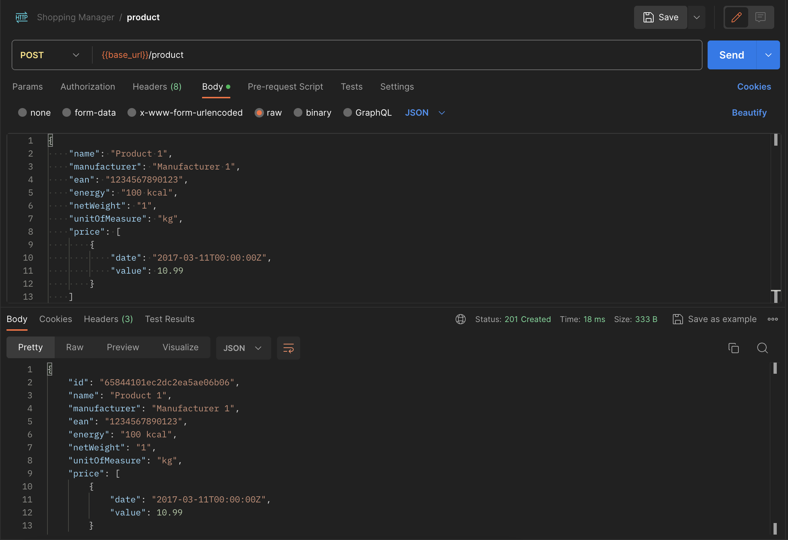

W poprzednich dwóch częściach było małe co nieco o [języku GO](/go-programming-language-startujemy/) oraz [MongoDB](/mongodb-i-mgo-czyli-kilka-slow-o-bazie-danych-dla-jezyka-go/). Czas scalić te dwie odrębne do tej pory funkcjonalności za pomocą **HTTP methods**. Czas na poznanie pierwszej z nich, czyli metody `POST`.

## HTTP methods - `POST`

Stworzenie endpointu w **Go**, dzięki któremu będziemy mogli zapisać nasze produkty do bazy danych **MongoDB**, można podzielić na cztery etapy: tworzenie obiektu, przygotowanie obiektu, otworzenie połączenia z bazą danych oraz zapis do bazy. Poniżej przedstawiam całą metodę `create()`. Na razie nie skupiam się nad optymalizacją czy walidacją. Chcę po prostu, aby metoda robiła dokładnie to, co sobie założyłem, czyli żeby działała.

```go
func create(responseWriter http.ResponseWriter, request *http.Request) {
  product := Product{}

  json.NewDecoder(request.Body).Decode(&product)
  product.ID = bson.NewObjectId()

  server.GetSession().DB("shopping-manager").C("products").Insert(product)

  responseWriter.Header().Set("Content-Type", "application/json")
  responseWriter.WriteHeader(201)

  productJSON, _ := json.Marshal(product)
  fmt.Fprintf(responseWriter, "%s", productJSON)
}
```

### Opis działania

Z pomocą pakietu `net/http` tworzymy metodę `create`, która jako parametry otrzymuje `http.ResponseWriter` i `*http.Request`. Następnie, na podstawie struktury `Product`, tworzymy lokalny byt o tej samej nazwie.

Dzięki pakietowi `encoding/json` mamy możliwość stworzenia dekodera i zdekodowania naszego produktu, poprzez przekazanie adresu naszego produktu. Z kolei biblioteka `gopkg.in/mgo.v2/bson` pozwala nam stworzyć unikalny klucz ID, który dołączamy do produktu.

Sesję z bazą danych otwieramy poprzez wcześniej przygotowaną metodę `GetSession` z lokalnego pakietu `service`. Wybieramy bazę i kolekcję i dodajemy produkt.

Pamiętajmy o nagłówkach:

```go
responseWriter.Header().Set("Content-Type", "application/json")
```

oraz o odpowiedzi:

```go
responseWriter.WriteHeader(201)
```

Teraz możemy zenkodować obiekt i przygotować do wyświetlenia. Przy tworzeniu obiektu wykorzystamy [blank identifier](https://golang.org/doc/effective_go.html#blank). Do wysłania danych wykorzystamy znany już pakiet `fmt`, a właściwie metodę `Fprintf`.

### Podsumowanie

Endpoint działa poprawnie, co prezentuje screen z Postmana zamieszczony poniżej. Jak wspominałem wcześniej, brakuje walidacji, brakuje również testów. Zależało mi tylko na napisaniu działającej metody, która skomunikuje moje API z bazą danych. Na usprawnienia i refaktoryzację przyjdzie czas później.



Super, że aktualizujesz swój artykuł, to zawsze świetny sposób na utrzymanie jego wartości dla czytelników. Możesz dodać dopisek mniej więcej w ten sposób:

---

#### Aktualizacja 21 grudnia 2023

Od czasu powstania tego artykułu, w Go oraz MongoDB wiele się zmieniło. Używana przeze mnie paczka `gopkg.in/mgo.v2` jest przestarzała. Obecnie zaleca się stosowanie nowszej i bardziej rozbudowanej paczki `go.mongodb.org/mongo-driver/mongo`.
