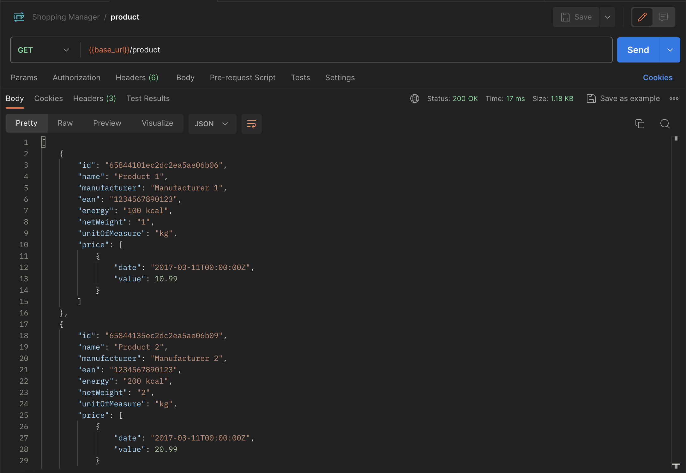
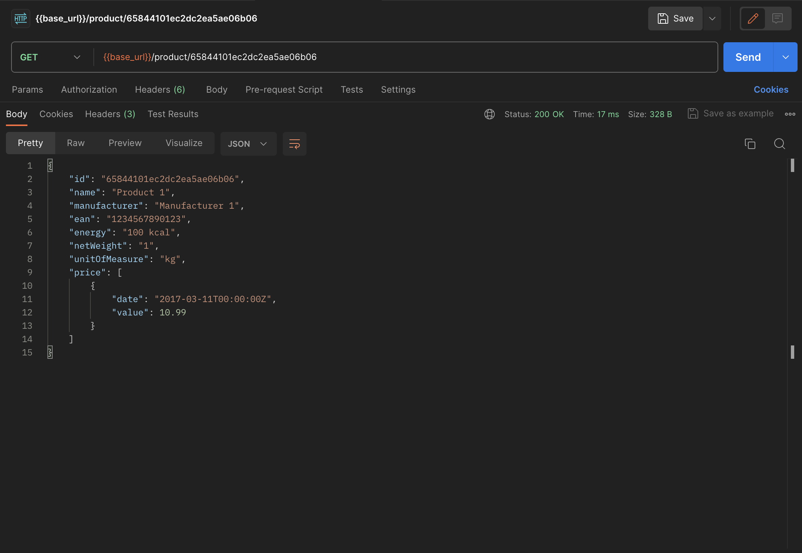

Dobrze zaplanowana praca to podstawa. W [poprzedniej części HTTP methods](/http-methods-z-go-i-mongodb-czesc-1-post/), nauczyliśmy się tworzyć produkty za pomocą metody `POST`. W tym wpisie czas na pobieranie listy produktów oraz pojedynczego produktu po ID.

Dzięki tym trzem endpointom będziemy mogli skutecznie i efektywnie rozpocząć pracę nad front-endem naszej aplikacji.

## HTTP methods - `GET`

Do pobierania elementów z bazy **MongoDB** użyjemy pakietów `net/http`, `gorilla/mux` oraz `mgo.v2/bson`. Do przetworzenia i wyświetlenia danych przydadzą się nam dodatkowo pakiety `encoding/json` oraz `fmt`.

### Pobieranie listy produktów - `getAll()`

Zacznijmy od pobierania listy produktów. Metoda `getAll()`, którą za chwilę stworzymy, umożliwi nam wyświetlenie listy wszystkich produktów. Nie skupiam się na paginacji, filtrowaniu czy sortowaniu. Podobnie jak w poprzednim wpisie, na razie interesuje mnie minimalna funkcjonalność.

```go
func getAll(responseWriter http.ResponseWriter, request *http.Request) {
  products := Products{}

  if error := server.GetSession().DB("shopping-manager").C("products").Find(nil).All(&products); error != nil {
    responseWriter.WriteHeader(404)

    return
  }

  responseWriter.Header().Set("Content-Type", "application/json")
  responseWriter.WriteHeader(200)

  productsJSON, _ := json.Marshal(products)
  fmt.Fprintf(responseWriter, "%s", productsJSON)
}
```

Analogicznie, jak w poprzednim wpisie, na początku tworzymy metodę `getAll()`, która jako parametry przyjmuje `http.ResponseWriter` oraz `*http.Request`. Po czym, na bazie struktury `Products`, tworzymy lokalną zmienną o tej samej nazwie.

Całą "magię" załatwia za nas odpowiednie zapytanie do bazy danych:

```
server.GetSession().DB("shopping-manager").C("products").Find(nil).All(&products)
```

Korzystamy ze [stworzonego wcześniej](/mongodb-i-mgo-czyli-kilka-slow-o-bazie-danych-dla-jezyka-go/) lokalnego pakietu `server` i metody `GetSession`. Całość bazuje na pakiecie `mgo.v2`. Po otwarciu sesji, wybraniu bazy danych oraz kolekcji, używamy metod `Find` i `All`, by wylistować wszystkie elementy z kolekcji.

Dodajemy jeszcze warunek, że jeżeli niczego nie znajdziemy, to endpoint odpowie nam statusem `404 - NOT FOUND`. W przeciwnym wypadku standardowa odpowiedź, czyli `200 - OK` wraz z nagłówkiem `"Content-Type", "application/json"`.

Na koniec zaprezentujmy wynik naszej pracy w formacie JSON, w czym pomoże nam metoda `Marshal` z pakietu `encoding/json`. Pamiętajmy o użyciu blank identifier.

Prezentacja odpowiedzi w Postmanie:



### Pobieranie produktu po ID - `get()`

Pobieranie produktu po ID jest analogiczne jak powyższy przykład.

```go
func get(responseWriter http.ResponseWriter, request *http.Request) {
  params := mux.Vars(request)
  oid := bson.ObjectIdHex(params["id"])
  product := Product{}

  if error := server.GetSession().DB("shopping-manager").C("products").FindId(oid).One(&product); error != nil {
    responseWriter.WriteHeader(404)

    return
  }

  responseWriter.Header().Set("Content-Type", "application/json")
  responseWriter.WriteHeader(200)

  productJSON, _ := json.Marshal(product)
  fmt.Fprintf(responseWriter, "%s", productJSON)
}
```

Potrzebujemy dodatkowo pobrać odpowiedni ID. Z pomocą przychodzi nam, znana już paczka, `gorilla/mux`. Za pomocą metody `Vars` jesteśmy w stanie stworzyć obiekt `params`. Następnie zwracamy `ObjectId` w postaci hexa.

Przygotowana przez nas zmienna `oid` pozwoli nam na przeszukanie kolekcji za jej pomocą. Zakładając, że ID w bazie są unikalne, używamy metody `FindId`, gdzie jako parametr przekazujemy `oid`, a następnie wyciągamy znaleziony produkt.

Warto przy tej okazji pokazać, jak zbudowany jest nasz endpoint:

```
server.Router.HandleFunc("/product/{id}", get).Methods("GET")
```

Na koniec, standardowo, odpowiedź z Postmana:



## Podsumowanie

Po pierwszych dwóch tygodniach pracy z językiem **Go** jestem bardzo zadowolony z jej efektów. Pisanie w tym języku jest bardzo szybkie i efektywne. W miarę poznawania kolejnych pakietów, odkrywając strukturę języka i poznając dobre praktyki, mam wrażenie, że język ten został napisany specjalnie dla mnie. Tym nieskromnym stwierdzeniem zamykam, na tydzień, pracę nad backendem mojej konkursowej aplikacji **Shopping Manager**.

---

#### Aktualizacja 21 grudnia 2023

Od czasu powstania tego artykułu, w Go oraz MongoDB wiele się zmieniło. Używana przeze mnie paczka `gopkg.in/mgo.v2` jest przestarzała. Obecnie zaleca się stosowanie nowszej i bardziej rozbudowanej paczki `go.mongodb.org/mongo-driver/mongo`.
