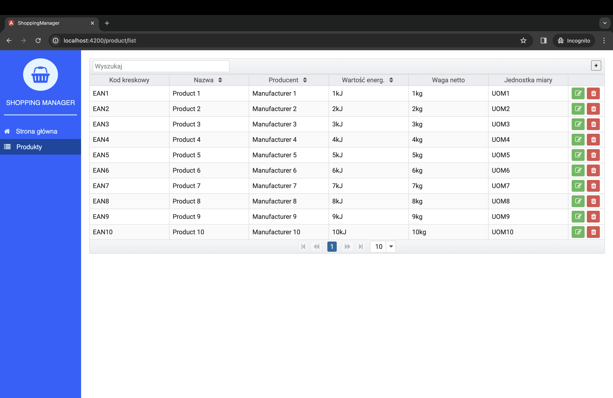

Pracuję efektywnie, jeśli mam jasno sprecyzowane cele i wymagania. Najwyższy czas skupić się nad logiką aplikacji. Poniższy wpis to pseudo makieta [konkursowego](/daj-sie-poznac-2017-z-czym-to-sie-je/) projektu **Shopping Manager**.

## Shopping Manager - Funkcjonalność

Aplikacja **Shopping Manager** ma na celu pomoc w racjonalnym robieniu zakupów spożywczych, optymalizację wydatków finansowych związanych z żywieniem oraz łatwe i przejrzyste zarządzanie listą zakupową oraz budżetem przeznaczonym na artykuły spożywcze.

### Produkty

**[MVP]** Jednym z filarów systemu są produkty spożywcze. Będziemy mieli możliwość dodawania produktu, przeglądania listy produktów oraz oznaczania ulubionych. Będziemy mogli określić cenę produktu oraz dostaniemy informację, jak cena zmieniała się w czasie.

**[V2]** W późniejszym etapie rozwoju aplikacji (jeżeli go doczekamy :-) ) lista produktów będzie zaciągana z zewnętrznej bazy, a ceny będą różne dla poszczególnych sklepów. Ceny powinny aktualizować się na bieżąco.

### Przepisy

**[MVP]** Kolejny filar to przepisy. Przepisy zawierają produkty, które są niezbędne do wykonania posiłku. Będziemy mieli możliwość tworzenia własnych przepisów, przeglądania bazy przepisów i oznaczania ulubionych. Określanie wartości energetycznej dla danego posiłku na podstawie produktów.

### Planowanie

**[MVP]** Określanie tygodniowego budżetu oraz określanie wielkości gospodarstwa domowego. Na tej podstawie zostaną dopasowane przepisy na najbliższy tydzień oraz stworzona lista zakupowa. Produkty długoterminowe, które nie zostaną wykorzystane w całości, będą mogły zostać wykorzystane w kolejnym planowaniu budżetu.

**[V2]** Dobranie odpowiedniego wzorca, aby skomponować jadłospis na podstawie naszych preferencji żywieniowych.

## Interfejs

Interfejs użytkownika powinien być maksymalnie uproszczony. Dashboard powinien składać się z podsumowania bieżącego budżetu i kolejnych list zakupowych.

W zakładce **Budżet** będzie możliwość zdefiniowania budżetu przeznaczonego na produkty spożywcze, sprawdzenie historii wydatków, generowanej na podstawie zatwierdzonej listy zakupowej.

Pozostałe dwie zakładki to kolejno listy produktów i przepisów wraz z wyżej opisanymi funkcjonalnościami.

W powyższym interfejsie przydałoby się jeszcze umiejscowić gdzieś jadłospis. To miejsce na razie nie jest sprecyzowane. Najdogodniejsze znajdzie się w trakcie pracy.

## Podsumowanie

Opisane funkcjonalności wydają się realne do zaimplementowania w trakcie trwania konkursu. Projekt nie wymaga ode mnie zaangażowania ponad miarę. Dowiezienie tej wersji oraz wywiązanie się z założeń opisanych w [tym poście](/daj-sie-poznac-2017-z-czym-to-sie-je/) wymaga natomiast trzech rzeczy: systematyczności, systematyczności oraz... systematyczności.
