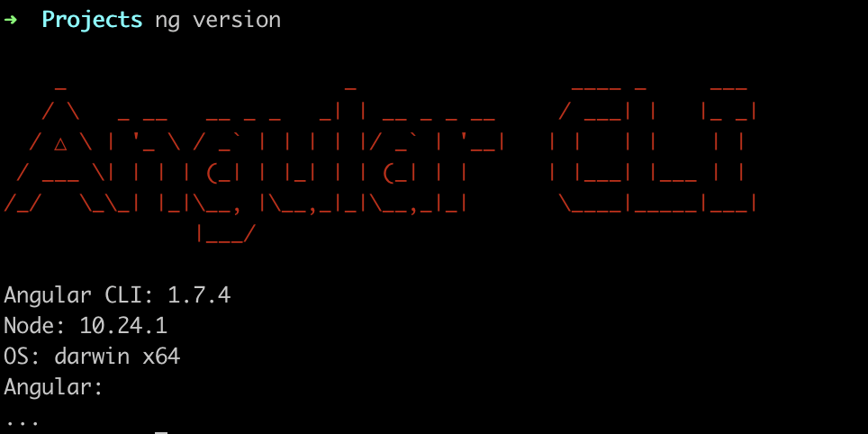
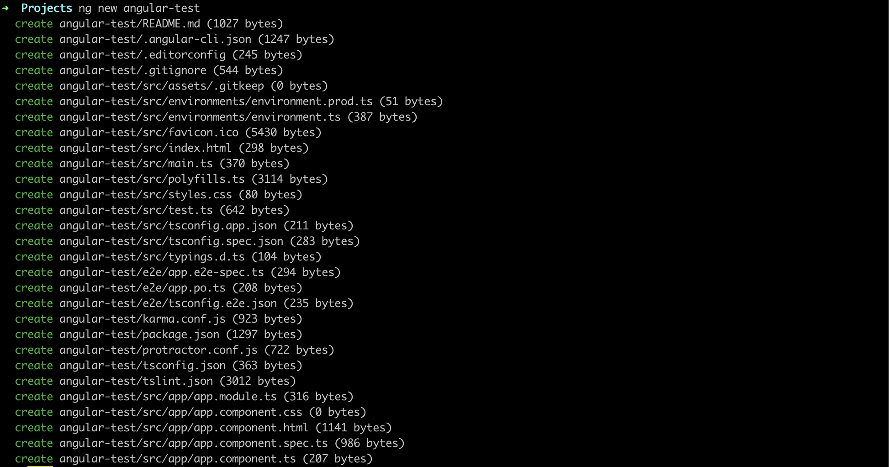
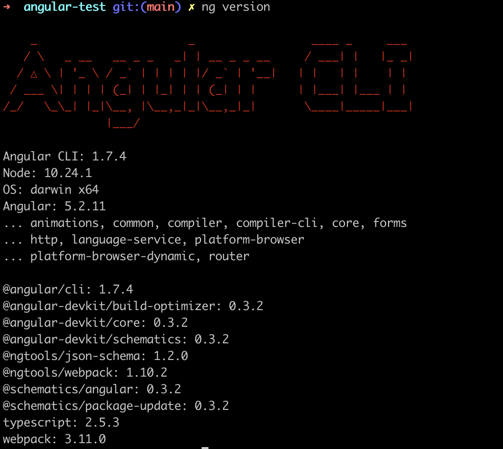
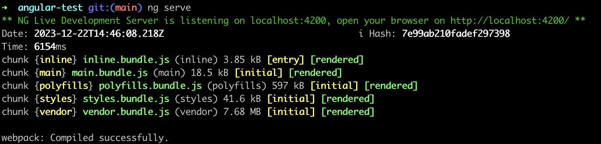
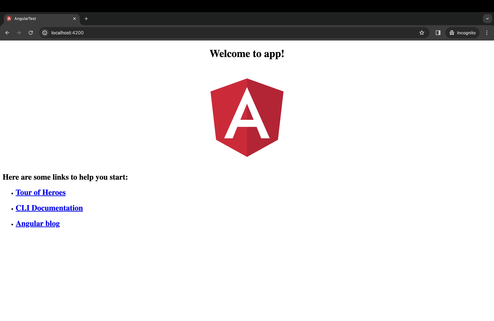

Szybki i przyjemny frontend aplikacji internetowej, to marzenie wielu deweloperów. Naprzeciw oczekiwaniom programistów wyszedł Google z produktem **Angular CLI**. Dedykowany command-line interface ma jedno zasadnicze zadanie, przyspieszyć i maksymalnie uprościć pracę w standardowych czynnościach związanych z tworzeniem i zarządzaniem projektem.

## Instalacja Angular CLI

Pierwszy etap pracy z **Angular CLI** to globalne zainstalowanie paczki `@angular/cli` przez `npm`:

```bash
npm install -g @angular/cli
```



Jeżeli wszystko przebiegło pomyślnie, odpalenie komendy `ng help` powinno wyświetlić [obszerną pomoc](./ng-help/). Już na tym etapie możemy zauważyć, że prefiks `ng` został zarezerwowany właśnie na potrzeby Angular CLI.

## Pierwszy projekt

Gdy mamy zainstalowaną paczkę `@angular/cli`, nic nie stoi na przeszkodzie, by szybko stworzyć własny projekt. Do tego celu wykorzystamy komendę `ng new my_project`, gdzie zamiast `my_project` podajemy nazwę naszego projektu.

Przy tej okazji warto zaznaczyć, że Angular CLI ma wobec nas kilka wymagań odnośnie nazwy projektu:

> New project names must start with a letter, and must contain only alphanumeric characters or dashes. When adding a dash the segment after the dash must also start with a letter.

Nazwa projektu musi zaczynać się od litery, może się składać tylko ze znaków alfanumerycznych lub myślników. Po myślniku CLI oczekuje wyłącznie litery.



Jeżeli wszystko przebiegło w porządku nasz projekt powinien wyglądać mniej więcej tak:

```bash
-rw-r--r--    1 dawid  staff   1093 19 mar 18:35 README.md
drwxr-xr-x    5 dawid  staff    170 19 mar 18:35 e2e
-rw-r--r--    1 dawid  staff   1240 19 mar 18:35 karma.conf.js
drwxr-xr-x  744 dawid  staff  25296 19 mar 18:36 node_modules
-rw-r--r--    1 dawid  staff   1213 19 mar 18:35 package.json
-rw-r--r--    1 dawid  staff    756 19 mar 18:35 protractor.conf.js
drwxr-xr-x   14 dawid  staff    476 19 mar 18:35 src
-rw-r--r--    1 dawid  staff    385 19 mar 18:35 tsconfig.json
-rw-r--r--    1 dawid  staff   2710 19 mar 18:35 tslint.json
```

### Tip

Angular CLI domyślnie tworzy nam style w formacie **CSS**. Jeżeli wolimy pracować np. z językiem **SASS**, nic nie stoi na przeszkodzie. Możemy to ustalić już na poziomie tworzenia projektu, deklarując parametr `--style`. Pełną listę opcjonalnych parametrów znajdziecie w [oficjalnej dokumentacji](https://web.archive.org/web/20180917230015/https://github.com/angular/angular-cli/wiki/new#options).



## Uruchomienie serwera

Aby uruchomić stworzone przez nas środowisko, należy wpisać w konsoli komendę `ng serve`. Nasz projekt zostanie zbudowany, a aplikacja zostanie wystawiona pod zdefiniowanym przez nas adresem (domyślnie localhost:4200).



Aplikacja będzie działać do momentu wyłączenia jej przez nas.

## Tworzenie komponentu / modułu / dyrektywy / etc

Sercem stworzonego przez nas projektu jest folder `src/app`. Początkowo znajduje się tam `app.component.ts`, `app.module.ts` oraz plik z widokiem, style oraz testy.

Dodanie nowego komponentu czy modułu jest banalnie proste. Wystarczy, że w konsoli wpiszemy `ng generate` lub w skrócie `ng g`, a następnie nazwę tego, co chcemy stworzyć.

Angular CLI rozróżnia następujące funkcjonalności:

- **Component:** `ng g component my-new-component`
- **Directive:** `ng g directive my-new-directive`
- **Pipe:** `ng g pipe my-new-pipe`
- **Service:** `ng g service my-new-service`
- **Class:** `ng g class my-new-class`
- **Guard:** `ng g guard my-new-guard`
- **Interface:** `ng g interface my-new-interface`
- **Enum:** `ng g enum my-new-enum`
- **Module:** `ng g module my-module`

## Podsumowanie

Angular CLI to przyjazne narzędzie, które wspomaga pracę nad frontendem aplikacji tworzonych w Angularze. Jest bardzo intuicyjny i wygodny w użytkowaniu. Największego boosta dostajemy na samym początku, kiedy wszystko dostajemy podane na tacy.


