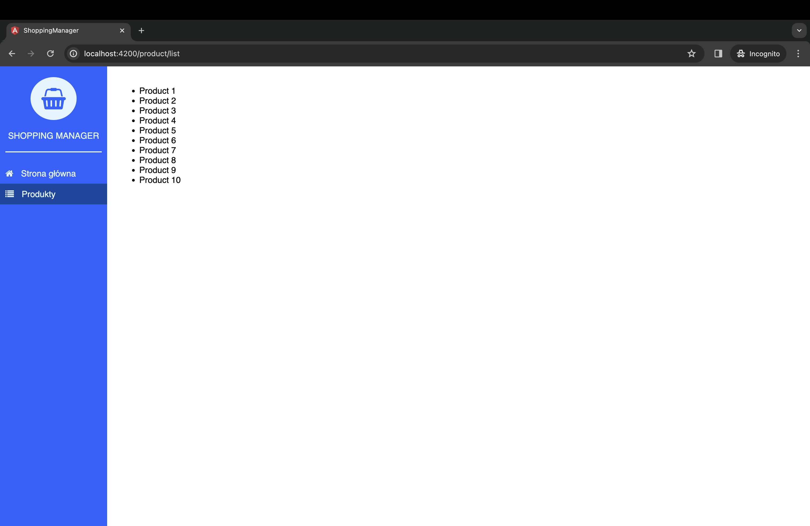

W poprzednim wpisie [utworzyliśmy aplikację w Angular 2](/angular-2-angular-cli-pierwsze-kroki/) z pomocą Angular CLI. W tym wpisie stworzymy prosty serwis do pobierania danych z API oraz wyświetlimy wynik naszej pracy w przeglądarce. Do komunikacji wykorzystamy paczkę **Angular 2 - HTTP** (`@angular/http`).

## HTTP Module

**Http Module** nie należy do rdzenia **Angular 2**. Jest dodatkowym modułem wykorzystywanym do komunikacji w sieci. Aby go wykorzystać, należy zaimportować paczkę `@angular/http`.

```typescript
import { Injectable } from '@angular/core';
import { Http, Response } from '@angular/http';

import { Observable } from 'rxjs/Observable';
import 'rxjs/add/operator/catch';
import 'rxjs/add/operator/map';

import { Product } from './product.model';

@Injectable()
export class ProductService {
  private listUrl: string = 'http://localhost:8001/product';

  constructor(private http: Http) {}

  public list(): Observable<Product[]> {
    return this.http
      .get(this.listUrl)
      .map((response: Response) => {
        return response.json();
      })
      .catch(this.handleError);
  }

  private handleError(error: Response | any) {
    let errMsg: string;

    if (error instanceof Response) {
      const body: any = error.json() || '';
      const err = body.error || JSON.stringify(body);
      errMsg = `${error.status} - ${error.statusText || ''} ${err}`;
    } else {
      errMsg = error.message ? error.message : error.toString();
    }

    console.error(errMsg);
    return Observable.throw(errMsg);
  }
}
```

### Generowanie serwisu

Na początku pracy wygenerujemy serwis, w którym będzie logika odpowiedzialna za komunikację z backendem: `ng g s product`.

Importujemy serwis w odpowiednim module oraz dodajemy go do `providers`.

```typescript
@NgModule({
  imports: [
    CommonModule,
    ProductRoutes
  ],
  providers: [ProductService],
  declarations: [ProductListComponent]
})
```

### Pobieranie danych

Do pobierania listy produktów wykorzystamy metodę `list()`. Tworzymy zatem publiczną metodę o tej nazwie, która zwracać będzie nam **Observable**: `public list(): Observable<Product[]>`.

Następnie wykorzystujemy `@angular/http` i metodę `get()` w parametrze, której podajemy URL do naszego endpointa:

```typescript
this.http.get(this.listUrl);
```

Dzięki metodzie `map()` z biblioteki `rxjs` uzyskamy Observable. Tamteż możemy sparsować dane, które otrzymujemy do formatu JSON:

```typescript
.map((response: Response) => {
  return response.json();
});
```

Warto też obsłużyć wyjątek i poinformować użytkownika o ewentualnym niepowodzeniu:

```typescript
private handleError(error: Response | any) {
  let errMsg: string;

  if (error instanceof Response) {
    const body: any = error.json() || '';
    const err = body.error || JSON.stringify(body);
    errMsg = `${error.status} - ${error.statusText || ''} ${err}`;
  } else {
    errMsg = error.message ? error.message : error.toString();
  }

  console.error(errMsg);
  return Observable.throw(errMsg);
}
```

### Wykorzystanie serwisu

Zwieńczeniem naszej pracy będzie wykorzystanie serwisu w komponencie `product-list`.

```typescript
export class ProductListComponent implements OnInit {
  public products: Product[];

  constructor(private productService: ProductService) {}

  private getProducts(): void {
    this.productService.list().subscribe((products: Product[]) => {
      this.products = products;
    });
  }

  ngOnInit() {
    this.getProducts();
  }
}
```

Tworzymy metodę `getProducts()`, w której wykorzystamy stworzoną wcześniej metodę `list()` z `product.service`. Robimy na niej `subscribe()` i przypisujemy wynik do zmiennej `products`.

### Wyświetlenie danych

Na koniec możemy wypisać nasze dane, np. za pomocą dyrektywy `*ngFor`:

```html
<ul>
  <li *ngFor="let product of products">{{ product.name }}</li>
</ul>
```

W Chrome nasze produkty przedstawiają się następująco:


