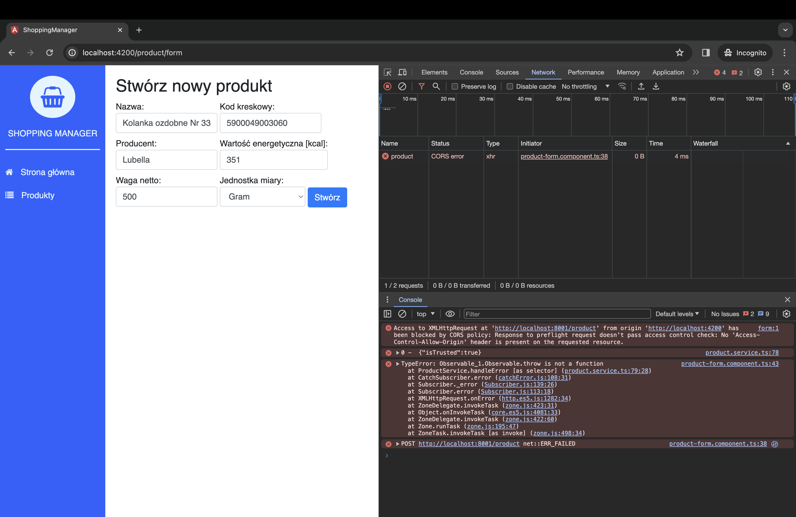
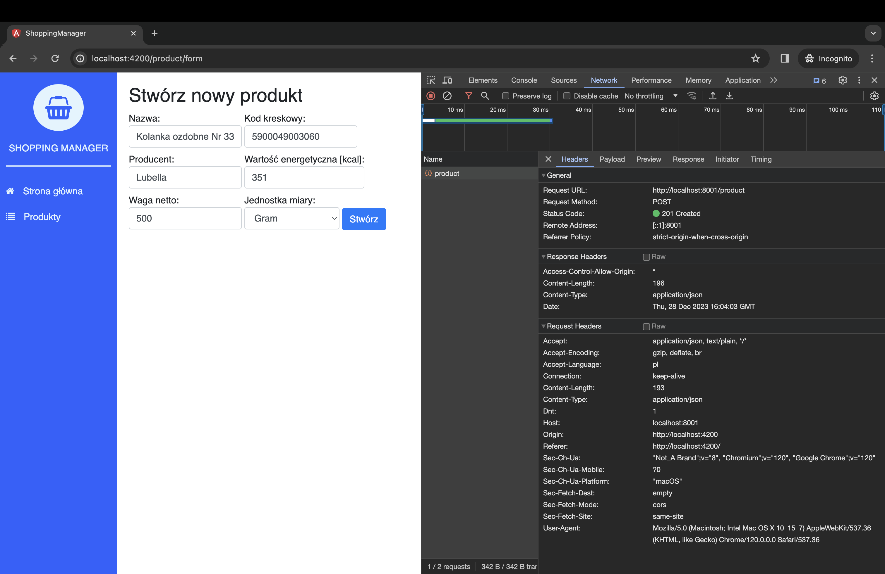

Dzisiejszy wpis został wymuszony przez zaistniałą sytuację. Powrócił bowiem jak bumerang problem, który zignorowałem wcześniej. Stąd też krótka rozprawka, która jest opisem problemu z Cross-Origin Resource Sharing na serwerze w języku Go.

## Trochę teorii

CORS (Cross-Origin Resource Sharing) to technologia pozwalająca na wykonywanie asynchronicznych zapytań do każdego miejsca w sieci. Warunek jest jeden, musimy dostać zgodę na używanie zasobów tego miejsca.

> **Cross-origin resource sharing** (w skrócie **CORS**) - mechanizm umożliwiający współdzielenie zasobów pomiędzy serwerami znajdującymi się w różnych domenach. Ściślej rzecz biorąc chodzi o możliwość wykonywania żądań AJAX między takimi serwerami przy zachowaniu pewnych ograniczeń co do dopuszczalnego źródła żądania. - _za Wikipedią_

## CORS - golang

U mnie problem wystąpił w momencie wysyłania danych z formularza na wcześniej przygotowany endpoint.



Nasze zapytanie zostaje przerwane w momencie wysyłania `OPTIONS`, dostajemy status `404 Not Found`. Dodatkowo w konsoli dostajemy poniższy komunikat:

```bash
XMLHttpRequest cannot load http://localhost:8001/product. Response to preflight request doesn't pass access control check: No 'Access-Control-Allow-Origin' header is present on the requested resource. Origin 'http://localhost:4200' is therefore not allowed access. The response had HTTP status code 404.
```

### Diagnoza

Błąd ewidentnie wskazuje na problem z CORSem. W celu przyspieszenia pracy nad API, poszedłem na pewne uproszczenia w konfiguracji. Dla przypomnienia, start mojego serwera, bez ceregieli, wyglądał następująco:

```go
http.ListenAndServe(":8001", Router)
```

### gorilla/handlers

Na ratunek przyszła biblioteka [gorilla/handlers](https://github.com/gorilla/handlers). Jak nazwa wskazuje, jest to zbiór handlerów do pakietu `net/http`. Użycie jest bardzo proste i intuicyjne.

Instalujemy bibliotekę:

```bash
go get github.com/gorilla/handlers
```

Po imporcie i wpięciu w serwer już widać różnicę. Zmienił się status na `403 Forbidden`.

Teraz wystarczy ustawić minimalne wymagane nagłówki, i problem zażegnany:

```go
// Start server
func Start() {
  fmt.Println(time.Now(), "Go HTTP server start")

  allowedHeaders := handlers.AllowedHeaders([]string{"Content-Type"})
  allowedOrigins := handlers.AllowedOrigins([]string{"*"})

  log.Fatal(http.ListenAndServe(":8001", handlers.CORS(allowedHeaders, allowedOrigins)(Router)))
}
```



#### Aktualizacja 28 grudnia 2023

Obecnie błąd wygląda następująco:

```bash
Access to XMLHttpRequest at 'http://localhost:8001/product' from origin 'http://localhost:4200' has been blocked by CORS policy: Response to preflight request doesn't pass access control check: No 'Access-Control-Allow-Origin' header is present on the requested resource.
```
