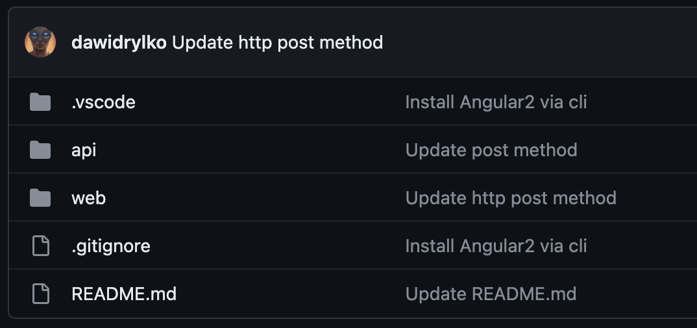
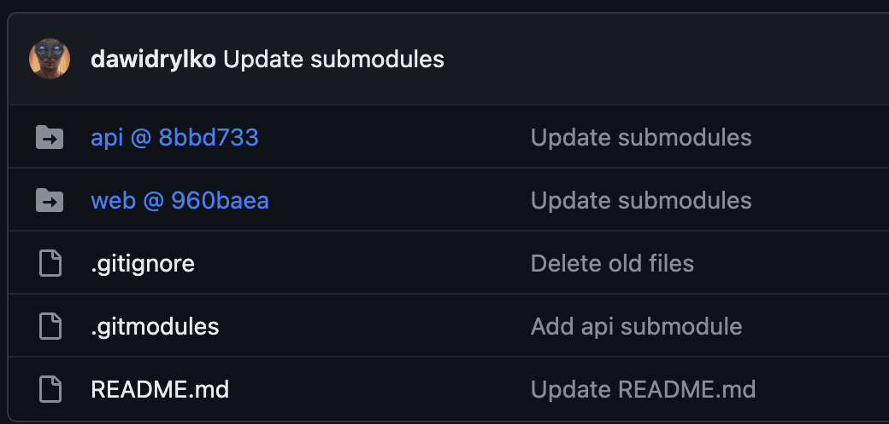

Jednym z założeń Shopping Manager było stworzenie aplikacji RESTowej - backend napisany w **Go** oraz frontend utworzony przy pomocy **Angular 2**. Jako że jest to również aplikacja konkursowa, na tegoroczną edycję Daj Się Poznać, zobligowany byłem całość umieścić w jednym repozytorium.

Proces developmentu nie był przez to utrudniony. Wszak pracę nad aplikacją wykonuję cały czas sam. Nie zbaczając z toru, tkwiłem jednak w tym błędnym rozwiązaniu.

### Moment krytyczny

Przyszedł jednak dzień, że aplikacja powinna opuścić `localhost`. Wtedy też, chcąc nie chcąc, musiałem rozdzielić backend od frontendu.

Z pomocą przyszedł niezawodny Git. Oferuje on rozwiązanie **submodules**, które doskonale nadaje się do rozwiązania wszystkich problemów. Pierwsze zdania z dokumentacji znakomicie odzwierciedlają mój problem:

> It often happens that while working on one project, you need to use another project from within it. Perhaps it’s a library that a third party developed or that you’re developing separately and using in multiple parent projects. A common issue arises in these scenarios: you want to be able to treat the two projects as separate yet still be able to use one from within the other.

### Dwa nowe repozytoria

[Dotychczasowa struktura](https://github.com/dawidrylko/shopping-manager/tree/d1268ae2740a9e9092ad93e25a4fdc327dc876aa) wyglądała następująco:



By rozdzielić repozytoria, trzeba wpierw założyć nowe. Dlatego stworzyłem odpowiednio `shopping-manager-api` i `shopping-manager-web`:

- [shopping-manager-api](https://github.com/dawidrylko/shopping-manager-api)
- [shopping-manager-web](https://github.com/dawidrylko/shopping-manager-web)

Po odpowiednim sformatowaniu plików i przygotowaniu niezależnych repozytoriów, możemy je umieścić w starym. Aby to zrobić, należy posłużyć się komendą:

```bash
git submodule add nazwa_repozytorium
```

Dodatkowo zależało mi, by struktura projektu została taka sama. Dlatego po nazwie repozytorium podałem nazwę folderu, w którym `submodule` miał zostać stworzony:

```bash
git submodule add git@github.com:dawidrylko/shopping-manager-api.git api
```

Repozytorium zostało sklonowane do wskazanego katalogu. Został także stworzony plik `.gitmodules`, którego struktura przedstawia się następująco:

```bash
[submodule "api"]
	path = api
	url = git@github.com:dawidrylko/shopping-manager-api.git
```

Jeżeli teraz spojrzymy na [główne repozytorium](https://github.com/dawidrylko/shopping-manager/tree/0cc5d61f10122f13ca2b5915fb167b5bd0d712cc), możemy zauważyć, że wygląd folderu się zmienił. Dodatkowo obok folderu widnieje commit, na który wskazuje submodule. Analogicznie postępujemy z drugim repozytorium.



### Aktualizacja

Repozytoria, które zawarte są w submodułach, wskazują na odpowiedniego commita. Aby zaaktualizować submodules, wykonujemy komendę:

```bash
git submodule update --remote --merge
```

## Źródła

- [Git Tools - Submodules](https://git-scm.com/book/en/v2/Git-Tools-Submodules)
