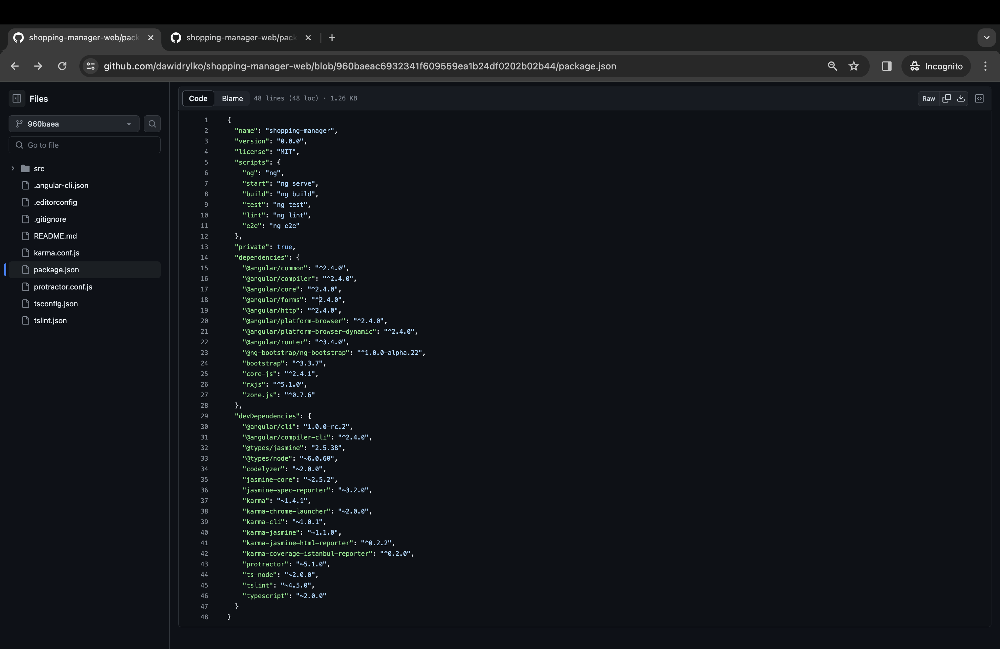
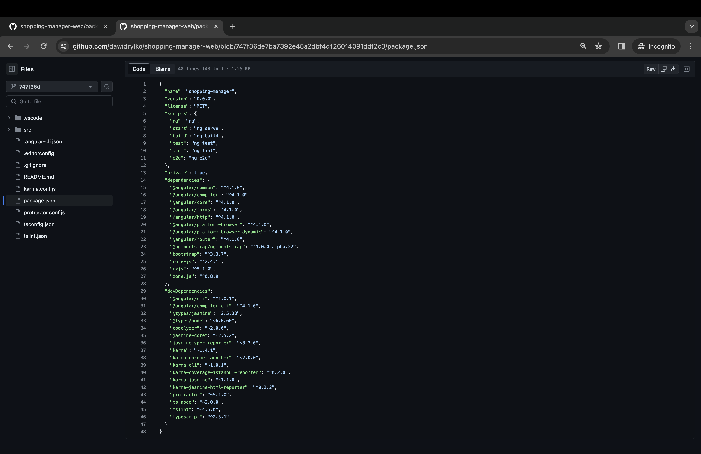

Nowy **Angular** żyje i ma się nad wyraz dobrze. Efektem było wypuszczenie nieco ponad miesiąc temu wersji **4.0.0**, z kolei zaledwie przedwczoraj wyszła wersja **4.1.0**. W tym wpisie omówimy pokrótce nową wersję oraz przeprowadzimy migrację z wersji **Angular 2** do **Angular 4**.

## Angular 4 - co nowego?

### Mniej znaczy szybciej

Projektanci frameworka postawili sobie za cel **przyspieszenie** oraz **zredukowanie kodu wynikowego** Angular 4. Jak możemy przeczytać na oficjalnym blogu:

> We’ve made changes under to hood to what AOT generated code looks like. These changes reduce the size of the generated code for your components by around 60% in most cases. The more complex your templates are, the higher the savings.

> During our release candidate period, we heard from many developers that migrating to 4 reduced their production bundles by hundreds of kilobytes.

Animacje zostały wyciągnięte z **@angular/core** i umieszczone w osobnym pakiecie. By wykorzystać teraz `animations`, trzeba zaimportować pakiet **BrowserAnimationsModule** z **@angular/platform-browser/animations**.

### Features

Na warsztat poszły dyrektywy **\*ngIf** oraz **\*ngFor**. Można teraz po stronie HTML-a wykorzystywać składnię if/else:

```html
<div *ngIf="userList | async as users; else loading">
  <user-profile
    *ngFor="let user of users; count as count; index as i"
    [user]="user"
  >
    User {{i}} of {{count}}
  </user-profile>
</div>

<ng-template #loading>Loading...</ng-template>
```

### TypeScript

Update przyniósł również wsparcie dla kolejnych wersji języka TypeScript. **Angular 4.0.0** jest zgodny z TypeScriptem **2.1** i **2.2**. Z kolei przedwczorajszy update **Angular 4.1.0** przyniósł zgodność z TypeScriptem **2.2** i **2.3**.

To tylko kluczowe zmiany. Zainteresowanych zachęcam do zerknięcia w [CHANGELOG](https://github.com/angular/angular/blob/main/CHANGELOG_ARCHIVE.md).

## Migracja

Wpierw rzućmy okiem na [nasz package.json](https://github.com/dawidrylko/shopping-manager-web/blob/960baeac6932341f609559ea1b24df0202b02b44/package.json). Interesują nas zależności **@angular,** **zone.js** oraz **typescript**.



Proces migracji zaczynamy od podniesienia TypeScriptu do najnowszej wersji:

```bash
npm install --save-dev typescript@latest
```

W moim przypadku musiałem podnieść także `@angular/cli`:

```bash
npm install --save-dev @angular/cli@latest
```

Przyszedł czas na `zone.js`:

```bash
npm install --save zone.js@latest
```

Ostatnim etapem jest podniesienie pozostałych wykorzystywanych paczek, u mnie będzie to kolejno:

```bash
npm install --save-dev @angular/compiler-cli@latest
```

oraz

```bash
npm install @angular/{common,compiler,core,forms,http,platform-browser,platform-browser-dynamic,router}@latest --save
```

Proces migrowania do wersji 4.1.0 przeszedł bez żadnych komplikacji. Kluczowym elementem jest niewielki rozmiar mojej aplikacji. Robiłem jednak wcześniej migrację dużo bardziej rozbudowanego systemu. Problemy, które wyniknęły w trakcie, nie blokowały mnie jednak w żadnym stopniu. Pamiętajmy, że nie powinniśmy zbytnio odwlekać aktualizacji systemów, które utrzymujemy, i tych, które się ciągle rozwijają.

Na koniec jeszcze [package.json po wszystkich aktualizacjach](https://github.com/dawidrylko/shopping-manager-web/blob/747f36de7ba7392e45a2dbf4d126014091ddf2c0/package.json):



## Źródła:

- [Angular 4.0.0 Now Available](https://web.archive.org/web/20170416222918/http://angularjs.blogspot.com/2017/03/angular-400-now-available.html) _[Wayback Machine]_
- [Angular 4.1.0 Now Available](https://web.archive.org/web/20170508a044213/https://angularjs.blogspot.com/2017/04/angular-410-now-available.html) _[Wayback Machine]_
