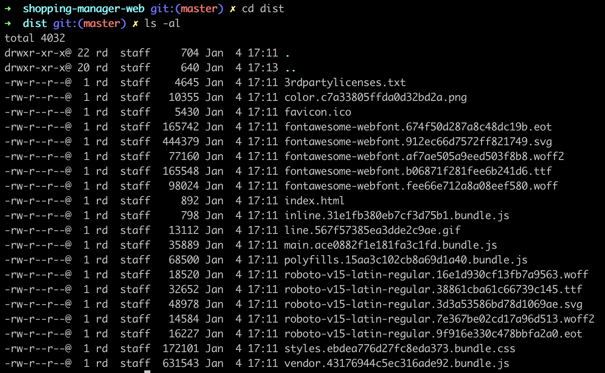
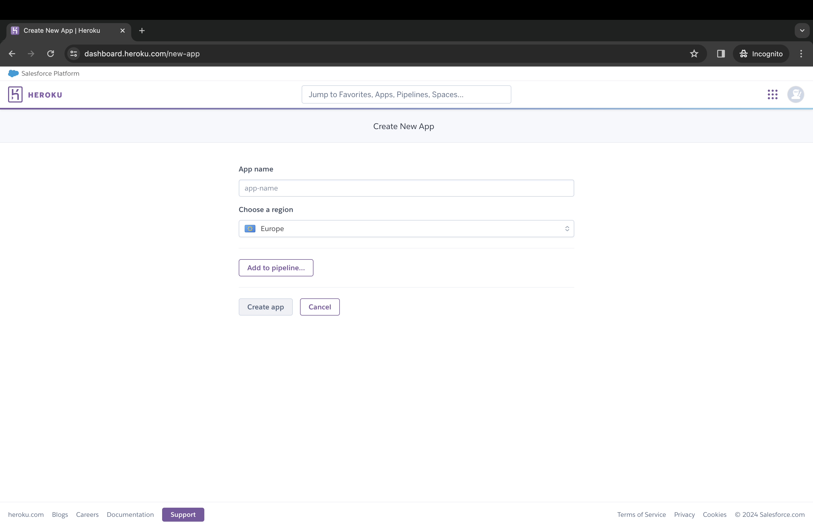

Proces deploymentu to dla deweloperów temat rzeka. Mamy obecnie wiele możliwości oraz wiele gotowych rozwiązań. W tym wpisie zademonstruję, jak wykonać deploy aplikacji napisanej przy użyciu frameworka **Angular** na **Heroku**.

## Przygotowanie

Na początku musimy trochę zmodyfikować `package.json`, który został wygenerowany za pomocą [Angular CLI](/angular-2-angular-cli-pierwsze-kroki/). Nasza aplikacja będzie budowana bezpośrednio na serwerze **Heroku**, dlatego musimy przenieść wymagane zależności z `devDependencies` do `dependencies`. W moim przypadku są to:

- `@angular/cli: ^1.0.1`
- `@angular/compiler-cli: ^4.1.0`
- `typescript: ^2.3.1`

Dodatkowo, zadeklarujmy jaką wersję **node** i **npm** Heroku powinien wykorzystać do budowania aplikacji. Określamy to w następujący sposób:

```json
"engines": {
  "node": "7.5.0",
  "npm": "4.1.2"
},
```

W przypadku nie zadeklarowania wersji node i npm, Heroku użyje domyślnych. W chwili obecnej są to: `node 6.10.3` i `npm 3.10.10`. Lokalnie korzystałem z `node 7.5.0` i `npm 4.1.2`, więc aby wystrzec się błędów i różnic przy instalacji oraz kompilowaniu, zdecydowałem się na zadeklarowanie wersji, z których korzystam.

## Budowanie aplikacji

Jeżeli przygotowaliśmy aplikację, przetestujmy czy uda się nam ją zbudować lokalnie. Do tego celu wykorzystamy komendę:

```bash
ng build --prod --aot
```

Parametr `--prod` oznacza wersję produkcyjną, natomiast `--aot` [Ahead-of-time (AOT) compilation](https://angular.io/guide/aot-compiler).

Polecam zerknąć na [dokumentację Angular CLI](https://web.archive.org/web/20180503095208/https://github.com/angular/angular-cli/wiki/build), gdzie znajdziemy wszystkie atrybuty możliwe do wykorzystania podczas budowania aplikacji.

Jeżeli wszystko przebiegnie pomyślnie, zostanie utworzony folder `dist/`, a w nim znajdować się będzie kod wynikowy. Dodatkowo możemy przetestować poprawność budowania używając serwera http.



Na koniec tego etapu umieszczamy komendę do budowania aplikacji do skryptów. Zależy nam na tym, by Heroku automatycznie wykonało budowanie, więc skrypt nazywamy `postinstall`.

```json
"scripts": {
  ...
  "postinstall": "ng build --prod --aot"
},
```

## Utworzenie serwera

Do uruchomienia naszej aplikacji na Heroku wykorzystamy niezawodnego [Express.js](https://expressjs.com/). Instalujemy framework poleceniem:

```bash
npm install express --save
```

Po pomyślnej instalacji, tworzymy prosty skrypt, który wypuści naszą aplikację na domyślny port Heroku, czyli 8080:

```javascript
const express = require('express');
const app = express();

app.use(express.static(__dirname + '/dist'));
app.listen(process.env.PORT || 8080);
```

Ostatnią czynność, jaką musimy wykonać w tym et

apie, to podmiana w `package.json` skryptu `start`:

```json
"scripts": {
  ...
  "start": "node server.js"
},
```

## Aplikacja na Heroku

Utworzenie aplikacji na Heroku zajmuje chwilę. Na początku wybieramy nazwę aplikacji oraz region, gdzie nasza aplikacja będzie uruchomiona.



Następnie w zakładce **Deploy**, mamy możliwość wybrania sposobu, w jaki nasza aplikacja ma być dystrybuowana. Mając repozytorium aplikacji w serwisie GitHub, zdecydowałem się na wybranie właśnie tego sposobu.


Teraz możemy zdecydować, czy nasza aplikacja ma być automatycznie deployowana czy też nie. Nic nie stoi na przeszkodzie, by wykonać ręczny deploy w dowolnym momencie.


Po wykonanym deployu możemy przejrzeć logi z budowania i uruchomić naszą aplikację.


