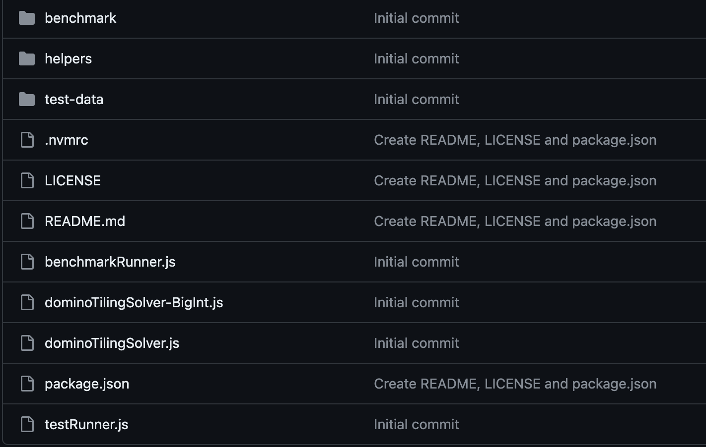
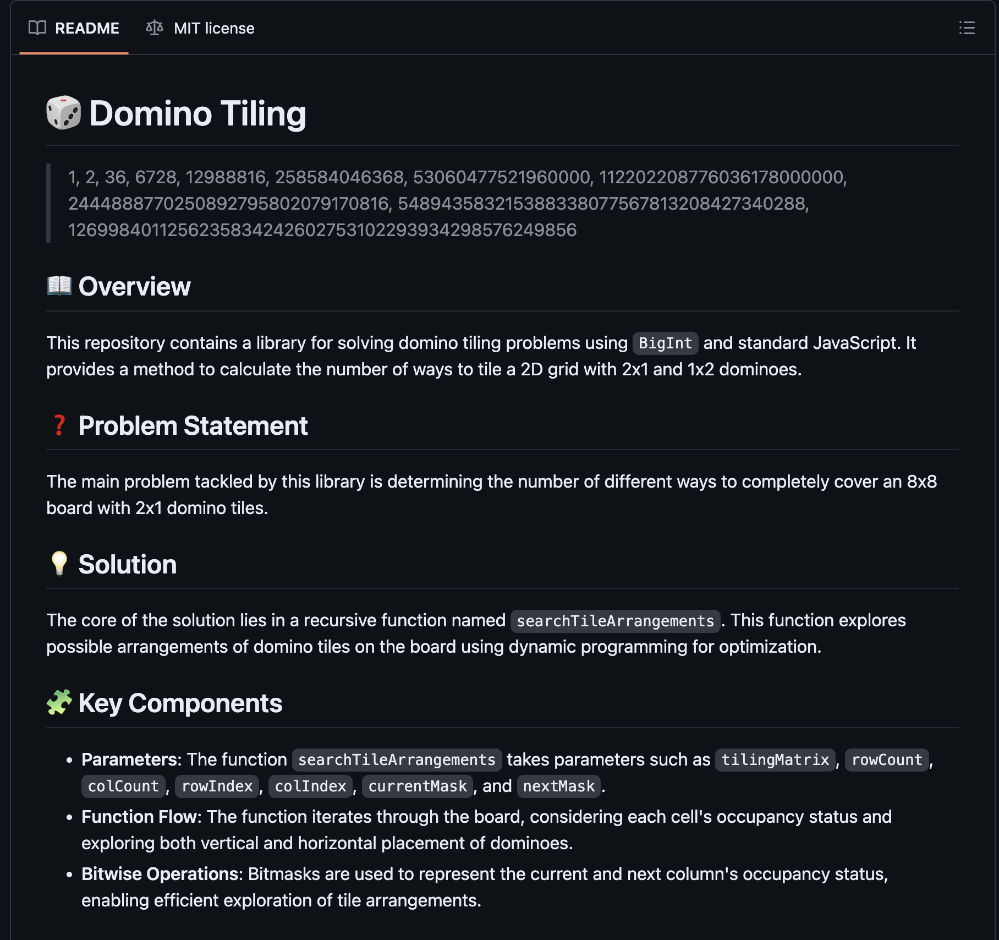

Poprzednim razem popełniłem [artykuł dotyczący układania płytek domino](/domino-tiling) na kwadratowej planszy o wymiarach 2n x 2n. Zamysł był prosty: zaimplementować algorytm, który dla danej planszy zwróci wszystkie możliwe układy płytek domino.

Zgłębiając temat, zauważyłem, że jest on znacznie szerszy i ciekawszy, niż początkowo myślałem. Na początku powstał algorytm, który dla danej planszy zwracał wszystkie możliwe układy płytek domino. Wszystko działało dobrze, ale maksymalny rozmiar planszy wynosił `12 x 12`. Następnie opracowałem wersję algorytmu opartą na `BigInt`, która pozwala na obsługę większych plansz. Dodatkowo, zostały dodane benchmarki oraz testy.

Nadszedł więc czas, aby odseparować `Domino tiling` do osobnego [projektu](https://github.com/dawidrylko/domino-tiling).

## Struktura projektu

```bash
domino-tiling/
├── benchmark/
├── helpers/
├── test-data/
├── benchmarkRunner.js
├── dominoTilingSolver-BigInt.js
├── dominoTilingSolver.js
└── testRunner.js
```

Aktualnie projekt składa się z kilku modułów:
- `benchmark` - katalog zawierający wyniki benchmarków.
- `helpers` - katalog zawierający pomocnicze funkcje.
- `test-data` - katalog zawierający dane testowe.
- `benchmarkRunner.js` - moduł umożliwiający przeprowadzenie benchmarków algorytmów.
- `dominoTilingSolver.js` - główny moduł zawierający algorytm rozwiązujący problem układania płytek domino na planszy 2n x 2n.
- `dominoTilingSolver-BigInt.js` - wariant algorytmu pozwalający na obsługę większych plansz.
- `testRunner.js` - moduł umożliwiający przeprowadzenie testów algorytmów.



## Readme

W projekcie znajduje się również plik `README.md`, który zawiera informacje o projekcie, instalacji, użyciu oraz benchmarkach.



## Jak zacząć?

1. Sklonuj repozytorium:

```
git clone https://github.com/dawidrylko/domino-tiling.git
```

2. Uruchom projekt:

```
npm start
```

Ta komenda uruchomi benchmark 1000 razy. Jeśli chcesz uruchomić inną ilość iteracji, użyj komendy:

```
node benchmarkRunner.js -n <k>
```

## Co dalej?

Na pewno chciałbym dodać więcej testów oraz benchmarków. W zamyśle jest także opracowanie algorytmu, który będzie generować sekwencję:

> 1, 2, 36, 6728, 12988816, 258584046368, 53060477521960000, 112202208776036178000000, 2444888770250892795802079170816, 548943583215388338077567813208427340288, 1269984011256235834242602753102293934298576249856

Zapraszam do testowania oraz zgłaszania propozycji nowych funkcjonalności. Projekt jest dostępny na [GitHubie](https://github.com/dawidrylko/domino-tiling).
