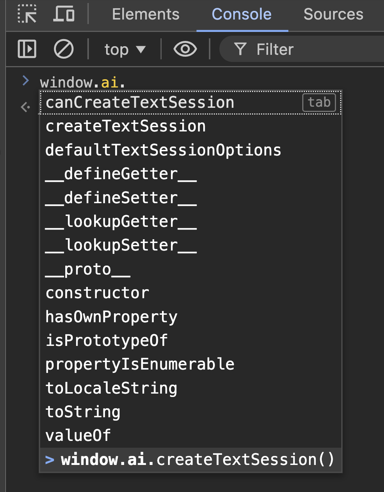

Wychodząc naprzeciw oczekiwaniom użytkowników oraz programistów, Google wprowadził eksperymentalne funkcje AI w przeglądarkach Chrome dla deweloperów (Canary i Dev). Dzięki temu już teraz możemy korzystać z najnowszego wbudowanego w przeglądarkę Gemini Nano. W tym artykule pokrótce przedstawię, jak skorzystać z tych funkcji.

> Aby wyszukiwanie w internecie było łatwiejsze, bezpieczniejsze i bardziej dostępne, wprowadziliśmy do Chrome najnowsze systemy uczące się i technologie AI. Deweloperzy mogą wykorzystać tę technologię, aby zwiększyć komfort korzystania z internetu.

## Instalacja

W celu skorzystania z najnowszych funkcji AI w Chrome, należy pobrać odpowiednią wersję przeglądarki. W momencie pisania tego artykułu funkcje AI są dostępne w wersji nightly dla deweloperów (Canary) oraz w wersji deweloperskiej:

1. [Wersja nightly dla deweloperów (Canary)](https://www.google.com/intl/pl/chrome/canary/)
   
2. [Google Chrome w wersji deweloperskiej](https://www.google.com/intl/pl/chrome/dev/)
   

Po instalacji odpowiedniej przeglądarki możemy zauważyć, że funkcje, które nas interesują, są domyślnie wyłączone.


## Ustawienia

Aby skorzystać z nowych funkcji AI w Chrome, należy włączyć odpowiednie flagi. W tym celu wpisujemy w pasek adresu przeglądarki `chrome://flags` i klikamy enter. Następnie szukamy odpowiednich flag.

1.  Prompt API for Gemini Nano - **Enable**

    > Enables the exploratory Prompt API, allowing you to send natural language instructions to a built-in large language model (Gemini Nano in Chrome). Exploratory APIs are designed for local prototyping to help discover potential use cases, and may never launch.

    ```
    chrome://flags/#prompt-api-for-gemini-nano
    ```

    

2.  Enables optimization guide on device - **Enable BypassPerfRequirement**

    > Enables the optimization guide to execute models on device. – Mac, Windows, Linux, ChromeOS, Lacros

    ```
    chrome://flags/#optimization-guide-on-device-model
    ```

    

**Po ustawieniu flag należy zrestartować przeglądarkę.**


Następnie przechodzimy do `chrome://components` i sprawdzamy, czy jest zainstalowany `Optimization Guide On Device Model`.

Jeżeli nie pojawił się na liście, należy wyłączyć/włączyć flagi, zrestartować przeglądarkę i powtarzać tę czynność aż do momentu, kiedy komponent się pojawi. Jeżeli czynność się powiodła, możemy zauważyć, że funkcje AI są dostępne.


## Praca z `window.ai`

Tworzenie sesji wykonujemy za pomocą komendy `createTextSession`. Możemy również sprawdzić, czy możemy utworzyć sesję za pomocą komendy `canCreateTextSession`.


```javascript
const session = await window.ai.createTextSession();
```

Teraz możemy wykorzystać sesję do interakcji z AI. W tym celu możemy wykorzystać komendę `prompt` lub `promptStreaming`.

Przykładowe wywołanie komendy `prompt`:


```javascript
const result = await session.prompt('Hi! I am Dawid.');
console.log(result);
```


```javascript
await session.prompt('Tell me a joke');
```

## API



### Window AI API

```javascript
await window.ai.canCreateTextSession();
// 'readily'
```

Ta funkcja sprawdza, czy możliwe jest utworzenie sesji tekstowej AI. Zwraca wartość `'readily'`, jeśli jest to możliwe.

```javascript
await window.ai.defaultTextSessionOptions();
// {temperature: 0.800000011920929, topK: 3}
```

Ta funkcja zwraca domyślne opcje konfiguracji sesji tekstowej AI. Opcje te obejmują parametry takie jak `temperature` i `topK`.

```javascript
await window.ai.createTextSession(options);
// AITextSession {}
```

Ta funkcja tworzy nową sesję tekstową AI z podanymi opcjami. Zwraca obiekt `AITextSession`, który można wykorzystać do dalszej interakcji z AI.

### Session API


```javascript
await session.prompt('Hi! I am Dawid.');
// ' Hey Dawid!'
```

Ta funkcja wysyła komunikat tekstowy do sesji AI i zwraca odpowiedź. W tym przypadku AI odpowiada na przywitanie imieniem.

```javascript
await session.promptStreaming('Hi! I am Dawid.');
// ReadableStream {locked: false}
```

Ta funkcja wysyła komunikat do AI i zwraca odpowiedź w formie strumienia danych. Jest to przydatne do przetwarzania większych ilości tekstu w czasie rzeczywistym.

```javascript
await session.clone();
// AITextSession {}
```

Ta funkcja tworzy kopię istniejącej sesji tekstowej AI. Może być używana do rozpoczęcia nowej sesji z tymi samymi ustawieniami.

```javascript
await session.destroy();
// undefined
```

Ta funkcja kończy sesję tekstową AI i zwalnia zasoby. Po jej wywołaniu sesja nie będzie już dostępna.

## Źródła

- [Artificial Intelligence | Chrome for Developers](https://developer.chrome.com/docs/ai)
- [Chrome is adding `window.ai` – a Gemini Nano AI model right inside the browser | Hacker News](https://news.ycombinator.com/item?id=40834600)
- [Google Chrome Canary](https://www.google.com/intl/pl/chrome/canary/)
- [Google Chrome Dev](https://www.google.com/intl/pl/chrome/dev/)
