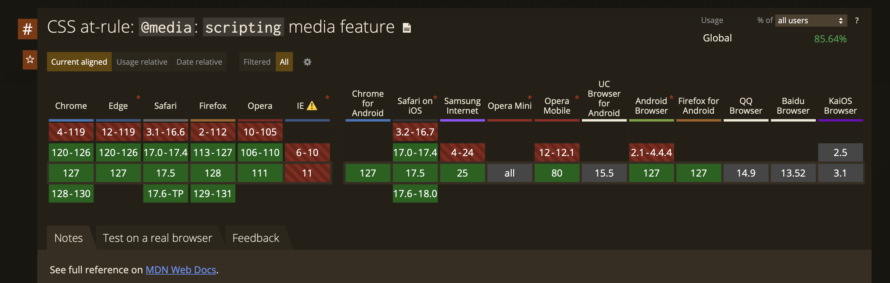

Kaskadowe arkusze stylów (CSS) można lubić lub nie. Nie można jednak zaprzeczyć, że są one niezwykle ważne w tworzeniu stron internetowych. Dzisiejszy wpis poświęcony jest jednej z mniej popularnych, ale użytecznych funkcji - `@media (scripting)`.

## Co to jest `@media (scripting)`?

`@media (scripting)` jest z nami już od pewnego czasu, ale wciąż nie jest szeroko stosowane. Ta funkcjonalność umożliwia dostosowanie stylów w zależności od tego, czy skrypty (np. JavaScript) są dostępne lub wyłączone.

## Składnia

1. `none` - Skrypty są **WYŁĄCZONE** w bieżącym dokumencie.

```css
@media (scripting: none) {
  /* Style dla sytuacji, gdy skrypty są całkowicie niedostępne */
}
```

2. `initial-only` - Skrypty są **WŁĄCZONE** podczas początkowego ładowania strony, ale później **WYŁĄCZONE**.

```css
@media (scripting: initial-only) {
  /* Style dla sytuacji, gdy skrypty są dostępne tylko podczas początkowego ładowania strony */
}
```

3. `enabled` - Skrypty są **WŁĄCZONE** i aktywne w bieżącym dokumencie.

```css
@media (scripting: enabled) {
  /* Style dla sytuacji, gdy skrypty są dostępne i aktywne */
}
```

## Wsparcie przeglądarek



Funkcja `@media (scripting)` jest wspierana przez większość nowoczesnych przeglądarek, ale warto sprawdzić aktualny stan wsparcia na [Can I use](https://caniuse.com/?search=css-media-scripting).

## Przykładowe zastosowanie

- **[Graceful degradation](https://developer.mozilla.org/en-US/docs/Glossary/Graceful_degradation):** Zapewnienie pełnej funkcjonalności dla użytkowników z najnowszymi przeglądarkami, jednocześnie oferując podstawową funkcjonalność dla użytkowników ze starszymi wersjami przeglądarek.
- **[Progressive Enhancement](https://developer.mozilla.org/en-US/docs/Glossary/Progressive_Enhancement):** Dostarczanie podstawowej zawartości jak najszerszemu gronu odbiorców, z jednoczesnym dodawaniem bardziej zaawansowanych funkcji dla użytkowników z najnowszymi przeglądarkami.
- **Bezpieczeństwo:** Niektórzy użytkownicy lub oprogramowanie zarządzające mogą wyłączyć skrypty w celu zwiększenia bezpieczeństwa.
- **Blokowanie reklam:** Użytkownicy mogą korzystać z blokerów reklam, które blokują skrypty.

### Przykład

Przyjrzyjmy się przykładowemu kodowi CSS, który demonstruje użycie `@media (scripting)`:

```css
p {
  color: black;
}

@media (scripting: none) {
  p {
    color: red;
  }
}

@media (scripting: initial-only) {
  p {
    color: green;
  }
}

@media (scripting: enabled) {
  p {
    color: blue;
  }
}
```

W powyższym przykładzie, kolor tekstu w paragrafie (`<p>`) zmienia się w zależności od dostępności skryptów w przeglądarce.

## Podsumowanie

`@media (scripting)` to ciekawe rozwiązanie, które pozwala na dostosowanie stylów CSS w zależności od dostępności skryptów w przeglądarce. Nawet jeśli nie jest używane na co dzień, warto wiedzieć o istnieniu tej funkcjonalności.

## Źródła

- [scripting - CSS: Cascading Style Sheets | MDN](https://developer.mozilla.org/en-US/docs/Web/CSS/@media/scripting)
- ["css-media-scripting" | Can I use... Support tables for HTML5, CSS3, etc](https://caniuse.com/?search=css-media-scripting)
