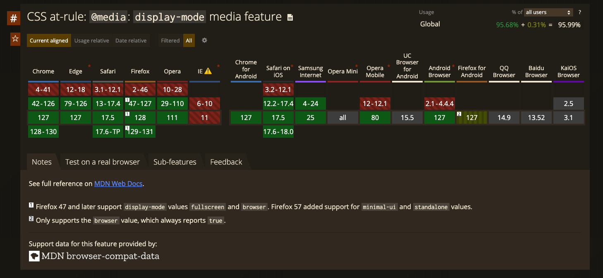

Ostatni wpis poświęcony był [funkcji @media (scripting)](/css-media-feature-scripting/). Dzisiaj będziemy kontynuować podróż po `Media Queries Level 5` i skupimy się na `@media (display-mode)`.

## Co to jest `@media (display-mode)`?

`@media (display-mode)` to funkcja, która umożliwia dostosowanie stylów w zależności od trybu wyświetlania aplikacji.

[Progressive Web Apps](https://developer.mozilla.org/en-US/docs/Web/Progressive_web_apps) (PWA) mogą ustawić tryb wyświetlania, ustawiając [`display`](https://developer.mozilla.org/en-US/docs/Web/Manifest/display) w pliku manifestu aplikacji. `@media (display-mode)` pozwala na dostosowanie stylów CSS w zależności od ustawionego trybu wyświetlania. Warto jednak zauważyć, że żądana wartość może nie być zawsze obsługiwana przez przeglądarkę.

## Składnia

1. `browser` - Aplikacja otwiera się w standardowej karcie przeglądarki lub nowym oknie. Jest to domyślny tryb wyświetlania aplikacji internetowych.

```css
@media (display-mode: browser) {
  /* Style dla sytuacji, gdy aplikacja działa w przeglądarce */
}
```

2. `fullscreen` - Aplikacja uruchamia się na pełnym ekranie, ukrywając wszystkie elementy interfejsu przeglądarki ([chrome](https://developer.mozilla.org/en-US/docs/Glossary/Chrome)). Tryb ten zapewnia użytkownikowi pełne zanurzenie w aplikacji.

```css
@media (display-mode: fullscreen) {
  /* Style dla sytuacji, gdy aplikacja działa w pełnym ekranie */
}
```

3. `minimal-ui` - Aplikacja działa w trybie przypominającym aplikacje natywne, z podstawowymi elementami interfejsu przeglądarki, takimi jak przyciski nawigacyjne. Elementy te mogą różnić się w zależności od przeglądarki.

```css
@media (display-mode: minimal-ui) {
  /* Style dla sytuacji, gdy aplikacja działa w trybie minimal-ui */
}
```

4. `picture-in-picture` - Aplikacja działa w trybie "obraz w obrazie", wyświetlając się w małym oknie na ekranie, co pozwala na jednoczesne korzystanie z innych aplikacji lub oglądanie innych treści.

```css
@media (display-mode: picture-in-picture) {
  /* Style dla sytuacji, gdy aplikacja działa w trybie obraz w obrazie */
}
```

5. `standalone` - Aplikacja działa jako samodzielna aplikacja, wyglądając i zachowując się jak aplikacja natywna, bez elementów interfejsu przeglądarki.

```css
@media (display-mode: standalone) {
  /* Style dla sytuacji, gdy aplikacja działa jako samodzielna aplikacja */
}
```

6. `window-controls-overlay` - Aplikacja działa jako okno z nakładką na kontrolki, które zawiera przyciski do minimalizacji, maksymalizacji i zamknięcia okna.

```css
@media (display-mode: window-controls-overlay) {
  /* Style dla sytuacji, gdy aplikacja działa jako okno z nakładką na kontrolki */
}
```

## Wsparcie przeglądarek



Funkcja `@media (display-mode)` jest wspierana przez większość nowoczesnych przeglądarek. Aktualny stan wsparcia można sprawdzić na [Can I use](https://caniuse.com/mdn-css_at-rules_media_display-mode).

## Przykładowe zastosowanie

- **Personalizacja interfejsu:** Dostosowanie interfejsu użytkownika w zależności od trybu wyświetlania aplikacji.
- **Optymalizacja wydajności:** Dostosowanie stylów CSS do trybu wyświetlania, aby zoptymalizować wydajność aplikacji.
- **Zwiększenie użyteczności:** Dostosowanie interfejsu użytkownika do trybu wyświetlania, aby zwiększyć użyteczność aplikacji.

### Przykład

Przyjrzyjmy się przykładom użycia `@media (display-mode)`:

```css
@media all and (display-mode: fullscreen) {
  body {
    margin: 0;
    border: 2px dashed red;
  }
}
```

W powyższym przykładzie, kiedy aplikacja jest uruchomiona w trybie pełnoekranowym, marginesy ciała dokumentu są ustawione na 0, a ramka jest czerwona i przerywana.

```css
@media (display-mode: picture-in-picture) and (prefers-color-scheme: light) {
  body {
    background: cyan;
  }
}

@media (display-mode: picture-in-picture) and (prefers-color-scheme: dark) {
  body {
    background: #3e3e3e;
  }

  a {
    color: cyan;
  }
}
```

W tym przykładzie dostosowujemy tło i kolor linków w zależności od trybu `picture-in-picture` oraz preferowanego schematu kolorów (jasny lub ciemny).

## Podsumowanie

`@media (display-mode)` to interesująca funkcja, która pozwala na dostosowanie stylów CSS w zależności od trybu wyświetlania aplikacji. Dzięki niej możemy tworzyć bardziej spersonalizowane i zoptymalizowane interfejsy użytkownika, co zwiększa użyteczność i satysfakcję z korzystania z aplikacji.

## Źródła

- [display-mode - CSS: Cascading Style Sheets | MDN](https://developer.mozilla.org/en-US/docs/Web/CSS/@media/display-mode)
- [CSS at-rule: `@media`: `display-mode` media feature | Can I use](https://caniuse.com/mdn-css_at-rules_media_display-mode)
