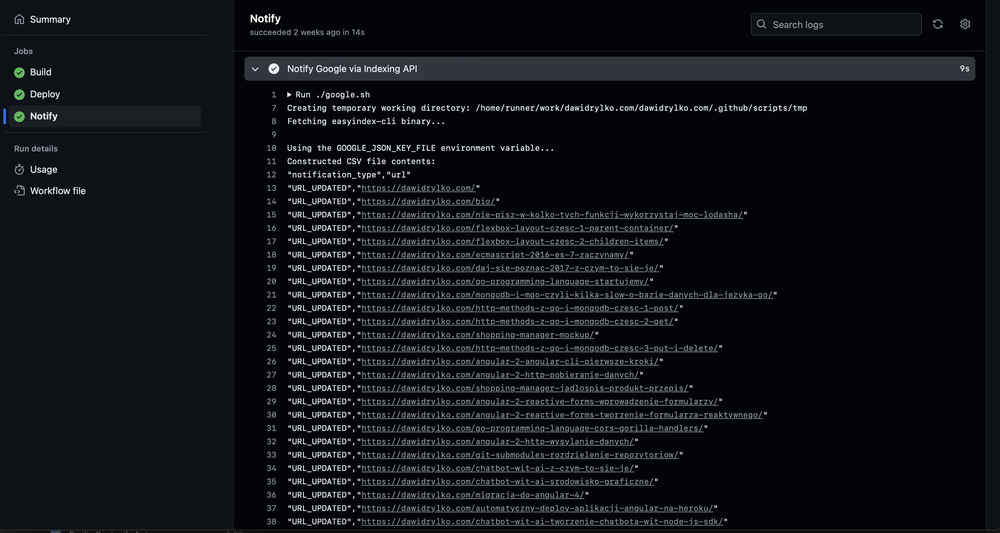

Jeżeli proces może zostać zautomatyzowany, warto to zrobić. Takie podejście pozwala zaoszczędzić czas, uniknąć błędów i zwiększyć wydajność. W tym artykule przedstawię prostą automatyzację przesyłania adresów URL do Google przy użyciu Indexing API i GitHub Actions.

## Wstęp

W chwili pisania tego artykułu moja strona internetowa jest hostowana na platformie GitHub Pages, a do wdrożeń wykorzystuję GitHub Actions. Wszystko działa dobrze, ale zauważyłem, że Google nie indeksuje nowych stron tak szybko, jakbym tego oczekiwał. Ręczne dodawanie podstron jest problematyczne i czasochłonne. Dlatego postanowiłem wykorzystać Indexing API i zintegrować je z moim procesem wdrożenia.

## Wymagania wstępne

Przed przystąpieniem do konfiguracji, upewnij się, że posiadasz:

- Konto w Google Cloud Console.
- Dostęp do Google Search Console dla odpowiedniej witryny.
- Repozytorium na GitHubie, które jest skonfigurowane do korzystania z GitHub Actions.
- Podstawową znajomość GitHub Actions oraz pracy z API.

## Co to jest Indexing API?

W [dokumentacji Indexing API](https://developers.google.com/search/apis/indexing-api/v3/quickstart) można przeczytać:

> Interfejs Indexing API umożliwia właścicielowi witryny powiadomienie Google o dodaniu lub usunięciu strony. Dzięki temu Google może zaplanować nowe indeksowanie stron i w rezultacie zapewnić wyższą jakość ruchu użytkowników.

Indexing API oferuje kilka metod, które pozwalają na zarządzanie indeksowaniem stron:

- **Aktualizacja URL**: powiadomienie Google o nowym adresie URL do zaindeksowania lub o zaktualizowaniu treści zamieszczonych pod przesłanym wcześniej adresem URL.

  ```http
  POST https://indexing.googleapis.com/v3/urlNotifications:publish
  ```

  ```json
  {
    "url": "content_location",
    "type": "URL_UPDATED"
  }
  ```

- **Usunięcie URL**: powiadomienie Google o usunięciu strony z serwerów, co skutkuje jej usunięciem z indeksu.

  ```http
  POST https://indexing.googleapis.com/v3/urlNotifications:publish
  ```

  ```json
  {
    "url": "content_location",
    "type": "URL_DELETED"
  }
  ```

- **Uzyskanie stanu żądania**: sprawdzenie, kiedy ostatnio zostało odebrane powiadomienie dotyczące danego adresu URL.

  ```http
  GET https://indexing.googleapis.com/v3/urlNotifications/metadata?url=url-encoded_url
  ```

- **Wysyłanie zbiorczych próśb o indeksowanie**: zmniejszenie liczby połączeń HTTP, które musi nawiązać klient.

  ```http
  POST /batch HTTP/1.1
  Host: indexing.googleapis.com
  Content-Length: content_length
  Content-Type: multipart/mixed; boundary="===============7330845974216740156=="
  Authorization: Bearer oauth2_token

  --===============7330845974216740156==
  Content-Type: application/http
  Content-Transfer-Encoding: binary
  Content-ID: <b29c5de2-0db4-490b-b421-6a51b598bd22+2>

  POST /v3/urlNotifications:publish [1]
  Content-Type: application/json
  accept: application/json
  content-length: 58

  { "url": "http://example.com/jobs/42", "type": "URL_UPDATED" }
  --===============7330845974216740156==
  Content-Type: application/http
  Content-Transfer-Encoding: binary
  Content-ID: <b29c5de2-0db4-490b-b421-6a51b598bd22+1>

  POST /v3/urlNotifications:publish [2]
  Content-Type: application/json
  accept: application/json
  content-length: 75

  { "url": "http://example.com/widgets/1", "type": "URL_UPDATED" }
  --===============7330845974216740156==
  Content-Type: application/http
  Content-Transfer-Encoding: binary
  Content-ID: <b29c5de2-0db4-490b-b421-6a51b598bd22+3>

  POST /v3/urlNotifications:publish [3]
  Content-Type: application/json
  accept: application/json
  content-length: 58

  { "url": "http://example.com/jobs/43", "type": "URL_DELETED" }
  --===============7330845974216740156==
  ```

## Konfiguracja

### Utworzenie konta usługi w Google Cloud Console

1. Przejdź do [Konta usługi – Administracja – Google Cloud Console](https://console.developers.google.com/iam-admin/serviceaccounts).
2. Kliknij `Utwórz projekt`.
   
3. Wprowadź nazwę projektu, np. `Nowy projekt`, i kliknij `Utwórz`.
   
4. Kliknij `Utwórz konto usługi`.
   
5. Wprowadź nazwę konta usługi, np. `Testowa nazwa`, i kliknij `Utwórz`.
   
6. Pomijamy następny krok, klikając `Dalej`.
   
7. Potwierdź klikając `Gotowe`.
   
8. Zanotuj adres e-mail konta usługi, gdyż będzie on potrzebny w dalszych krokach. Z listy opcji wybierz `Zarządzanie kluczami`.
   
9. Kliknij `Dodaj klucz`, a następnie `Utwórz nowy klucz`.
   
10. Wybierz typ klucza JSON, a następnie kliknij `Utwórz`.
    
11. Klucz zostanie zapisany na dysku w formie pliku JSON.
    
    Pobrany plik z kluczem będzie potrzebny później, aby narzędzie działało poprawnie.
12. W wyszukiwarce wpisz `Indexing API` i wybierz z listy `Web Search Indexing API`.
    
13. Kliknij `Włącz`, aby aktywować interfejs.
    

### Dodanie konta usługi do Google Search Console

1. Zaloguj się do [Google Search Console](https://www.google.com/webmasters/verification/home).
2. Wybierz usługę, do której chcesz dodać konto.
3. Przejdź do sekcji `Użytkownicy i uprawnienia` i kliknij `Dodaj użytkownika`.
   
4. Wprowadź adres e-mail konta usługi, które utworzyłeś w poprzednich krokach.
   

### Konfiguracja GitHub Actions Secrets

Ostatnią kwestią, związaną z konfiguracją, jest dodanie klucza do GitHub Actions Secrets. W ten sposób będziemy mogli bezpiecznie przechowywać klucz API w repozytorium.

1. Przejdź do swojego repozytorium na GitHubie.
2. Wybierz `Settings` z górnego menu.
3. Z menu po lewej stronie wybierz `Secrets and variables`, a następnie `Actions`.
4. Kliknij `New repository secret` i dodaj nowy sekret.
   
5. W polu `Name` wprowadź nazwę sekretu (np. `GOOGLE_JSON_KEY_FILE`), a w polu `Secret` wklej całą zawartość pliku JSON z kluczem pobranym wcześniej (w kroku 11). Upewnij się, że wklejasz całą zawartość pliku JSON, łącznie z nawiasami klamrowymi i wszystkimi wartościami.
6. Kliknij `Add secret`, aby zapisać sekret.

## GitHub Actions

W celu automatyzacji procesu przesyłania adresów URL do Google za pomocą Indexing API można wykorzystać dowolne narzędzie do wykonywania poleceń w systemie operacyjnym. W moim przypadku jest to skrypt bash oraz GitHub Actions.

### `google.sh`

W pliku `google.sh` znajduje się skrypt, który pobiera adresy URL z mojej strony internetowej i przesyła je do Google za pomocą Indexing API. Skrypt korzysta z narzędzia [easyindex-cli](https://github.com/usk81/easyindex-cli). Został zaczerpnięty z artykułu [Live Update Google through the Indexing API in GitHub Actions](https://www.jpatrickfulton.dev/blog/2023-07-13-google-and-indexingapi/) i dostosowany do moich potrzeb.

Obecną konfigurację znajdziesz [tutaj](https://github.com/dawidrylko/dawidrylko.com/blob/master/.github/scripts/google.sh).

```sh
#!/usr/bin/env bash
set -o errexit
set -o nounset

BASE_URL="https://dawidrylko.com"
STATIC_PAGES=("bio")
POSTS_DIR="../../../content/pl/"
TMP_DIR="$(pwd)/tmp"
TMP_FILE="$TMP_DIR/google.csv"

start_time=$(date +%s.%3N)

log_error() {
  echo "Error: $1"
  exit 1
}

# Create a temporary working directory
create_tmp_directory() {
  if [ ! -d "$TMP_DIR" ]; then
    echo "Creating temporary working directory: $TMP_DIR"
    mkdir "$TMP_DIR" || log_error "Failed to create directory $TMP_DIR"
  fi
}

# Download https://github.com/usk81/easyindex-cli
download_easyindex_cli() {
  EASYINDEX_CLI="./easyindex-cli"
  if [ ! -f "$EASYINDEX_CLI" ]; then
    echo "Fetching easyindex-cli binary..."
    curl -s -L "https://github.com/usk81/easyindex-cli/releases/download/v1.0.6/easyindex-cli_1.0.6_linux_amd64.tar.gz" | tar xz || log_error "Failed to download and extract easyindex-cli binary."
    echo
  fi
}

# Copy credentials file
copy_credentials_file() {
  echo "Using the GOOGLE_JSON_KEY_FILE environment variable..."
  if [ -z "${GOOGLE_JSON_KEY_FILE:-}" ]; then
    log_error "GOOGLE_JSON_KEY_FILE is not set or is empty. Exiting."
  fi

  echo "$GOOGLE_JSON_KEY_FILE" > "$TMP_DIR/credentials.json" || log_error "Failed to write to credentials file $TMP_DIR/credentials.json"
}

# Construct submission payload
construct_submission_payload() {
  echo "\"notification_type\",\"url\"" >> "$TMP_FILE"
  echo "\"URL_UPDATED\",\"${BASE_URL}/\"" >> "$TMP_FILE"

  for page in "${STATIC_PAGES[@]}"; do
    echo "\"URL_UPDATED\",\"${BASE_URL}/${page}/\"" >> "$TMP_FILE"
  done

  if [ -d "$POSTS_DIR" ]; then
    POSTS=("$POSTS_DIR"*/)
    for ((i=0; i<${#POSTS[@]}; i++)); do
      POST_DIR="${POSTS[i]}"
      POST_NAME=$(basename "$POST_DIR")
      POST_SLUG="${POST_NAME:12}"
      echo "\"URL_UPDATED\",\"${BASE_URL}/${POST_SLUG}/\"" >> "$TMP_FILE"
    done
  fi

  echo "Constructed CSV file contents:"
  cat "$TMP_FILE"
  echo
}

# Submit URLs to Google search engine
submit_to_search_engine() {
  echo "Submitting to Google via Indexing API..."
  "$EASYINDEX_CLI" google publish --csv "$TMP_FILE" -C "$TMP_DIR/credentials.json" || log_error "An error returned by easyindex-cli. Exiting."
  echo
}

# Main execution
create_tmp_directory

cd "$TMP_DIR" || log_error "Failed to change to temporary directory $TMP_DIR"

download_easyindex_cli
copy_credentials_file
construct_submission_payload
submit_to_search_engine

end_time=$(date +%s.%3N)
duration=$(echo "scale=0; ($end_time - $start_time) * 1000 / 1" | bc)
echo "---------------------------------"
echo "Script completed in $duration milliseconds."
```

Po utworzeniu pliku `google.sh`, należy nadać mu uprawnienia do wykonywania. W przeciwnym razie skrypt nie będzie mógł być uruchomiony:

```bash
chmod +x .github/scripts/google.sh
```

Ten krok jest kluczowy, ponieważ bez nadania uprawnień wykonywania, GitHub Actions nie będzie mógł uruchomić skryptu, co spowoduje błąd podczas działania workflow.

### `cd.yml`

Wykorzystując skrypt `google.sh`, można go uruchomić w GitHub Actions. W pliku `cd.yml` dodałem nowy krok, który uruchamia skrypt, jeżeli w komunikacie commita znajduje się `[notify]`.

Obecną konfigurację znajdziesz [tutaj](https://github.com/dawidrylko/dawidrylko.com/blob/master/.github/workflows/cd.yml#L74).

```yaml
notify:
  name: Notify
  runs-on: ubuntu-latest
  needs: deploy
  if: "contains(github.event.head_commit.message, '[notify]')"
  steps:
    - name: Checkout
      uses: actions/checkout@v4

    - name: Notify Google via Indexing API
      env:
        GOOGLE_JSON_KEY_FILE: ${{ secrets.GOOGLE_JSON_KEY_FILE }}
      working-directory: '.github/scripts'
      shell: bash
      run: ./google.sh
```

## Bezpieczeństwo

Podczas korzystania z Google Cloud Console, Search Console oraz GitHub Actions, bezpieczeństwo powinno być priorytetem:

1. **Przechowywanie kluczy API**:

   - Używaj sekretów w GitHub Actions do przechowywania kluczy API, aby nie były one widoczne w kodzie źródłowym.
   - Regularnie zmieniaj klucze i monitoruj dostęp do swoich zasobów w Google.

2. **Zabezpieczenie kont**:

   - Skonfiguruj dwuetapową weryfikację oraz monitoruj dostęp do konta usługi.

3. **Monitorowanie i audyt**:
   - Regularnie sprawdzaj logi związane z Indexing API, aby wykrywać nieautoryzowane próby dostępu.

## Uruchomienie

Po zakończeniu konfiguracji, wystarczy dodać nowy commit z komunikatem zawierającym `[notify]`. Spowoduje to, że GitHub Actions uruchomi skrypt `google.sh`, który przekaże adresy URL do Google za pomocą Indexing API.




## Podsumowanie

Automatyzacja dodawania adresów URL do Google Indexing API za pomocą GitHub Actions to doskonały sposób na oszczędność czasu i zwiększenie wydajności. Poprzez zintegrowanie tego procesu z istniejącymi narzędziami, możesz mieć pewność, że strony będą szybciej indeksowane przez Google. Pamiętaj jednak o zachowaniu najwyższych standardów bezpieczeństwa, aby chronić swoje zasoby i dane.

Moja strona internetowa oparta jest na Gatsby, a kod źródłowy jest hostowany na platformie GitHub. Należy pamiętać, że ustawienia mogą się różnić w zależności od wykorzystywanych technologii.

Pełne i aktualne informacje znajdują się w moim repozytorium [dawidrylko/dawidrylko.com](https://github.com/dawidrylko/dawidrylko.com) na GitHubie.

## Źródła

- [Indexing API Quickstart | Google Search Central | Google for Developers](https://developers.google.com/search/apis/indexing-api/v3/quickstart)
- [usk81/easyindex-cli | GitHub](https://github.com/usk81/easyindex-cli)
- [Live Update Google through the Indexing API in GitHub Actions | jpatrickfulton.dev](https://www.jpatrickfulton.dev/blog/2023-07-13-google-and-indexingapi/)
