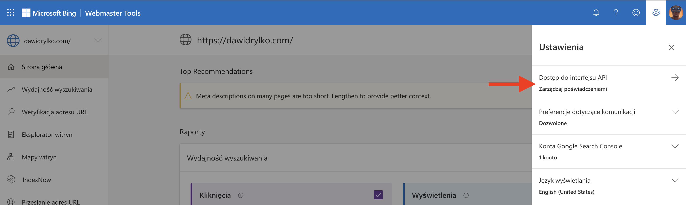
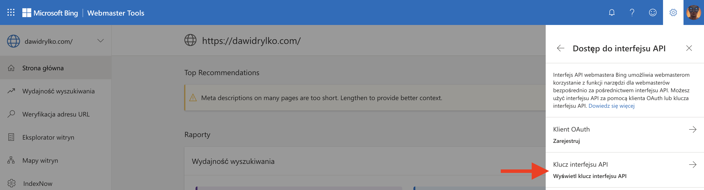
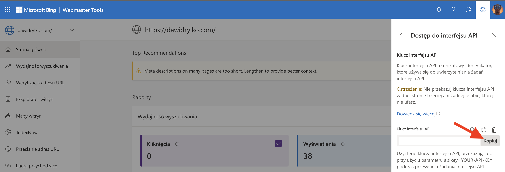
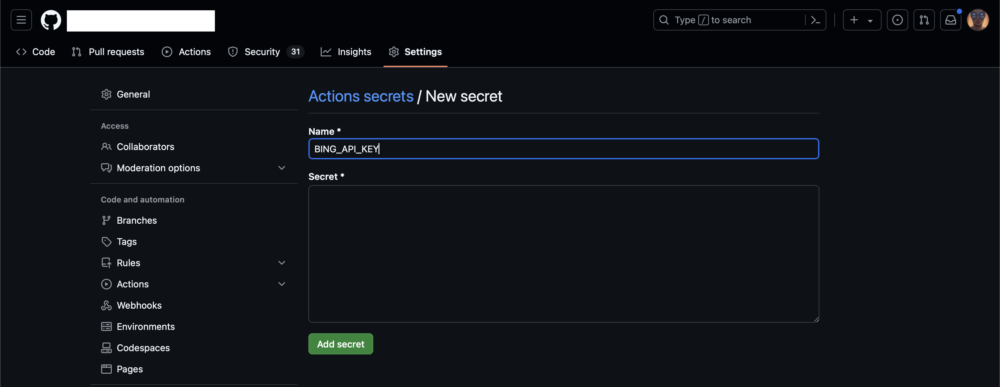
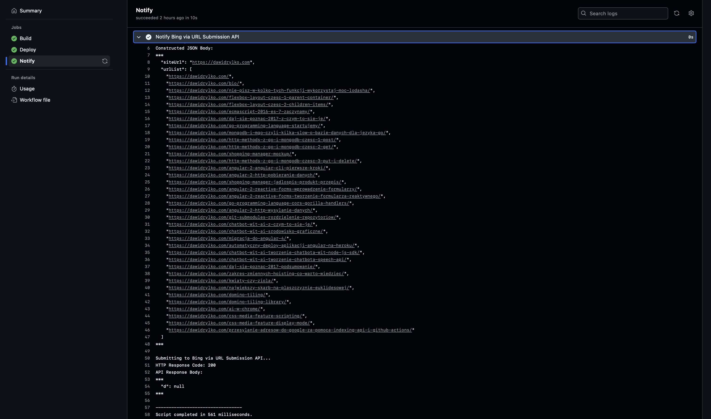
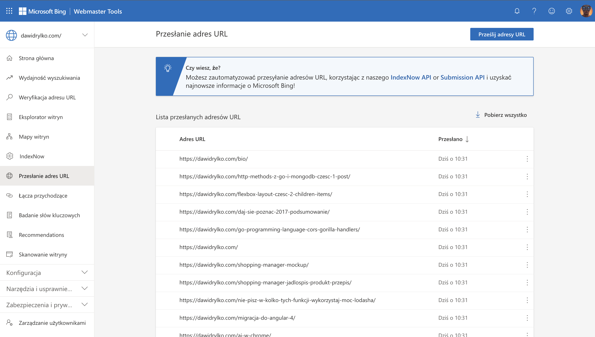

Jeżeli proces można zautomatyzować, warto to zrobić. Podobnie jak w przypadku **Google Indexing API**, Bing udostępnia własne **URL Submission API**. Dzięki temu możemy natychmiast informować wyszukiwarkę o nowych i zmienionych podstronach, co przyspiesza ich indeksację i pojawianie się w wynikach wyszukiwania.

## Wstęp

Wcześniej opisałem proces integracji z [Google Indexing API](/przesylanie-adresow-do-google-za-pomoca-indexing-api-i-github-actions/). Teraz skoncentruję się na Bing. Moja strona jest hostowana na **GitHub Pages**, a do wdrożeń wykorzystuję **GitHub Actions**. Aby skrócić czas oczekiwania na zaindeksowanie nowych lub zmienionych treści, wdrożę rozwiązanie, które po każdym wdrożeniu automatycznie wyśle zaktualizowane adresy URL do Bing za pośrednictwem Microsoft Bing URL Submission API.

## Wymagania wstępne

Przed rozpoczęciem konfiguracji upewnij się, że:

- Masz zarejestrowaną witrynę w Bing Webmaster Tools.
- Posiadasz potwierdzoną własność domeny w Bing Webmaster Tools.
- Dysponujesz repozytorium na GitHubie, skonfigurowanym do użycia GitHub Actions.
- Znasz podstawy GitHub Actions i komunikacji z API.

## Czym jest Microsoft Bing URL Submission API?

Microsoft Bing URL Submission API pozwala witrynom informować wyszukiwarkę o nowych oraz zaktualizowanych stronach. Dzięki temu Bing może szybciej uwzględnić wprowadzone zmiany, co przekłada się na sprawniejsze aktualizowanie wyników wyszukiwania.

Z dokumentacji Microsoft Bing:

{/* https://www.bing.com/webmasters/url-submission-api */}

> **Microsoft Bing URL Submission API** to prosty w integracji interfejs, umożliwiający natychmiastowe powiadamianie Bing o zmianach w treści. Dzięki temu nowe lub zaktualizowane podstrony są szybciej indeksowane.

{/* https://learn.microsoft.com/en-us/dotnet/api/microsoft.bing.webmaster.api.interfaces.iwebmasterapi.submiturlbatch */}

API umożliwia przesyłanie wielu adresów URL w jednym żądaniu (do 500 naraz, z uwzględnieniem limitów). Aby sprawdzić dostępny limit, wywołaj metodę `GetUrlSubmissionQuota(String)`.

### Parametry żądania

- **`siteUrl` (`string`)**: adres witryny, której dotyczą przesyłane URL-e.
- **`urlList` (`string[]`)**: lista przesyłanych adresów URL.

### Przykładowe żądania i odpowiedzi

#### XML

**Żądanie:**

```xml
POST /webmaster/api.svc/pox/SubmitUrlBatch?apikey=SAMPLE_API_KEY HTTP/1.1
Content-Type: application/xml; charset=utf-8
Host: ssl.bing.com

<SubmitUrlBatch xmlns="http://schemas.datacontract.org/2004/07/Microsoft.Bing.Webmaster.Api">
  <siteUrl>http://dawidrylko.com</siteUrl>
  <urlList>
    <string xmlns="http://schemas.microsoft.com/2003/10/Serialization/Arrays">http://dawidrylko.com/url1</string>
    <string xmlns="http://schemas.microsoft.com/2003/10/Serialization/Arrays">http://dawidrylko.com/url2</string>
  </urlList>
</SubmitUrlBatch>
```

**Odpowiedź:**

```xml
HTTP/1.1 200 OK
Content-Length: 0
```

#### JSON

**Żądanie:**

```json
POST /webmaster/api.svc/json/SubmitUrlbatch?apikey=SAMPLE_API_KEY HTTP/1.1
Content-Type: application/json; charset=utf-8
Host: ssl.bing.com

{
  "siteUrl": "http://dawidrylko.com",
  "urlList": [
    "http://dawidrylko.com/url1",
    "http://dawidrylko.com/url2"
  ]
}
```

**Odpowiedź:**

```json
HTTP/1.1 200 OK
Content-Length: 10
Content-Type: application/json; charset=utf-8

{
  "d": null
}
```

## Konfiguracja

### Pobieranie klucza API z Bing Webmaster Tools

1. Zaloguj się do [Bing Webmaster Tools](https://www.bing.com/webmasters/).
2. Kliknij ikonę ustawień (⚙️) w prawym górnym rogu.
   
3. Wybierz `Dostęp do interfejsu API`.
   
4. Kliknij `Klucz interfejsu API`.
   
5. Skopiuj klucz API i zachowaj go w bezpiecznym miejscu.
   

### Konfiguracja GitHub Actions Secrets

Aby bezpiecznie przechowywać klucz API w repozytorium:

1. Otwórz ustawienia repozytorium na GitHubie (`Settings`).
2. Przejdź do `Secrets and variables > Actions`.
3. Kliknij `New repository secret` i dodaj sekret, np. `BING_API_KEY`.
   

## GitHub Actions

Do automatyzacji przesyłania adresów URL do Bing użyjemy skryptu bash oraz GitHub Actions. Po każdym wdrożeniu na GitHub Pages skrypt zostanie automatycznie uruchomiony, przesyłając aktualne URL-e do Bing.

### `bing.sh`

Poniższy skrypt `bing.sh` pobiera adresy URL ze strony i przesyła je do Bing za pomocą URL Submission API. Bazuje on na podejściu przedstawionym w [Live Update Microsoft Bing through the Submission API in GitHub Actions](https://www.jpatrickfulton.dev/blog/2023-07-14-bing-and-submissionapi/) i został dostosowany do moich potrzeb.

Pełna konfiguracja dostępna jest w moim repozytorium:  
[.github/scripts/bing.sh](https://github.com/dawidrylko/dawidrylko.com/blob/master/.github/scripts/bing.sh)

```sh
#!/usr/bin/env bash
set -o errexit
set -o nounset

BASE_URL="https://dawidrylko.com"
STATIC_PAGES=("bio")
POSTS_DIR="../../../content/pl/"
TMP_DIR="$(pwd)/tmp"
TMP_FILE="$TMP_DIR/bing.json"

start_time=$(date +%s.%3N)

log_error() {
  echo "Error: $1"
  exit 1
}

# Create a temporary working directory
create_tmp_directory() {
  if [ ! -d "$TMP_DIR" ]; then
    echo "Creating temporary working directory: $TMP_DIR"
    mkdir "$TMP_DIR" || log_error "Failed to create directory $TMP_DIR"
  fi
}

# Construct submission payload
construct_submission_payload() {
  local json_content="{\"siteUrl\": \"$BASE_URL\", \"urlList\": [\"$BASE_URL/\","

  for page in "${STATIC_PAGES[@]}"; do
    json_content+="\"$BASE_URL/$page/\","
  done

  if [ -d "$POSTS_DIR" ]; then
    POSTS=("$POSTS_DIR"*/)
    for ((i=0; i<${#POSTS[@]}; i++)); do
      POST_DIR="${POSTS[i]}"
      POST_NAME=$(basename "$POST_DIR")
      POST_SLUG="${POST_NAME:12}"
      json_content+="\"$BASE_URL/$POST_SLUG/\","
    done
  fi

  if [ -z "$json_content" ]; then
    log_error "JSON content is empty."
  fi

  json_content="${json_content%,}]}"

  echo "Constructed JSON Body:"
  echo "$json_content" | jq '.' > "$TMP_FILE" || log_error "Failed writing to $TMP_FILE"
  cat "$TMP_FILE"
  echo
}

# Check if Microsoft Bing API key is set
check_api_key() {
  if [ -z "${BING_API_KEY:-}" ]; then
    log_error "BING_API_KEY is not set or is empty. Please set the API key and run the script again."
  fi
}

# Submit URLs to Microsoft Bing search engine
submit_to_search_engine() {
  local bing_api_url="https://ssl.bing.com/webmaster/api.svc/json/SubmitUrlbatch?apikey=${BING_API_KEY}"

  echo "Submitting to Microsoft Bing via URL Submission API..."
  response=$(curl -s -w "%{http_code}" "$bing_api_url" \
    -H "Content-Type: application/json; charset=utf-8" \
    -d "@$TMP_FILE" || log_error "Failed submitting to Microsoft Bing API.")

  http_code=${response: -3}
  body=${response::-3}

  echo "HTTP Response Code: $http_code"
  echo "API Response Body:"
  echo "$body" | jq '.'
  echo
}

# Main execution
create_tmp_directory

cd "$TMP_DIR" || log_error "Failed to change to temporary directory $TMP_DIR"

check_api_key
construct_submission_payload
submit_to_search_engine

end_time=$(date +%s.%3N)
duration=$(echo "scale=0; ($end_time - $start_time) * 1000 / 1" | bc)
echo "---------------------------------"
echo "Script completed in $duration milliseconds."
```

### `cd.yml`

W pliku `cd.yml` GitHub Actions można dodać krok uruchamiający `bing.sh` po wdrożeniu, pod warunkiem, że w komunikacie commita nie ma `[skip notify]`.

Przykładowa konfiguracja kroku dostępna jest w repozytorium:  
[.github/workflows/cd.yml](https://github.com/dawidrylko/dawidrylko.com/blob/master/.github/workflows/cd.yml#L74)

```yaml
notify:
  name: Notify
  runs-on: ubuntu-latest
  needs: deploy
  if: "!contains(github.event.head_commit.message, '[skip notify]')"
  steps:
    - name: Checkout
      uses: actions/checkout@v4

    - name: Notify Microsoft Bing via URL Submission API
      env:
        BING_API_KEY: ${{ secrets.BING_API_KEY }}
      working-directory: '.github/scripts'
      shell: bash
      run: ./bing.sh
```

## Bezpieczeństwo

1. **Przechowywanie kluczy API**:

   - Używaj GitHub Actions Secrets do przechowywania kluczy.
   - Regularnie je rotuj i monitoruj dostęp.

2. **Zabezpieczenie kont**:

   - Włącz weryfikację dwuetapową i monitoruj logi.

3. **Monitorowanie i audyt**:
   - Sprawdzaj logi w Bing Webmaster Tools pod kątem nieautoryzowanych działań.

## Uruchomienie

Po ukończeniu konfiguracji, przy każdym kolejnym wdrożeniu GitHub Actions uruchomi `bing.sh`, który przekaże listę URL-i do Bing. W efekcie nowa treść zostanie szybciej zindeksowana.




## Podsumowanie

Automatyzacja przesyłania adresów URL do Bing URL Submission API za pomocą GitHub Actions pozwala oszczędzić czas i szybciej uzyskać widoczność nowych treści w wynikach wyszukiwania. Wystarczy skonfigurować klucz API, dodać skrypt i kroki w GitHub Actions. Cały proces będzie działać automatycznie po każdym wdrożeniu.

Moja strona jest oparta na Gatsby, a kod hostowany na GitHub Pages. Ustawienia mogą się różnić w zależności od używanych technologii.

Aktualne informacje oraz pełną konfigurację znajdziesz w repozytorium [dawidrylko/dawidrylko.com](https://github.com/dawidrylko/dawidrylko.com).

## Źródła

- [Interfejs URL i interfejs API przesyłania zawartości narzędzi dla webmasterów Microsoft Bing | Microsoft Bing](https://www.bing.com/webmasters/url-submission-api)
- [IWebmasterApi.SubmitUrlBatch(String, List\<String\>) Method (Microsoft.Bing.Webmaster.Api.Interfaces) | Microsoft Learn](https://learn.microsoft.com/en-us/dotnet/api/microsoft.bing.webmaster.api.interfaces.iwebmasterapi.submiturlbatch)
- [Live Update Microsoft Bing through the Submission API in GitHub Actions | jpatrickfulton.dev](https://www.jpatrickfulton.dev/blog/2023-07-14-bing-and-submissionapi/)
