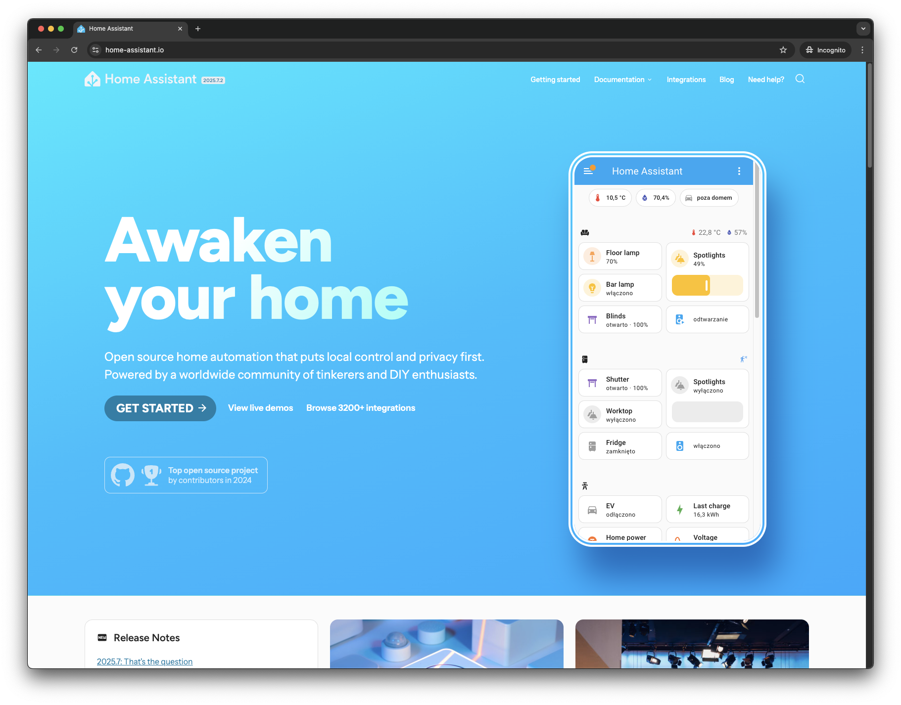
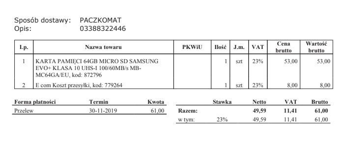
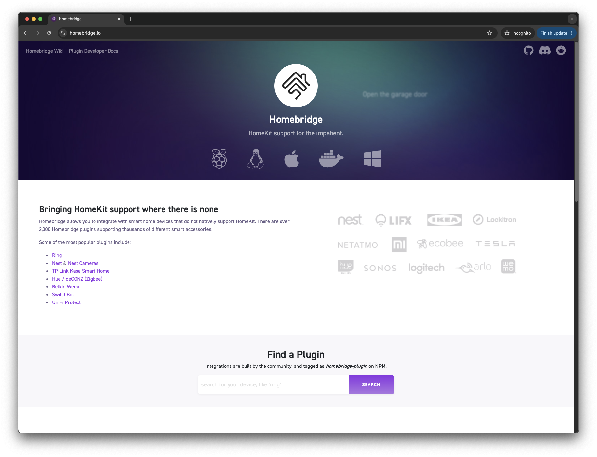
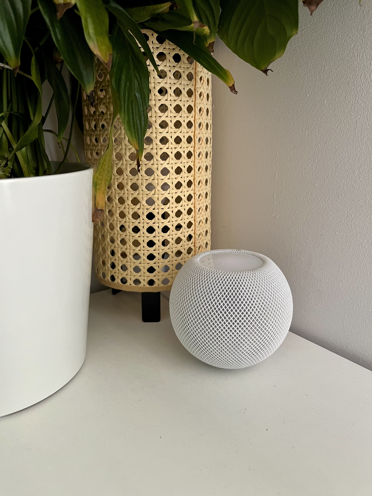
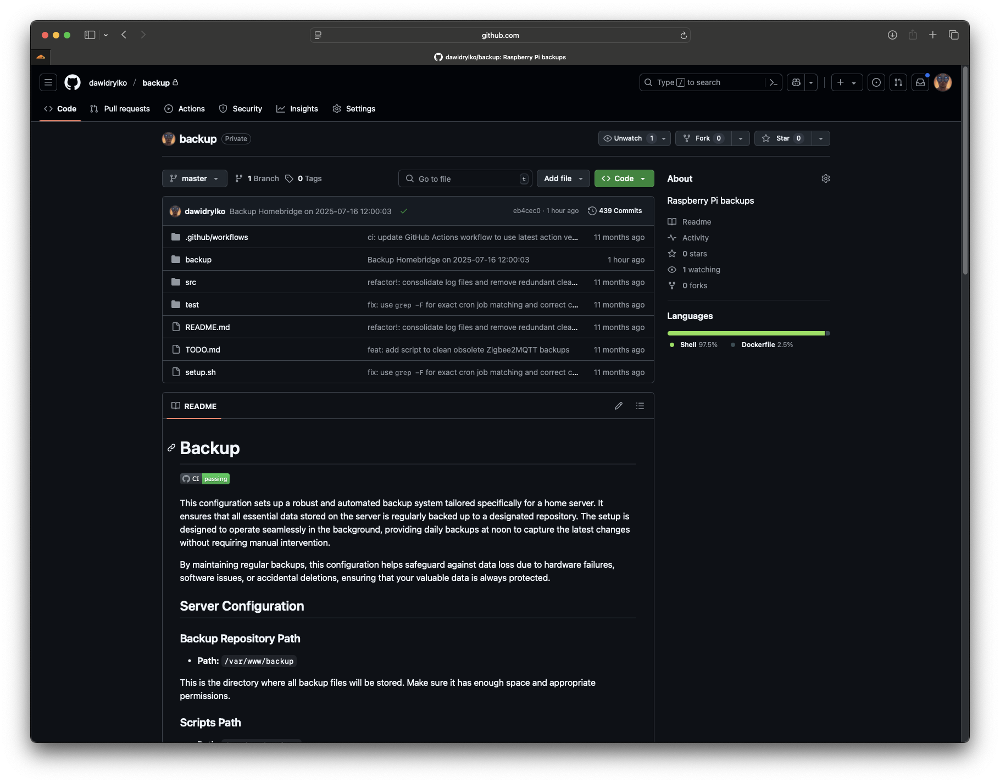
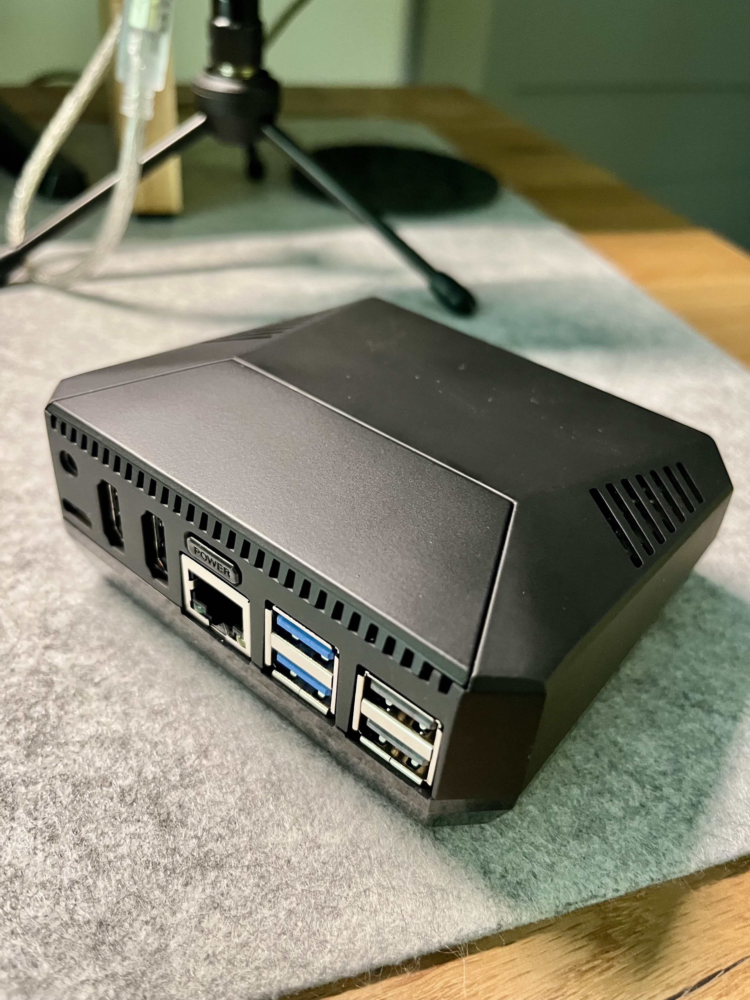

Moja przygoda ze **Smart Home** rozpoczęła się świeżo po przeprowadzce do nowego mieszkania. Całość idealnie się zgrała. _Tabula rasa_. Teoretycznie mogłem zrobić wszystko, na co miałem ochotę. Teoretycznie... Praktyka ma się jednak nijak do teorii. W tym wpisie zanudzę Was moją historią z inteligentnym domem. Miało być szybko, łatwo i przyjemnie, a okazało się nieszybko i niełatwo. Przyjemności jednak nie zabrakło.

> Co trudnego może być w podłączeniu kilku urządzeń do internetu?

Mając na uwadze moje niebagatelne doświadczenie w szeroko pojętym świecie IT, postanowiłem, że wszystko zrobię sam. Były ku temu realne podstawy. W końcu zaliczyłem na studiach przedmiot z sieci komputerowych, zbudowałem mini stację pogodową opartą na Atmedze, a ponadto byłem posiadaczem Raspberry Pi 3, które z powodzeniem wykorzystywałem jako domowe centrum multimedialne.

## Home Assistant



Wyposażony w entuzjazm i "doświadczenie", zabrałem się do roboty. Zacząłem od najważniejszego (przynajmniej tak mi się wtedy wydawało) elementu układanki. Zainstalowałem [Home Assistant](https://github.com/home-assistant) na mojej już wówczas leciwej malince, korzystając z królującego wtedy Hass.io. Z perspektywy czasu wybór nie był zbyt trafny. Problemem nie był sam instalator, lecz fakt, że system zainstalowałem na karcie SD (sic!). Tak, na najzwyklejszej karcie pamięci, jaką akurat miałem w domu. Wszystko działało. Karta miała 32 GB, więc zacząłem instalować na potęgę najrozmaitsze dodatki.


Miałem już w domu kilka urządzeń Xiaomi, więc musiały zostać skonfigurowane. Zgodnie z zasadą: _nic nie może się zmarnować_. W tym czujniki do roślin Xiaomi Flower Care zamówione z AliExpress. Wymusiły one na malince wzmożone obroty, by rejestrować parametry wokół moich baobabów. Komunikacja przez Bluetooth zjadała wprawdzie baterie niczym Pan Kleks atrament, ale co z tego. CR2032 są tanie. Karty SD już niekoniecznie.


Bluetooth okazał się jednak zawodny. Komunikacja była niestabilna i nieregularna. Chcąc poprawić niezawodność odczytów, kupiłem na Allegro moduł ESP32 ESP-WROOM-32 z WiFi i Bluetooth, który miał przejąć od malinki zadania związane z komunikacją BLE. Liczyłem na to, że odciążę Raspberry i ustabilizuję działanie systemu. Niestety, zanim zdążyłem wszystko podłączyć, wydarzyło się coś nieoczekiwanego.

Pierwsza karta SD padła po niespełna dwóch tygodniach. Mimo że podłączonych urządzeń było niewiele. Częstotliwość odczytów, a zwłaszcza zapisów, była natomiast porażająca. Tłumaczyłem to sobie: _To przecież stara karta, której godzina wybiła_. W "literaturze", zwłaszcza na Reddicie, często przewijała się myśl, że Raspberry Pi z kartą pamięci to niekoniecznie najlepszy wybór. Sama specyfikacja kart też nie pozostawiała złudzeń. Nie chciałem jednak dopuścić do siebie myśli, że to po prostu zła konfiguracja. Zamówiłem na Allegro nową, "lepszą" kartę SD.



Gdy przyszła druga karta, zainstalowałem ponownie HA na Hass.io. Zmniejszyłem częstotliwość odczytów i zapisów z czujników przy roślinach oraz z czujników temperatury i wilgotności. Czysta konfiguracja, powiadomienia o konieczności podlania roślin znowu działały. Miałem historię temperatury, wilgotności i nasłonecznienia. Byłem zadowolony. Przez niespełna miesiąc.

Tym razem nie było tak spektakularnie. Karta przestała działać częściowo. Początkowo sądziłem, że to moja wysłużona malinka postanowiła przejść na drugą stronę. Jednak po kilku dniach coraz bardziej niestabilnego działania, to karta dopełniła żywota. Byłem znowu w punkcie wyjścia.

## Homebridge

Euforia opadła. Postanowiłem się doedukować. Zamówiłem polisingowy terminal (HP T620 Quad Core 1.5 GHz, 4 GB RAM, 16 GB SSD), który miał być wybawieniem i rozwiązać moje bolączki. Stety lub niestety, trafił do mnie wadliwy egzemplarz. Zwróciłem go, zanim zdążyłem zainstalować cokolwiek.

W międzyczasie, czekając na wymianę terminala na sprawny, moim oczom ukazał się projekt [Homebridge](https://github.com/homebridge/homebridge). Wydał mi się bardzo ciekawy. Wziąłem kolejną kartę SD i zainstalowałem na niej Homebridge. Tym razem w Dockerze (nie wiem, co mnie podkusiło). Po szybkiej konfiguracji wszystko działało dobrze… znowu.



Wcześniej widziałem w dodatkach Home Assistanta charakterystyczną ikonkę Homebridge, ale nie drążyłem, do czego służy. Trafiłem na niego zupełnym przypadkiem. Idealnie się złożyło, ponieważ, o zgrozo, mój ekosystem oparty jest o Jabłko.

Szybko skonfigurowałem pozostałe elementy wyposażenia, kupione jeszcze w zamierzchłych czasach i spisane już na straty. Zrezygnowałem całkowicie z zapisywania historii. Miałem moje powiadomienia, ale dodatkowo, z poziomu aplikacji Dom (o której istnieniu do tej pory nie miałem fioletowego pojęcia), mogłem zmieniać temperaturę w lodówce LG, a także włączać i wyłączać oczyszczacz powietrza z Xiaomi.

To dało mi zupełnie inny obraz sytuacji. Nie potrzebowałem już Home Assistanta. Miałem coś lepszego, natywną aplikację. Mimo że była bardziej prymitywna, spełniała wszystkie moje potrzeby. W dodatku mogłem zapytać Siri, jak się mają moje roślinki.

Sklep miał problemy z wysyłką innego terminala w takiej samej konfiguracji, więc zrezygnowałem z zakupu. Spodziewałem się wprawdzie, że może powtórzyć się sytuacja z kartą SD, ale nic takiego się (o dziwo) nie wydarzyło.

Nie ma róży bez kolców. Głównym problemem było wymuszone działanie w obrębie sieci lokalnej. Było to o tyle problematyczne, że często, będąc w domu, wyłączałem WiFi. Robiłem to ponieważ nie miałem jeszcze światłowodu, tylko internet radiowy. Po wyłączeniu traciłem dostęp do Homebridge, a co za tym idzie, do wszystkich urządzeń.

Na ratunek przyszedł mi Apple HomePod Mini, który nie był tylko fajnie grającym głośniczkiem, ale także pełnoprawnym hubem. Rozwiązanie problemu niezbyt tanie, ale głośnik służy mi po dziś dzień, więc chyba się spłacił.



## Zigbee

Coraz bardziej zagłębiając się w tematykę inteligentnych domów, zauważyłem, że moduły, podzespoły i elementy wykonawcze u pana Chińczyka są znacznie tańsze niż u nas. Postanowiłem więc "usmartnić" niskim kosztem to, co już wtedy posiadałem. Zainwestowałem też w dongla Zigbee (ConBee II, on akurat tani nie był) i dodałem nowe kontenery: `zigbee2mqtt` oraz `mosquitto`. Całość została spięta w jedną sieć, na coraz starszym Raspberry Pi 3. Dzięki takiemu zestawowi mogłem robić, co mi się podobało.

Obecna konfiguracja smart home, prawie nieruszona od tamtego czasu, z wyjątkiem `healthcheck`, którego dodałem później:

```yaml
services:
  homebridge:
    image: homebridge/homebridge:latest
    restart: always
    network_mode: host
    hostname: homebridge
    container_name: homebridge
    volumes:
      - ./homebridge:/homebridge
    devices:
      - /dev/ttyACM0:/dev/ttyACM0
    logging:
      driver: json-file
      options:
        max-size: '10mb'
        max-file: '1'
    healthcheck:
      test: curl --fail localhost:8581 || exit 1
      interval: 60s
      retries: 5
      start_period: 300s
      timeout: 2s

  mosquitto:
    image: eclipse-mosquitto
    restart: unless-stopped
    hostname: mosquitto
    container_name: mosquitto
    ports:
      - 1883:1883
      - 9001:9001
    volumes:
      - ./mosquitto:/mosquitto
    command: 'mosquitto -c /mosquitto-no-auth.conf'

  zigbee2mqtt:
    image: koenkk/zigbee2mqtt:latest
    restart: unless-stopped
    network_mode: host
    hostname: zigbee2mqtt
    container_name: zigbee2mqtt
    volumes:
      - ./zigbee2mqtt:/app/data
      - /run/udev:/run/udev:ro
    environment:
      - TZ=Europe/Berlin
    devices:
      - /dev/ttyACM0:/dev/ttyACM0
```

## Raspberry Pi 5

Wszystko działało. Bardzo długo działo. Po wcześniejszych perturbacjach z kartami SD nie spodziewałem się, że aż tak długo. Pewnego lipcowego dnia 2024 roku niespodziewana burza zakończyła żywot mojej malinki. Spisywała się świetnie, ale czas było zrobić krok naprzód. Kupiłem na Botlandzie następujący zestaw:

- Raspberry Pi 5 8GB
- Raspberry Pi Active Cooler - aktywne chłodzenie (radiator + wentylator)
- Raspberry Pi 27W USB-C Power Supply - oficjalny zasilacz USB C 5,1V / 5A - biały
- Obudowa do Raspberry Pi 5 - oficjalna, czerwono-biała
- Bateria RTC do Raspberry Pi 5
- Pineboards HatDrive! Nano - adapter NVMe 2230, 2242 do Raspberry Pi 5

Dodatkowo na Allegro zamówiłem:

- TRANSCEND 256 GB M.2 2242 PCIe 400S Gen3x4 NVMe 3D TLC DRAM-less

Spora inwestycja, a plany były zaiste ogromne.


> Wszystko będzie inaczej

Nauczony wcześniejszymi porażkami, postanowiłem, że teraz wszystko będzie lepiej przemyślane. Docker Compose oraz backup, który w międzyczasie przygotowałem, pozwoliły na bezproblemowe odtworzenie środowiska. Nawet się zdziwiłem, że mimo innej konfiguracji sprzętowej wszystko działa. Główne obawy dotyczyły dongla Zigbee.

Swoją drogą, projekt backupu to temat na osobną historię, bo zrealizowałem go dość nietypowo. Z wykorzystaniem GitHub Actions, CRON-a, skryptów bashowych, [Bats](https://github.com/bats-core/bats-core) oraz storage'u w repozytorium GitHuba.



Konfiguracja okazała się świetna, wszystko działało jak złoto. Z wyjątkiem tego, że Raspberry Pi 5... się nudziło. Żeby urozmaicić sobie życie i dołożyć sobie niepotrzebnej roboty, postanowiłem przenieść całą konfigurację na mojego Synology. Niech wszystko będzie w jednym miejscu. W końcu mam wersję z plusem, więc mogę wrzucić Dockera i działać.


Tak też zrobiłem. Szybko przeniosłem kontenery na Synology. Skonfigurowałem ponownie backup (dorobiłem też skrypty automatyzujące konfigurację backupu, CRON-ów i uprawnień). Zadowolony z siebie mogłem wreszcie odpocząć.

Odpoczynek nie trwał jednak długo. Najbliższy rachunek za prąd pokazał, że nie był to najbardziej przemyślany wybór. Synology 423+ z hibernacją dysków pobiera mniej niż 5W, a w trybie dostępu do danych do 32W. Szybkie odczyty z watomierza pokazały, że ta konfiguracja jest przestrzelona. Raspberry Pi 5 z aktywnym chłodzeniem pobierało mniej niż 4W. Rachunek był prosty: nie muszę stresować NAS-a, który robi mi głównie za storage, skoro malinka w eksploatacji jest dużo tańsza. W dodatku nie będę zażynać cache'a oraz całej maszyny, nie wspominając o separacji.

Nie wróciłem jednak do wcześniejszej malinki. Kupiłem nową obudowę (Argon ONE V3 M.2 NVMe PCIe do Raspberry Pi 5, z wentylatorem i radiatorem, aluminiowa, czarna) oraz Raspberry Pi 5 w wersji z 4GB pamięci RAM. Zestaw ten mam do momentu tworzenia tego wpisu i jestem zadowolony.



## Podsumowanie

Z perspektywy czasu mogę śmiało powiedzieć: _było warto_. Choć po drodze nie brakowało błędów, momentami całkiem kosztownych, wszystkie traktuję jako cenne lekcje. Moja kilkuletnia przygoda z inteligentnym domem dała mi mnóstwo frajdy, solidną porcję wiedzy i dużo satysfakcji.

### Wnioski

1. Zanim coś zrobisz - policz.
2. Zanim coś kupisz - sprawdź, czy naprawdę tego potrzebujesz.
3. Zanim przeniesiesz wszystko na inny sprzęt - zadaj sobie pytanie: _czy warto?_

Czasem mniej znaczy więcej, a kilka watów poboru energii może w skali miesiąca zaskakująco zaważyć na rachunku. W świecie smart home granica między zabawą, a przesadą jest bardzo cienka.

### Co dalej?

W kolejnych wpisach (które pojawią się, kiedy czas pozwoli, czyli niewiadomo kiedy) planuję opisać różne scenariusze i automatyzacje, które zbudowałem. Będą między innymi:

- historia ściemniaczy z Ikei, które niespodziewanie zyskały nowe życie dzięki Zigbee,
- moje podejście do bezpieczeństwa: kontaktrony, czujniki zalania i kamery,
- automatyzacje światła, wentylacji i zużycia prądu,
- jak rolety zmieniają życie bardziej, niż by się wydawało,
- eksperymenty z NFC, ogrzewaniem, podlewaniem i doświetlaniem roślin,
- oraz oczywiście - projekt backupu, który sam w sobie zasługuje na osobny rozdział.

To wszystko już mam, używam i rozwijam. Niektóre rozwiązania są genialne w swej prostocie. Inne są efektem przesadnej ciekawości i chęci dołożenia sobie roboty 🙃
