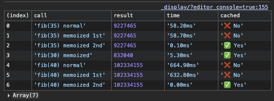
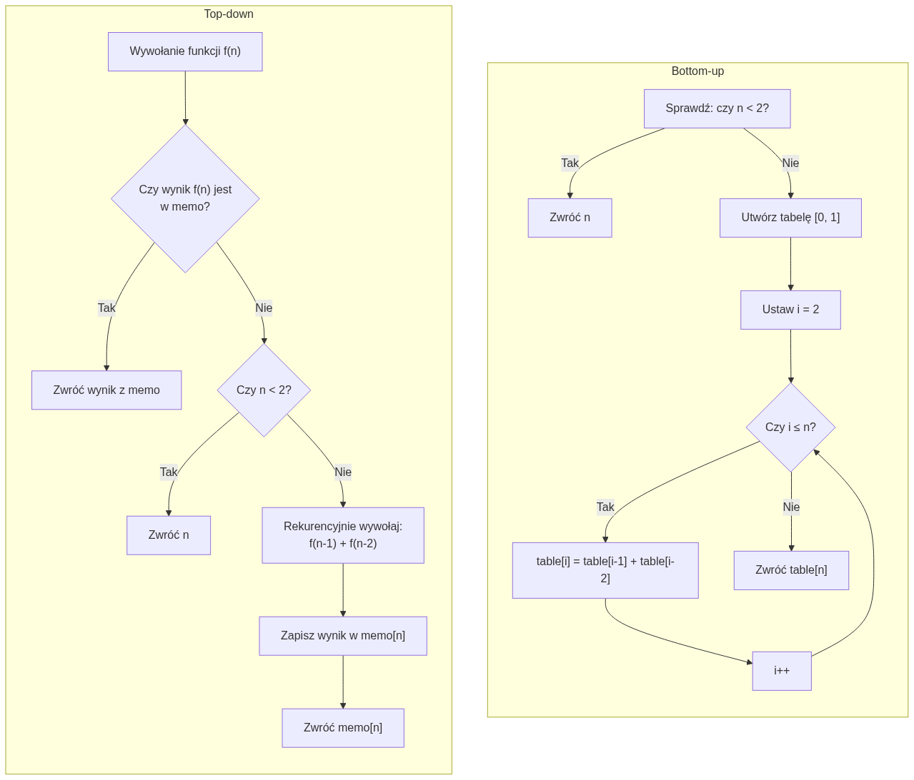

Wyobraź sobie, że jesteś sędziwym Albusem Dumbledorem. Każdą wolną chwilę poświęcasz analizie swoich dawnych decyzji. Najwięcej uwagi, rzecz jasna, kierujesz ku Tomowi Riddle'owi. Każde wspomnienie, każdy detal, każda wymiana zdań. Wszystko może okazać się kluczem do pokonania zła.

Dążysz do pełnego zrozumienia, nawet jeśli pozornie nic nie wskazuje na nowy trop. Robisz to wieczór po wieczorze, dzień po dniu. Nie chcesz jednak za każdym razem zaczynać od początku, przeżywać tych samych, często bolesnych chwil. Nie chcesz znów i znów dochodzić do tych samych wniosków.

Chcesz iść dalej. Ale gubisz się w natłoku myśli. Nie pamiętasz, czy już to analizowałeś? A może tylko wydaje ci się znajome?

## Myślodsiewnia

Z pomocą przychodzi **Myślodsiewnia** (ang. _Pensieve_). To magiczna, kamienna misa, w której możesz przechowywać i przeglądać swoje wspomnienia.

Wyciągnięcie wspomnienia z głowy, niczym srebrnej nitki spływającej po różdżce, trwa chwilę i nie wymaga wysiłku. Zawsze możesz do niego wrócić. Możesz je ponownie przeanalizować, bez potrzeby przetwarzania go od nowa w swoim umyśle. Wspomnienia są bezpieczne i uporządkowane, gotowe do użycia, kiedy tylko zechcesz.

Dzięki temu możesz przesuwać granicę zrozumienia coraz dalej. Nie tracisz czasu i energii na rzeczy, które już raz przemyślałeś.

W programowaniu mamy dokładnie ten sam problem, który dręczył Dumbledore'a. Funkcja, która analizuje dane lub wykonuje kosztowne obliczenia, często nie musi być uruchamiana wielokrotnie dla tych samych danych wejściowych. Wynik będzie przecież identyczny.

Zamiast więc liczyć wszystko od początku, możemy sięgnąć po technikę, którą na cześć pamiętania nazwano **memoizacją**.

## Memoizacja funkcyjna (_functional memoization_)

**Memoizacja funkcyjna** to technika optymalizacyjna, która polega na zapamiętywaniu wyników wywołań funkcji dla określonych argumentów. Działa jak osobista Myślodsiewnia dla funkcji. Gdy funkcja jest wywoływana ponownie z tymi samymi argumentami, jej wynik jest natychmiast zwracany z pamięci podręcznej (_cache_), zamiast być ponownie obliczany. Unikamy w ten sposób wielokrotnego wykonywania tych samych, często kosztownych operacji, co ma bezpośredni wpływ na przyspieszenie działania programu.

![Obraz w stylu komiksowym, przypominającym prace Stana Lee, przedstawia Hermionę Granger siedzącą przy drewnianym biurku. Ma na sobie szatę Hogwartu i intensywny wyraz twarzy, skupiony na otwartej księdze, do której pisze świecącym piórem. Biurko jest zastawione idealnie poukładanymi stosami grubych ksiąg i podręczników po obu stronach. Na pierwszym planie, na tacy, stoją symetrycznie ułożone fiolki i zlewki z kolorowymi eliksirami. Całość utrzymana jest w mrocznym, akademickim klimacie, z dramatycznym oświetleniem. Wygenerowana przez AI.](./Hermiona_przy_biurku.png)
Podobnie jak potężne zaklęcie, funkcja poddana memoizacji musi spełniać dwa kluczowe warunki:

1. **Musi być czysta i deterministyczna**: dla tych samych argumentów zawsze musi zwracać ten sam wynik.
1. **Nie może mieć efektów ubocznych** (_side effects_): jej działanie nie może zmieniać niczego poza nią samą.

### Przykład: Rzucanie zaklęcia `Memoize`

Oto jak możemy stworzyć własne zaklęcie `memoize` w TypeScript, które opakuje dowolną funkcję i da jej moc pamiętania.

```typescript
const memoize = <F extends (...args: any[]) => any>(fn: F): F => {
  // Nasza Myślodsiewnia do przechowywania wspomnień
  const cache = new Map<string, ReturnType<F>>();

  return ((...args: any[]) => {
    // Tworzymy unikalny klucz dla każdego zestawu argumentów
    const key = JSON.stringify(args);

    // Sprawdzamy, czy już analizowaliśmy to wspomnienie
    if (cache.has(key)) {
      // Jeśli tak, zwracamy wynik z Myślodsiewni
      return cache.get(key)!;
    }

    // Jeśli nie, wykonujemy kosztowne obliczenie
    const result = fn(...args);
    // I zapisujemy je w Myślodsiewni na przyszłość
    cache.set(key, result);
    return result;
  }) as F;
};
```

W ramach testów użyjemy tej funkcji do memoizacji klasycznego, rekurencyjnego algorytmu na ciąg Fibonacciego. Jest on znany z tego, że bez optymalizacji jego złożoność czasowa rośnie wykładniczo, niczym liczba diabełków kornwalijskich wypuszczonych w klasie.

```typescript
const test = () => {
  const fib = (n: number): number => (n < 2 ? n : fib(n - 1) + fib(n - 2));
  const fibMemoized = memoize(fib);

  const results: any[] = [];

  const measure = (label: string, fn: () => any, expectCached: boolean = false) => {
    const start = performance.now();
    const result = fn();
    const time = (performance.now() - start).toFixed(2);
    results.push({ call: label, result, time: `${time}ms`, cached: expectCached ? `✅ Yes` : `❌ No` });
  };

  measure(`fib(35) normal`, () => fib(35));
  measure(`fib(35) memoized 1st`, () => fibMemoized(35));
  measure(`fib(35) memoized 2nd`, () => fibMemoized(35), true);
  measure(`fib(30) memoized`, () => fibMemoized(30), true);
  measure(`fib(40) normal`, () => fib(40));
  measure(`fib(40) memoized 1st`, () => fibMemoized(40));
  measure(`fib(40) memoized 2nd`, () => fibMemoized(40), true);

  console.table(results);
};

test();
```

Wyniki działania tego kodu pokazują, jak potężna jest memoizacja. Pierwsze wywołanie `fibMemoized` jest wolne, ponieważ musi wykonać wszystkie obliczenia. Każde kolejne dla tego samego argumentu jest już błyskawiczne. Wynik jest pobierany prosto z Myślodsiewni.



## Memoizacja strukturalna (_structural memoization_)

**Memoizacja strukturalna** to technika, w której zamiast duplikować identyczne struktury danych, współdzielimy jedną, kanoniczną instancję. Jest to odpowiednik rozpoznawania przez Ministerstwo Magii, że dwie różdżki, mimo że są oddzielnymi przedmiotami, mają _identyczną_ budowę (np. 11 cali, ostrokrzew, pióro feniksa) i mogą być w katalogu reprezentowane przez ten sam wzorzec.

Technika ta, często nazywana _hash-consing_, unika tworzenia nadmiarowych kopii obiektów i przyspiesza ich porównywanie. Zamiast sprawdzać całą strukturę pole po polu, wystarczy porównać referencje.

### Przykład: Katalogowanie magicznych węzłów

Wyobraźmy sobie, że budujemy drzewo genealogiczne czarodziejów. Wiele osób będzie miało te same, proste cechy. Zamiast tworzyć nowy obiekt dla każdej cechy, możemy je współdzielić.

```typescript
// Definicja klasy reprezentującej postać
class Character {
  constructor(
    public readonly value: string,
    public readonly children: Character[] = [],
  ) {}
}

// Katalog postaci, który będzie przechowywał współdzielone instancje
const characterCache = new Map<string, Character>();

const createSharedCharacter = (value: string, children: Character[] = []): Character => {
  // Tworzymy unikalny klucz na podstawie wartości i dzieci
  const key = `${value}:${children.map(c => c.value).join(`,`)}`;

  if (characterCache.has(key)) {
    console.log(`♻️ Sharing character: ${value}`);
    return characterCache.get(key)!;
  }

  console.log(`✨ Creating new character: ${value}`);
  const newCharacter = new Character(value, children);
  characterCache.set(key, newCharacter);
  return newCharacter;
};

// Przykładowe postacie
const pureBlood = createSharedCharacter(`Pure blood`);
const halfBlood = createSharedCharacter(`Half blood`);
const harry = createSharedCharacter(`Harry`, [halfBlood]);
const draco = createSharedCharacter(`Draco`, [pureBlood]);
const dracoTwin = createSharedCharacter(`Draco`, [pureBlood]); // To samo co Draco, ale z tej samej instancji!

console.log(harry !== draco); // true, różne obiekty
console.log(draco === dracoTwin); // true, ten sam obiekt współdzielony!
```

## Z góry na dół (_top-down_) vs. z dołu do góry (_bottom-up_)

Problem obliczeniowy można rozwiązywać na dwa sposoby, niczym naukę skomplikowanego zaklęcia.

- **Z góry na dół (_Top-down_ z Memoizacją)**: Zaczynasz od głównego problemu i rekurencyjnie dzielisz go na mniejsze. Wyniki podproblemów zapisujesz w Myślodsiewni, by do nich nie wracać. To jak Dumbledore, który stawia sobie cel "zniszczyć Horkruksy" i rozbija go na zadania: "znaleźć dziennik", "znaleźć pierścień" itd., zapamiętując postępy.
- **Z dołu do góry (_Bottom-up_ z Tabulacją)**: Zaczynasz od najprostszych, bazowych przypadków i iteracyjnie budujesz rozwiązanie coraz większych problemów, aż dojdziesz do tego właściwego. To jak uczeń w Hogwarcie, który najpierw opanowuje "Wingardium Leviosa", potem "Accio", a dopiero na końcu próbuje rzucić Patronusa. Budujesz fundamenty, zanim wzniesiesz wieżę.



Podejście _top-down_ jest często bardziej intuicyjne, ale może prowadzić do głębokiej rekurencji. _Bottom-up_ bywa wydajniejsze, bo unika narzutu rekurencji i od razu buduje całą tablicę potrzebnych wyników.

### Przykład: Dwa podejścia do Fibonacciego

```typescript
// Podejście z góry na dół (Top-down) - Rekurencja z memoizacją
const fibTopDown = (n: number, memo: Record<number, number> = {}): number => {
  if (n in memo) return memo[n];
  if (n < 2) return n;

  memo[n] = fibTopDown(n - 1, memo) + fibTopDown(n - 2, memo);
  return memo[n];
};

console.log(`Top-down fib(10): ${fibTopDown(10)}`); // Wynik: 55

// Podejście z dołu do góry (Bottom-up) - Tabulacja
const fibBottomUp = (n: number): number => {
  if (n < 2) return n;

  const table = [0, 1];

  for (let i = 2; i <= n; i++) {
    table[i] = table[i - 1] + table[i - 2];
  }

  return table[n];
};

console.log(`Bottom-up fib(10): ${fibBottomUp(10)}`); // Wynik: 55
```

## Leniwa memoizacja (_lazy memoization_)

**Leniwa memoizacja** to technika, która łączy memoizację z **leniwą ewaluacją**. Obliczenie wartości jest odraczane do momentu, gdy wynik jest faktycznie potrzebny. Dopiero wtedy jest on obliczany i zapamiętywany.

To działa jak Mapa Huncwotów. Sama w sobie jest tylko kawałkiem pergaminu. Ujawnienie mapy Hogwartu następuje dopiero po wypowiedzeniu zaklęcia "Uroczyście przysięgam, że knuję coś niedobrego". Po pierwszym użyciu treść jest już znana i gotowa do wglądu.

### Przykład: Leniwe pozyskiwanie wiedzy

Możemy zaimplementować to na dwa sposoby:

```typescript
// 1. Z elementem zastępczym (placeholder)
class LazyValue<T> {
  private _value?: T;
  private hasBeenCalculated = false;

  constructor(private readonly calculation: () => T) {}

  public get value(): T {
    if (!this.hasBeenCalculated) {
      console.log(`📜 Activating the Marauder's Map for the first time...`);
      this._value = this.calculation();
      this.hasBeenCalculated = true;
    }
    return this._value!;
  }
}

const mapContent = new LazyValue(() => `Hogwarts map with all secret passages`);
console.log(`The parchment lies closed.`);
console.log(mapContent.value); // Pierwsze użycie - obliczenie
console.log(mapContent.value); // Drugie użycie - natychmiastowy zwrot

// 2. Z leniwą funkcją (thunk)
const createLazyFunction = <T>(calculation: () => T): (() => T) => {
  let value: T;
  let isCalculated = false;

  return () => {
    if (!isCalculated) {
      console.log(`🔮 Looking into the crystal ball for the first time...`);
      value = calculation();
      isCalculated = true;
    }
    return value;
  };
};

const getProphecy = createLazyFunction(() => `THE ONE WITH THE POWER TO VANQUISH THE DARK LORD APPROACHES...`);
console.log(`The prophecy awaits discovery.`);
console.log(getProphecy()); // Pierwsze użycie - obliczenie
console.log(getProphecy()); // Drugie użycie - natychmiastowy zwrot
```

## Demo: Dumbledore's Pensieve

Poniższy interaktywny przykład to nasza własna Myślodsiewnia w akcji. Każde kliknięcie w nazwę Horkruksa jest jak zanurzenie głowy w magicznej misie, by przeanalizować związane z nim, mroczne wspomnienie.

Aplikacja celowo symuluje kosztowne "wydobywanie wspomnienia", które za pierwszym razem trwa od 2 do 5 sekund. Kiedy jednak wspomnienie zostanie już raz "przeanalizowane", trafia do pamięci podręcznej (_cache_). Każde kolejne kliknięcie w ten sam Horkruks zwróci wynik **natychmiast**, czerpiąc go prosto z naszej cyfrowej Myślodsiewni.

Obserwuj logi, aby zobaczyć, kiedy aplikacja wykonuje ciężką pracę (`🔍 Extracting memories...`), a kiedy błyskawicznie korzysta z zapamiętanego wyniku (`⚡ Retrieved from memory cache`).

{/* Musi być odstęp pomiędzy importem a komponentem */}
import MemoizationDemo from '../../../src/demo/memoization-demo.tsx';

<MemoizationDemo />

## Podsumowanie

Memoizacja to potężna technika pozwalająca efektywnie zarządzać czasem i zasobami w programowaniu. Zamiast w kółko przetwarzać te same dane, możemy zapisać wynik i sięgać po niego w mgnieniu oka. Dzięki temu nasze aplikacje stają się szybsze, a my możemy skupić się na nowych wyzwaniach. Zalety memoizacji to:

- **Przyspiesza działanie aplikacji**: zwłaszcza w operacjach na UI (np. React), przy przetwarzaniu danych i w żądaniach do API.
- **Upraszcza kod**: eliminując potrzebę ręcznego zarządzania wynikami powtarzalnych obliczeń.
- **Oszczędza zasoby**: redukując liczbę kosztownych operacji, jak skomplikowane algorytmy czy zapytania do bazy danych.

Jednak, jak każda magia, wymaga ostrożności. Jej nadużywanie może mieć skutki uboczne. Wady memoizacji to:

- **Zwiększone zużycie pamięci**: przechowywanie wielu wyników w _cache_ może prowadzić do wycieków pamięci, jeśli nie zarządzamy nim właściwie.
- **Dodatkowa złożoność**: implementacja mechanizmu _cache_ dodaje kolejną warstwę logiki do aplikacji.
- **Trudniejsze debugowanie**: ukrycie obliczeń za warstwą pamięci podręcznej może czasami utrudnić śledzenie błędów.

Jak w każdym potężnym zaklęciu, kluczem jest umiar i świadomość: **co warto zapamiętać, a co trzeba puścić wolno**.

![Mem w stylu komiksowym, przypominającym prace Stana Lee, przedstawiający Dumbledore'a i Harry'ego Pottera stojących obok Myślodsiewni. Dumbledore, z długą siwą brodą i w okularach, uśmiecha się z zadowoleniem i wskazuje na Myślodsiewnię, mówiąc w dymku: 'Widzisz, Harry? Nie musimy już po raz setny przeliczać 'fib(35)'.' Harry, z potarganymi włosami i w okularach, wygląda na zmęczonego, ale z ulgą, a w dymku myśli mówi: 'Moja głowa już by tego nie zniosła!'. W tle widać regały z książkami i inne przedmioty z gabinetu Dumbledore'a. Wygenerowana przez AI.](./Dumbledore_i_Harry_przy_Myslodsiewni.png)

## Źródła

1. [Wikipedia, "Memoization"](https://en.wikipedia.org/wiki/Memoization)
1. Acar, Umut A., Guy E. Blelloch, and Robert Harper, "Selective Memoization", [ACM SIGPLAN Notices 38.1 (2003): 14-25](http://reports-archive.adm.cs.cmu.edu/anon/anon/usr0/ftp/usr/ftp/2002/CMU-CS-02-194.pdf).
1. [Stack Overflow, "What is the difference between bottom-up and top-down?"](https://stackoverflow.com/questions/6164629/what-is-the-difference-between-bottom-up-and-top-down)
1. [Stack Overflow, "What's the difference between recursion, memoization & dynamic programming?"](https://stackoverflow.com/questions/12133754/whats-the-difference-between-recursion-memoization-dynamic-programming)
