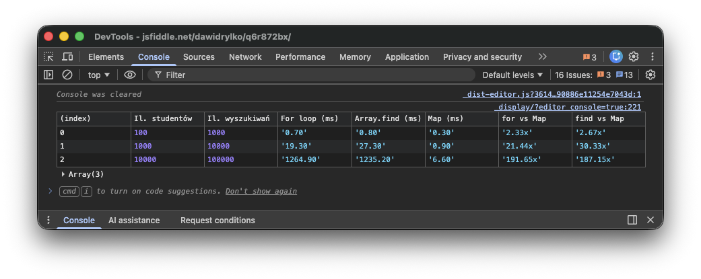

Tym razem wcielimy się w rolę profesor Minervy McGonagall. Starsza czarownica i wybitny pedagog po raz kolejny głowi się nad tym, jak urozmaicić swoje lekcje. Młodzi adepci magii są dziś bardziej wymagający niż kiedyś. Trudniej ich zaskoczyć, trudniej zatrzymać ich uwagę na dłużej.

Profesor McGonagall wie, że aby naprawdę do nich dotrzeć, nie wystarczy efektowna sztuczka. Nie chce już po raz setny demonstrować przemiany sowy w kielich ani fretki w chusteczkę do nosa. To widowiskowe, lecz powierzchowne. A transmutacja nigdy nie była magią na pokaz.

Szukając nowego podejścia, myśli o istocie tej dziedziny. O tym, co odróżnia prawdziwą transmutację od taniego czaru. O kontroli, dyscyplinie i odpowiedzialności za formę, jaką nadaje się materii. O przemianie, która nie polega na tworzeniu czegoś nowego, lecz na świadomym przekształcaniu tego, co już istnieje.

I właśnie od tej myśli rozpoczyna swoją lekcję.

## Transmutacja

**Transmutacja** (ang. _Transmutation_) to jedna z najbardziej fundamentalnych dziedzin magii. Nie polega na tworzeniu przedmiotów z niczego ani na ich unicestwianiu, lecz na zmianie struktury przy zachowaniu tożsamości materii.

Profesor McGonagall podkreśla, że dobra transmutacja jest **odwracalna, przewidywalna i precyzyjna**. Każda zmiana musi mieć jasno określony cel, a czarodziej musi dokładnie wiedzieć, co pozostaje niezmienne, a co ulega przekształceniu.

W programowaniu sytuacja wygląda identycznie. Dane rzadko pozostają w jednej formie. Są **przekształcane**, a nie tworzone od nowa. Sens informacji pozostaje ten sam, zmienia się jedynie jej reprezentacja.

## Tablica → Mapa ⚡️ (_Array → Map_)

Jedną z najczęstszych i najbardziej fundamentalnych transformacji struktur danych jest przejście z **tablicy** na **mapę**. Zamiana ta uczy świadomego kompromisu: struktura danych powinna odpowiadać **charakterowi operacji**, a nie przyzwyczajeniom programisty.

**Tablica** (_array_) jest **strukturą sekwencyjną**. Nadaje się do przechowywania uporządkowanych kolekcji elementów. Dostęp do elementów odbywa się poprzez indeksy, co jest szybkie i efektywne, gdy potrzebujemy:

- **iterować po wszystkich elementach**,
- **sortować** dane według określonych kryteriów,
- **filtrować** elementy na podstawie warunków,
- **mapować** wartości na nowe reprezentacje.

Jednak gdy naszym celem jest:

- **szybkie wyszukiwanie** elementów na podstawie klucza,
- **częste sprawdzanie istnienia** danego elementu,
- **unikanie wielokrotnych przeszukiwań** tablicy,

tablica staje się niewystarczająca. W takich przypadkach lepszym wyborem jest **mapa z haszowaniem** (_hash map_). Jest to struktura danych oparta na mechanizmie haszowania, która umożliwia **bezpośredni dostęp do wartości na podstawie klucza**.

### Przykład: Wyszukiwanie w tablicy

Przykład ten pokazuje najprostszą i najbardziej intuicyjną metodę wyszukiwania danych. Przechodzimy po elementach tablicy sekwencyjnie, aż znajdziemy pasujący element lub dojdziemy do końca kolekcji. Jest to podejście naturalne, lecz kosztowne przy większych zbiorach danych. Każdy kolejny element zwiększa czas wyszukiwania.

```typescript
/**
 * @typedef Student
 * @description Typ reprezentujący studenta z unikalnym identyfikatorem i imieniem.
 * @param id - Unikalny identyfikator studenta.
 * @param name - Imię studenta.
 */
type Student = {
  id: string;
  name: string;
};

/**
 * @description Przykładowa tablica studentów.
 */
const students: Student[] = [
  { id: 'a1', name: 'Harry' },
  { id: 'b2', name: 'Hermione' },
  { id: 'c3', name: 'Ron' },
];

/**
 * @description Funkcja wyszukująca studenta w tablicy na podstawie identyfikatora.
 * @param id - Identyfikator studenta do wyszukania.
 * @returns Znaleziony student lub undefined, jeśli nie znaleziono.
 */
const findStudentById = (id: string): Student | undefined => {
  return students.find(student => student.id === id);
};
```

#### Złożoność

- **Czasowa $O(n)$**: w najgorszym przypadku musimy przeszukać całą tablicę.
- **Pamięciowa $O(1)$**: nie wymaga dodatkowej pamięci poza tablicą.

### Przykład: Transformacja tablicy na mapę

Transformacja polega na jednorazowym przejściu przez tablicę i zapisaniu elementów w strukturze umożliwiającej bezpośredni dostęp po kluczu. Jest to klasyczny przykład kompromisu. Ponosiamy jednorazowy koszt początkowy, aby zyskać znacznie szybszy dostęp w przyszłości.

```typescript
/**
 * @description Transformacja tablicy studentów na mapę dla szybkiego dostępu.
 */
const studentsMap = new Map<string, Student>();

for (const student of students) {
  studentsMap.set(student.id, student);
}
```

Po udanej transformacji dane nie są już zwykłą **tablicą**, lecz **tablicą asocjacyjną**. Należy podkreślić, że sama transformacja również ma koszt obliczeniowy. Wykonujemy pełną iterację po tablicy ($O(n)$), co jest istotne zwłaszcza wtedy, gdy transformacja byłaby wykonywana wielokrotnie lub w krytycznej ścieżce aplikacji.

```typescript
/**
 * @description Funkcja wyszukująca studenta w mapie na podstawie identyfikatora.
 * @param id - Identyfikator studenta do wyszukania.
 * @returns Znaleziony student lub undefined, jeśli nie znaleziono.
 */
const findStudentById = (id: string): Student | undefined => {
  return studentsMap.get(id);
};
```

#### Złożoność

- **Czasowa $O(1)$**: dostęp do elementu na podstawie klucza jest natychmiastowy.
- **Pamięciowa $O(n)$**: wymaga dodatkowej pamięci na przechowywanie mapy.
- **Koszt transformacji $O(n)$\***: jednorazowy koszt przebudowy struktury, który należy uwzględnić w analizie wydajności całego systemu. Koszt ten zwykle amortyzuje się szybko, jeśli wyszukiwanie wykonywane jest wielokrotnie.

### Porównanie tablicy i mapy

<table>
  <thead>
    <tr>
      <th>Operacja</th>
      <th>Tablica (Array)</th>
      <th>Mapa (Map)</th>
    </tr>
  </thead>
  <tbody>
    <tr>
      <td>Wyszukiwanie po kluczu</td>
      <td>$O(n)$</td>
      <td>$O(1)$</td>
    </tr>
    <tr>
      <td>Iteracja</td>
      <td>$O(n)$</td>
      <td>$O(n)$</td>
    </tr>
    <tr>
      <td>Sprawdzenie istnienia</td>
      <td>$O(n)$</td>
      <td>$O(1)$</td>
    </tr>
    <tr>
      <td>Zużycie pamięci</td>
      <td>Niższe</td>
      <td>Wyższe</td>
    </tr>
  </tbody>
</table>

## Amortyzacja kosztu transformacji

Całkowity koszt wyszukiwania w tablicy i w mapie można zapisać następująco:

$$
T_{\text{array}} = k \cdot O(n)
$$

$$
T_{\text{map}} = O(n) + k \cdot O(1)
$$

gdzie:

- $n$ - liczba elementów
- $k$ - liczba wyszukiwań

Punkt opłacalności pojawia się, gdy:

$$
k \gg 1
$$

W praktyce oznacza to, że **już kilkanaście-kilkadziesiąt wyszukiwań** na danych średniej wielkości wystarcza, aby koszt transformacji został zamortyzowany.


## Kiedy **nie** używać Map

Mapa nie jest rozwiązaniem uniwersalnym. Nie warto jej stosować, gdy:

- wykonujemy **jedno lub dwa wyszukiwania**,
- kolekcja ma **kilka-kilkanaście elementów**,
- dane są **krótkotrwałe** (presja GC),
- operacje są wyłącznie sekwencyjne (`map`, `filter`, `reduce`),
- kod znajduje się w **krytycznej ścieżce renderowania**, a transformacja byłaby wykonywana wielokrotnie.

W takich przypadkach tablica bywa rozwiązaniem prostszym i tańszym.

## Złożoność cyklomatyczna

Złożoność cyklomatyczna mierzy liczbę niezależnych ścieżek wykonania kodu. Im jest niższa, tym kod jest prostszy w testowaniu i utrzymaniu. W kontekście transformacji struktur danych jest to aspekt często pomijany, mimo że ma realny wpływ na jakość kodu.

```typescript
// CC = 2
for (const s of students) {
  if (s.id === id) return s;
}

// CC = 1
students.find(s => s.id === id);

// CC = 1
studentsMap.get(id);
```

W powyższych przykładach widać wyraźnie, że:

- użycie metod deklaratywnych (`Array.find`, `Map.get`) eliminuje ręczne rozgałęzienia,
- ręczna pętla z warunkiem `if` zwiększa liczbę możliwych ścieżek wykonania.

Mapy sprzyjają więc nie tylko wydajności, ale również **prostocie logicznej kodu**.

## Wydajność

Różnice wydajności między opisanymi podejściami stają się widoczne dopiero przy dużych zbiorach danych. Dla kilku lub kilkunastu elementów wybór struktury nie ma znaczenia, jednak przy tysiącach lub setkach tysięcy rekordów:

- wyszukiwanie liniowe w tablicy (`Array.find`, `for`) skaluje się liniowo,
- wyszukiwanie w mapie pozostaje praktycznie stałe czasowo.

Potwierdza to poniższy benchmark:



Wyniki jednoznacznie pokazują, jak zmienia się charakterystyka wydajności wraz ze wzrostem liczby danych.

Dla **100 studentów i 1 000 wyszukiwań** wszystkie podejścia są zbliżone czasowo. Różnice mieszczą się w ułamkach milisekund, a koszt transformacji do mapy sprawia, że przewaga `Map` jest jeszcze niewielka. W tym zakresie skali wybór struktury danych ma głównie znaczenie semantyczne, a nie wydajnościowe.

Sytuacja zmienia się diametralnie przy **1 000 studentów i 10 000 wyszukiwań**. Czas wyszukiwania liniowego zaczyna rosnąć zauważalnie szybciej niż koszt dostępu do mapy. `Array.find` jest już ponad **30x wolniejsze** od `Map.get`. Ręczna pętla `for` nie radzi sobie o wiele lepiej, będąc około **20x wolniejszą**. Jednorazowy koszt transformacji zostaje w tym momencie w pełni zamortyzowany.

Najbardziej wyraźny efekt widać przy **10 000 studentów i 100 000 wyszukiwań**. Wyszukiwanie liniowe skaluje się zgodnie z teorią - czas rośnie niemal proporcjonalnie do liczby elementów. Mapa natomiast zachowuje się stabilnie: całkowity czas (wraz z kosztem transformacji) pozostaje rzędy wielkości niższy. W tym scenariuszu `Map` okazuje się ponad **180-190x szybsza** od wyszukiwania liniowego.

Benchmark potwierdza więc dwie kluczowe tezy:

- **złożoność asymptotyczna ma znaczenie dopiero w skali**,
- **koszt transformacji ma sens tylko wtedy, gdy dane są intensywnie odczytywane**.

Kod benchmarku:

```typescript
/**
 * @typedef Student
 * @description Typ reprezentujący studenta z unikalnym identyfikatorem i imieniem.
 * @param id - Unikalny identyfikator studenta.
 * @param name - Imię studenta.
 */
type Student = {
  id: string;
  name: string;
};

/**
 * @description Generuje tablicę studentów o podanej liczbie elementów.
 * @param count - Liczba studentów do wygenerowania.
 * @returns Tablica studentów.
 */
const generateStudents = (count: number): Student[] => {
  return Array.from({ length: count }, (_, i) => ({ id: `student_${i}`, name: `Student ${i}` }));
};

/**
 * @description Benchmark dla zwykłej tablicy z pętlą for.
 */
const benchmarkFor = (students: Student[], searchCount: number): number => {
  const start = performance.now();

  for (let i = 0; i < searchCount; i++) {
    const randomId = `student_${Math.floor(Math.random() * students.length)}`;

    let found: Student | undefined;
    for (const student of students) {
      if (student.id === randomId) {
        found = student;
        break;
      }
    }
  }

  const end = performance.now();
  return end - start;
};

/**
 * @description Benchmark dla zwykłej tablicy z metodą find.
 */
const benchmarkArray = (students: Student[], searchCount: number): number => {
  const start = performance.now();

  for (let i = 0; i < searchCount; i++) {
    const randomId = `student_${Math.floor(Math.random() * students.length)}`;
    students.find(s => s.id === randomId);
  }

  const end = performance.now();

  return end - start;
};

/**
 * @description Benchmark dla mapy.
 */
const benchmarkMap = (students: Student[], searchCount: number): number => {
  // Koszt transformacji
  const transformStart = performance.now();
  const studentsMap = new Map(students.map(s => [s.id, s]));
  const transformEnd = performance.now();
  const transformTime = transformEnd - transformStart;

  const searchStart = performance.now();

  for (let i = 0; i < searchCount; i++) {
    const randomId = `student_${Math.floor(Math.random() * students.length)}`;
    studentsMap.get(randomId);
  }

  const searchEnd = performance.now();
  const searchTime = searchEnd - searchStart;

  return transformTime + searchTime;
};

// Definicja przypadków testowych
const testCases = [
  { studentCount: 100, searchCount: 1000 },
  { studentCount: 1000, searchCount: 10000 },
  { studentCount: 10000, searchCount: 100000 },
];

// Definicja wyników benchmarków
const results: Array<Record<string, string>> = [];

// Uruchomienie benchmarków
testCases.forEach(({ studentCount, searchCount }) => {
  const students = generateStudents(studentCount);

  const forTime = benchmarkFor(students, searchCount);
  const arrayTime = benchmarkArray(students, searchCount);
  const mapTime = benchmarkMap(students, searchCount);

  const speedupArrayVsMap = (arrayTime / mapTime).toFixed(2);
  const speedupForVsMap = (forTime / mapTime).toFixed(2);

  results.push({
    'Il. studentów': studentCount,
    'Il. wyszukiwań': searchCount,
    'For loop (ms)': forTime.toFixed(2),
    'Array.find (ms)': arrayTime.toFixed(2),
    'Map (ms)': mapTime.toFixed(2),
    'for vs Map': `${speedupForVsMap}x`,
    'find vs Map': `${speedupArrayVsMap}x`,
  });
});

console.table(results);
```

### Uwagi do benchmarku

- Benchmark został uruchomiony w **przeglądarce Google Chrome (V8)**.
- Czasy są uśrednione; pomiary uwzględniają koszt transformacji dla `Map`.
- `Math.random()` wprowadza niewielki szum pomiarowy.
- Brak warm-upu JIT (celowo, dla prostoty).
- Benchmark porównuje **strategie**, nie mikrooptymalizacje.

## Podsumowanie

Transformacja **Tablica → Mapa** jest jedną z najważniejszych i najbardziej praktycznych przemian struktur danych. Uczy myślenia w kategoriach **intencji operacji**, a nie przywiązania do pierwotnej formy danych. To świadoma decyzja architektoniczna, która powinna być podejmowana zawsze wtedy, gdy:

- dominują operacje wyszukiwania po kluczu,
- dane są intensywnie odczytywane,
- zależy nam na prostocie logicznej kodu.

Jak w transmutacji, kluczowe jest pytanie: **co zyskujemy i co poświęcamy**.

Zalety:

- **Dostęp do danych**: Mapa umożliwia błyskawiczne wyszukiwanie elementów na podstawie klucza.
- **Deklaratywność**: Kod staje się bardziej czytelny i zrozumiały, gdy jasno określamy zamiar szybkiego dostępu do danych.
- **Struktura danych**: Mapa lepiej odzwierciedla charakter operacji wykonywanych na danych.
- **Złożoność cyklomatyczna**: Utrzymanie niskiej złożoności cyklomatycznej ułatwia zrozumienie i utrzymanie kodu.

Wady:

- **Zużycie pamięci**: Mapa wymaga więcej pamięci niż tablica.
- **Koszt transformacji**: Przekształcenie tablicy w mapę wiąże się z jednorazowym kosztem czasowym $O(n)$.
- **Utrata kolejności**: W JavaScript `Map` **zachowuje kolejność wstawiania**, w przeciwieństwie do klasycznych, abstrakcyjnych hash map znanych z teorii.

Profesor McGonagall ujęłaby to krótko:
**świadoma forma jest ważniejsza niż efektowna zmiana.**


## Źródła

1. [Wikipedia, "Data structure"](https://en.wikipedia.org/wiki/Data_structure)
1. [Wikipedia, "Associative array"](https://en.wikipedia.org/wiki/Associative_array)
1. [Map - JavaScript | MDN](https://developer.mozilla.org/en-US/docs/Web/JavaScript/Reference/Global_Objects/Map)
1. [Stack Overflow, "Convert object array to hash map, indexed by an attribute value of the Object"](https://stackoverflow.com/questions/26264956/convert-object-array-to-hash-map-indexed-by-an-attribute-value-of-the-object)
