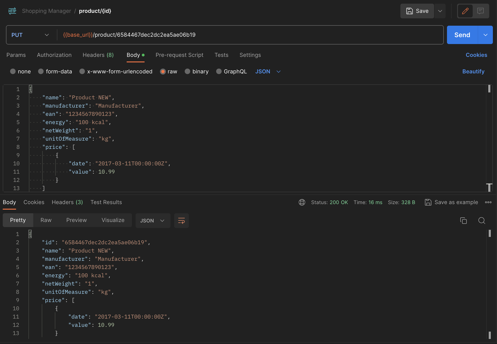
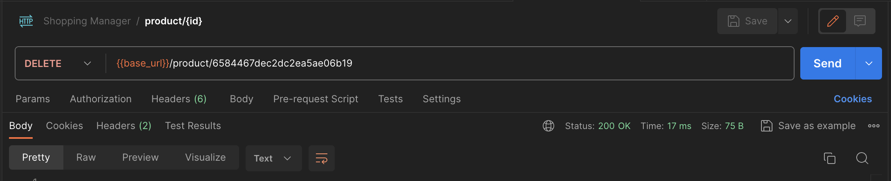

W poprzednich dwóch częściach cyklu nauczyliśmy się [tworzyć](/http-methods-z-go-i-mongodb-czesc-1-post/) produkty, [pobierać](/http-methods-z-go-i-mongodb-czesc-2-get/) listę produktów oraz pojedynczy produkt za pomocą `ID`. Poniższy wpis zademonstruje, w jaki sposób możemy zaaktualizować produkt oraz jak go usunąć, czyli poznamy metody **PUT** i **DELETE**.

## HTTP methods - `PUT`

### Aktualizacja produktu

Do aktualizacji produktu wykorzystamy wiedzę, którą zdobyliśmy do tej pory - czyli [pobieranie produktu po ID](/http-methods-z-go-i-mongodb-czesc-2-get/).

```go
func update(responseWriter http.ResponseWriter, request *http.Request) {
  fmt.Println(time.Now(), "Update product")

  params := mux.Vars(request)

  if !bson.IsObjectIdHex(params["id"]) {
    responseWriter.WriteHeader(404)
    return
  }

  oid := bson.ObjectIdHex(params["id"])

  product := Product{}
  product.ID = oid
  json.NewDecoder(request.Body).Decode(&product)

  session := server.GetSession()

  if error := session.DB("shopping-manager").C("products").UpdateId(oid, product); error != nil {
    responseWriter.WriteHeader(404)
    server.FinishSession(session)

    return
  }

  responseWriter.Header().Set("Content-Type", "application/json")
  responseWriter.WriteHeader(200)
  server.FinishSession(session)

  productJSON, _ := json.Marshal(product)
  fmt.Fprintf(responseWriter, "%s", productJSON)
}
```

Na początek wykorzystamy pakiet `gorilla/mux`, aby dostać się do parametrów zapytania. Następnie sprawdzamy, czy wśród parametrów znajduje się `ID`. Jeżeli wszystko przebiegło poprawnie, to konwertujemy `ID` na `ObjectIdHex`.

W kolejnym kroku, podobnie jak przy metodzie `POST`, tworzymy nasz lokalny produkt, parsujemy i dekodujemy. Otwieramy połączenie z bazą danych i dzięki metodzie `UpdateId`, aktualizujemy nasz produkt przesyłając kolejno `oid` i `product`.

Na koniec standardowe ustawienie nagłówków: `"Content-Type", "application/json"`, odpowiedź `200 - OK`. Zamykamy sesję i zwracamy nasz zmodyfikowany produkt w formacie JSON.

Efekt pracy w POSTMANie:



## HTTP methods - `DELETE`

### Usuwanie produktu

Usuwanie produktów, na podstawie naszych doświadczeń, wydaje się teraz dziecinnie proste.

```go
func remove(responseWriter http.ResponseWriter, request *http.Request) {
  fmt.Println(time.Now(), "Remove product")

  params := mux.Vars(request)

  if !bson.IsObjectIdHex(params["id"]) {
    responseWriter.WriteHeader(404)

    return
  }

  oid := bson.ObjectIdHex(params["id"])
  session := server.GetSession()

  if error := session.DB("shopping-manager").C("products").RemoveId(oid); error != nil {
    responseWriter.WriteHeader(404)
    server.FinishSession(session)

    return
  }

  responseWriter.WriteHeader(200)
  server.FinishSession(session)
}
```

Metoda `remove()`, nie różni się niczym znaczącym od wcześniej wspomnianych metod. Całą magię wykonuje `RemoveId()`, gdzie jako parametr przekazujemy `ObjectIdHex`. Efekt naszej pracy na screenie poniżej:



## Podsumowanie

Powyższy wpis, to trzecia i ostatnia część cyklu **HTTP methods**. Praca nad tymi kilkoma endpointami dała mi wiele satysfakcji. Zdaję sobie sprawę, że wymagają one poprawy. Poszedłem na duże uproszczenia, ale ucząc się języka **Go** oraz **MongoDB**, postawiłem sobie na razie za cel: minimalną, działającą funkcjonalność. To będzie dobry wstęp do czegoś większego.

---

#### Aktualizacja 21 grudnia 2023

Od czasu powstania tego artykułu, w Go oraz MongoDB wiele się zmieniło. Używana przeze mnie paczka `gopkg.in/mgo.v2` jest przestarzała. Obecnie zaleca się stosowanie nowszej i bardziej rozbudowanej paczki `go.mongodb.org/mongo-driver/mongo`.
